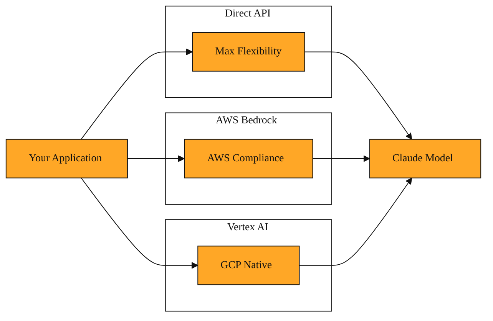

# The Anthropic API

## When Copy and Paste Hits a Wall

Picture a busy Tuesday afternoon. Your application is a project-management tool, and users are asking it to summarize long meeting transcripts. Right now, your only option is to open a browser tab, paste the transcript into a chat window, wait for an answer, copy the summary, and paste it back into your database. One transcript might take five minutes. If the transcript is fifty pages, it might take several tries just to fit it all in. When a hundred users ask at the same time, the task becomes physically impossible. Your application cannot do this on its own while you sleep. It cannot react automatically when a new transcript is uploaded. The intelligence is trapped behind a glass screen, and your code has no way to reach it.

That frustration is the starting point for the Anthropic API. It exists so developers can move AI from a manual tool into an automatic part of their software.

## The Interface That Connects Your Code to Claude

The Anthropic API is the interface that lets your application talk to Claude with code instead of a keyboard. An interface, in this sense, is simply a shared language and doorway. Your code builds a request. It sends that request over the internet to Anthropic's servers. Those servers read your message, run it through a Claude model, and return a response your code can read, display, store, or act upon. You do not download the model. You do not need a supercomputer in your closet. You only need a way to ask and a way to listen.

Developers typically begin at platform.claude.com. That is where you create an API key, which works like a secure password identifying your application. The developer docs at docs.anthropic.com explain how to shape a request, what format the answer takes, and how to handle errors when something goes wrong. Anthropic also provides software libraries, called SDKs, that wrap the raw API calls into simple functions. This means you can send a message and receive a reply using code that looks almost like normal conversation, rather than building raw internet requests by hand.

At the center of it all is a message endpoint, which is simply the web address your code contacts to start a conversation.

This back-and-forth is powerful because it lives inside your software. A user clicks a button in your tool. The code running on your server calls the API. The response flows straight into your user interface. No one opens a browser. No one copies and pastes. The AI becomes a service your application consumes, similar to a payment processor or a mapping provider. Your code remains in control of when to ask, what to ask, and what to do with the answer.

## Three Ways to Open the Door

Anthropic offers more than one path to connect. The right path depends on how your team is already set up.

The most direct route is the Anthropic API itself. You create an account, receive an API key, and send requests straight to Anthropic's infrastructure. This path usually gives you the newest capabilities first. For example, you can use prompt caching to speed up repeated requests, or the Files API to upload and manage documents alongside your prompts. You can also check the model comparison chart and the pricing page for Claude 4 to predict costs before you build. This is often the fastest way for a solo developer or a startup to get started.

Some teams, however, run their entire operation inside Amazon Web Services or Google Cloud. For them, Anthropic makes Claude available through the Amazon Bedrock API and the Google Vertex AI API. These partnerships let you call Claude through the same cloud dashboard you already use every day. Your accounting team sees one bill. Your security team sees data staying within a boundary they already trust.

Each option carries a real trade-off. The direct Anthropic API tends to roll out features first and exposes the full range of tools. The cloud-provider paths integrate neatly with existing infrastructure and compliance rules, but they may not offer every new feature on the exact same day. If you are a startup building a brand-new legal document analyzer from scratch, you might choose the direct API for maximum flexibility and the latest optimizations. If you are a hospital system that must keep all patient data inside AWS, you might choose Amazon Bedrock because it respects boundaries you have already built. If your company standardizes on Google Cloud, Vertex AI lets you stay in that world without opening a separate vendor relationship.

*Figure: The three entry points to Claude highlight that the destination is identical while the trade-off is in infrastructure and governance.*

<InlineQuiz
  id="quiz-s3-l1-api-path-tradeoffs"
  question="A startup is building a new legal document analyzer from scratch. The team wants the latest prompt caching optimizations and maximum flexibility. Which path should they choose?"
  options='["The direct Anthropic API, because it tends to receive new capabilities first and exposes the full range of tools.","Amazon Bedrock, because it integrates neatly with existing AWS infrastructure and compliance rules.","Google Vertex AI, because it lets a team stay inside Google Cloud without a separate vendor relationship.","The direct Anthropic API, because it is the only path that keeps all data inside a cloud provider the team already uses."]'
  correct="0"
  explanation="The lesson explicitly recommends the direct Anthropic API for a startup building from scratch that needs maximum flexibility and the latest features like prompt caching. Amazon Bedrock is designed for teams that already run on AWS and need to keep data within that boundary, which is not the scenario described. Google Vertex AI fits organizations standardized on Google Cloud, not a startup with no existing cloud lock-in. Finally, the direct API sends requests to Anthropic's own servers rather than keeping data inside a cloud provider, so data residency is actually a reason to choose a cloud partner path, not the direct API."
  courseSlug="claude-for-developers-beginner"
  lessonSlug="01-the-anthropic-api"
/>

## What the Pipe Can Carry

Once the connection is open, the API can handle surprising weight. A single request can include up to 200,000 tokens. A token is roughly a word or part of a word. In practical terms, that means you can send a small novel, a long legal contract, or hundreds of pages of source code in one go. The API keeps the context coherent across long documents and across multi-turn conversations. Your application can ask a follow-up question, and the API remembers what was discussed two messages ago.

This capacity matters for real products. Imagine a developer building a research assistant. Without the API, they would have to chop a hundred-page PDF into tiny fragments and feed them to a chat window by hand. With the API, the application uploads the file and asks for a summary in a single automated step. The heavy lifting, the memory, and the reasoning all happen on Anthropic's side. Your server simply sends the request and receives the structured answer.

Because Anthropic hosts the model, they also handle the hardest parts of running it at scale. If traffic spikes, their systems absorb the load. If a model improves, you receive the benefits without rewriting your code. You only need to monitor your usage against your plan's limits. The responses that travel back are shaped by Constitutional AI. That means the underlying models are designed to prioritize transparency, accuracy, and the avoidance of harmful content. Your application does not need to build those safety layers from scratch. They arrive as part of the package, carried through the same pipe that delivers the answer.

## The Mental Model: Pipe, Not Water

It helps to think of the Anthropic API as a postal service for intelligence. Your application writes the letter. The API delivers it to Claude's servers and brings back the reply. You do not own the post office, the trucks, or the sorting machines. You simply need a valid stamp, which is your API key, and an address, which is the endpoint. You pay for the messages you send and receive, not for the massive computers running the model.

This means the API is not the brain. It is the connection. The brain is the model on the other end. The API gets your request to the right place, handles the scaling, and returns the result in a format your code can use. Once you internalize that separation, development becomes simpler. You stop worrying about how to host a massive AI model and start focusing on what you want to ask it.

But an interface is only useful if you know what sits behind it. In the next lesson, we will meet the Claude model family. Opus, Sonnet, and Haiku are the engines you reach through this API. Each one is tuned for a different kind of job. Understanding the API gets your message to the right building. Choosing the right model gets it to the right desk.
