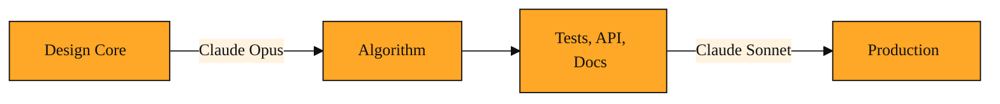

# The Claude Model Family: Opus and Sonnet

The Claude Model Family is a set of three models built by Anthropic and served through the Anthropic API. Instead of giving developers one general-purpose engine, they offer three specialized options. That raises an obvious question. Why complicate things? Wouldn't one perfect model be simpler?

The short answer is no. Imagine you had to build an entire house using only a single screwdriver. It would work for the screws. For the nails, the saw, the paint brush, and the level, you would be out of luck. You would either damage the materials or spend ten times as long forcing the wrong tool to do the job. Using AI works the same way. If a platform gives you only one model, that model must try to be everything to everyone. It will be too expensive for small tasks. It will be too weak for the hardest ones. You end up overpaying for simplicity or failing at complexity. Neither outcome works when you are shipping production software.

This is exactly the problem Anthropic faced when serving developers. A startup debugging a novel algorithm needs a different kind of thinking than a retailer answering ten thousand shipping questions an hour. A researcher analyzing a hundred-page legal contract needs a different level of depth than a mobile app suggesting dinner recipes. Charging every team the same rate and making every request wait the same length of time does not make sense. So Anthropic built the Claude Model Family. It includes Opus, Sonnet, and Haiku. Each one represents a deliberate trade-off between capability, speed, and cost. Instead of forcing every request through the same engine, you pick the one that matches the road ahead.

## The Claude Model Family

The family is not three different products that happen to share a name. They are siblings. They share the same training principles, safety standards, and conversational style. The difference is size and focus. One is built for depth. One is built for balance. One is built for speed. When you send a request to the Anthropic API, you choose which sibling shows up to work by setting a single parameter. That choice determines how much you pay, how long you wait, and how nuanced the answer will be.

Capability means how well the model reasons, codes, and writes. Speed means how fast you get the first token back and how quickly the full response finishes. Cost means how many tokens you can afford to process before your budget tightens. A model that maximizes all three at once is impossible. Physics and economics get in the way. The Claude Model Family accepts this reality and gives you three tuned options instead of one compromised average.

Right now we will focus on the first two members. We will save the third, Haiku, for the next lesson.

## Opus: The Deep Thinker

Opus is the most capable model in the family. When Anthropic released Claude Opus 4.8, they designed it for the tasks that make other models stumble. Complex reasoning, long-horizon planning, and agentic coding are its home territory. Agentic coding simply means the model can act more like a software agent. It can plan several steps ahead, explore different approaches, and catch its own mistakes before it writes the final code.

Think of Opus as the senior architect you call when the building is leaning. If you are debugging a race condition inside a payment processing system, you do not need a generic explanation of what threads are. You need something that can hold the entire schema, the transaction logs, and the concurrency model in memory at once. You need it to spot the hidden pattern. Opus does this because it allocates more computational effort to reasoning. It thinks longer and deeper.

That depth comes with a cost. Opus is slower and more expensive than the other family members. Using it to classify a thousand short emails is like hiring a chess grandmaster to sort your recycling. The grandmaster would do it perfectly, but you would waste money and time. Reserve Opus for moments where a wrong answer is expensive and the problem is genuinely hard.

## Sonnet: The Daily Workhorse

Sonnet occupies the middle ground. Anthropic describes Claude Sonnet 4.6 as frontier intelligence at scale, built for coding, agents, and enterprise use. In plain language, this means it is very smart, but it is also efficient enough to run all day in a production system. It does not reason quite as deeply as Opus on the most arcane problems, but it is far more capable than a basic model for everyday engineering work.

Picture a team building an internal dashboard. They need to turn natural language questions into SQL queries. They need to format API responses into clean JSON. They need to draft error messages that sound human. Sonnet handles all of this with competence and speed. When you are iterating quickly, sending dozens of prompts per hour, Sonnet keeps your feedback loop tight and your bill manageable.

Enterprise use adds another layer. In a large company, a model might serve hundreds of internal users at once. If each request is slow or pricey, the system grinds to a halt. Sonnet is designed to avoid that bottleneck. It gives you advanced reasoning without the operational headaches that come from running the largest model at full throttle.

Many developers treat Sonnet as their default. They reach for Opus only when Sonnet stalls out on a genuinely tricky problem. This habit works well because Sonnet covers the wide middle of software development. It is the reliable sedan you drive to work, while Opus is the heavy truck you rent for moving day.

## Real Decisions: When to Use Which

The best way to understand the trade-off is to walk through a few realistic situations.

First, consider a late-night outage. Your database migration failed halfway through, and the rollback script is throwing foreign key errors. The schema spans six tables with interwoven dependencies. You need a repair script that will not destroy production data. You paste the full schema, the migration log, and the error trace into your prompt. This is a job for Claude Opus 4.8. You will wait a few extra seconds and pay a bit more, but the depth of reasoning reduces the chance that you make the outage worse. Saving five dollars on API costs is meaningless if you corrupt a customer database.

Second, imagine you are launching a customer support chatbot for a busy online store. Thousands of shoppers will ask about order tracking, return windows, and sizing charts. The answers are important, but they follow predictable patterns. If the bot takes eight seconds to reply, shoppers will abandon the chat. If the bot costs a penny per message, your margin disappears at scale. Here, Claude Sonnet 4.6 is the better choice. It answers accurately, it responds quickly, and it keeps the operating cost low enough that you can serve every customer without stress.

Third, think about a product team building a new recommendation engine. In week one, the team uses Opus to design the core algorithm. The math is subtle, and the foundation must be right. Once the algorithm is sound, they switch to Sonnet to write the surrounding unit tests, the API wrapper, and the documentation. This pattern of starting with Opus for depth and shifting to Sonnet for volume is one of the most common ways experienced developers use the family. You pay for genius when you need it. You pay for efficiency when you do not.

*Figure: The hybrid workflow pattern: start with Opus to architect the hard foundation, then shift to Sonnet for high-volume implementation and scaling.*

<InlineQuiz
  id="quiz-s4-l2-hybrid-workflow-pattern"
  question="Your team used Claude Opus 4.8 to design a subtle core algorithm. After the foundation is sound, you need to write unit tests, an API wrapper, and documentation. According to the workflow pattern in this lesson, what is the best next step?"
  options='["Continue using Opus 4.8 for all remaining work to maintain consistency and avoid switching models mid-project.","Switch to Sonnet 4.6 for the tests, wrapper, and docs because the work shifted from deep reasoning to high-volume implementation.","Switch to Sonnet 4.6 only for documentation while keeping Opus 4.8 for the tests and API wrapper since they still require coding skill.","Restart the entire project with Sonnet 4.6 because using Opus for the algorithm was unnecessary overkill from the start."]'
  correct="1"
  explanation="Correct option B is right because the lesson describes a common hybrid pattern where teams start with Opus for depth on the hard foundation, then shift to Sonnet for the surrounding high-volume implementation work like tests and docs. This keeps costs and latency reasonable without sacrificing quality on routine tasks. Option A is wrong because the lesson explicitly warns against using Opus for work that does not need its depth; consistency is not worth the extra cost and slowdown. Option C is wrong because the lesson groups tests, wrappers, and docs together as the kind of daily engineering work Sonnet handles well; reserving Opus for them misses the point of the trade-off. Option D is wrong because the lesson states that designing the core algorithm is exactly the kind of hard, rare problem where Opus depth is justified; calling it overkill contradicts the guidance."
  courseSlug="claude-for-developers-beginner"
  lessonSlug="02-the-claude-model-family-opus-and-sonnet"
/>

## A Simple Rule for Picking Your Model

The Claude Model Family is best understood as a set of gears rather than a set of personalities. Opus is the low gear. It turns slowly, but it generates enormous force for the steepest climbs. Sonnet is the medium gear. It handles the flat roads and gentle hills where you spend most of your journey. Haiku, which we have not yet explored, is the high gear built for pure speed on the straightaways. The Anthropic API lets you shift between these gears by changing one word in your request.

Memorizing which model is best in theory will not help you. What matters is looking at the slope in front of you and choosing the gear that matches it. If the problem is hard, rare, and expensive to get wrong, reach for Opus. If the problem is daily, repeated, and needs to happen at scale, reach for Sonnet. That simple habit will save you money, cut your latency, and give you better results than treating every task the same.

We have met the deep thinker and the daily workhorse. Next, we will meet Haiku, the fastest member of the family. After that, we will look at how to actually put Claude to work, and how to give it tools that let it interact with the world beyond the text box.
