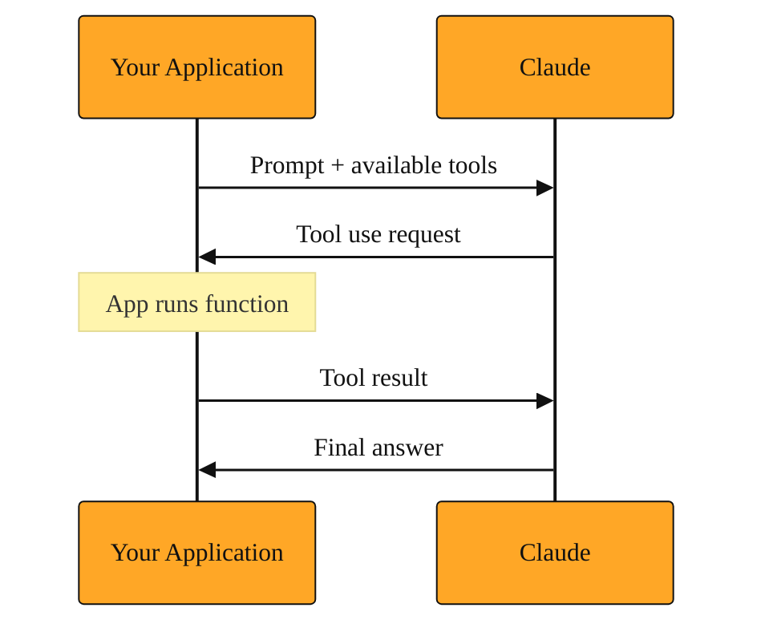

# Haiku, the Claude Family, and Tool Use

If you have spent time with Opus and Sonnet, you have probably asked yourself a practical question. Do I really need the most powerful model for every single task my app performs? If I am filtering comments, routing customer messages, or answering simple questions at scale, running every request through Sonnet feels like hiring a senior engineer to sort the office mail. There has to be a cheaper, faster way. And there is.

That way is Haiku. But to understand where Haiku fits, you first need to see the bigger picture. You might think of Claude as a single model, but it is actually a family. Opus, Sonnet, and Haiku are all part of that family. Think of Claude as the last name, and Opus, Sonnet, and Haiku as the siblings. Each sibling has a different specialty, and part of building well is learning when to call which one.

## The Claude family: one name, three members

In earlier lessons you worked with Opus and Sonnet. You saw that Opus is the most capable member of the family, built for deep reasoning and complex coding. Sonnet sits in the middle, offering strong performance for most tasks without the top-tier cost. Haiku is the third member. It is the fastest and the most affordable, though it gives up some depth in exchange for that speed.

When you send a request through the API, you pick a specific model name such as claude-opus-4-8, claude-sonnet-4-6, or claude-haiku-4-5. All of them share the same underlying training and safety principles because they are all Claudes, but they differ in size, speed, and price. Choosing the right sibling for the job is one of the most important decisions you will make when building with the API. It affects your response times, your bill, and the quality of the user experience.

## Haiku: speed and savings for the simple stuff

Haiku is designed for the tasks that happen over and over again at high volume. It excels at reading comprehension, classification, and light rewriting. It can sort support tickets by urgency, flag toxic content, extract dates from emails, or answer straightforward FAQs. Because it is a smaller model, it returns tokens quickly and costs less per request than its bigger siblings.

Imagine you run a forum with thousands of posts per hour. You need a moderation layer that decides whether a post needs human review. Running every post through Opus would be slow and expensive. Running them through Haiku is fast and cheap. It can scan the text, apply your policy, and output a simple flag like "pass" or "review" in a fraction of a second. If your application handles fifty thousand classifications a day, those savings add up quickly.

The trade-off is real. Haiku will struggle with tasks that require multi-step reasoning, advanced mathematics, or long-context synthesis. If you ask it to debug a complex distributed system, architect a new service, or write a novel legal argument, it will not perform as well as Sonnet or Opus. The skill is learning to route simple work to Haiku and reserve the heavier models for heavier problems. When in doubt, test the same prompt on Haiku and Sonnet. If Haiku’s answer is good enough, you have just found a way to serve your users faster and spend less.

## Tool Use: letting models reach outside the chat

So far, every response you have gotten from Opus or Sonnet has been plain text generated from the model's training data. That knowledge has a cutoff date, and it cannot see your private database, your company spreadsheets, or the current weather in Tokyo. Tool Use changes this. It is a capability that lets Claude interact with external systems rather than relying only on what it learned during training.

Here is how it works. You define one or more tools for the model. A tool is basically a description of a function your application already knows how to run, such as looking up a product's price in your inventory database or checking the status of a server. You tell the model the tool's name, what it does, and what inputs it expects. When the model decides it needs that information to answer the user, it does not guess. Instead, it outputs a structured request saying which tool to call and what arguments to pass. Your application receives that request, runs the actual function in your own code, and sends the result back to the model. Then the model writes the final answer using that live data.

Think of it like a research assistant who is allowed to call the library reference desk. The assistant cannot walk into the stacks themselves, and they cannot physically pull the books. But they can ask your code to fetch a specific record, and then they can use what your code brings back to write a better response. The model stays inside the text channel. Your code stays in control of the outside world.

Tool Use is available across the Claude family. Haiku can use simple tools, like checking a status code or fetching a single record. Sonnet and Opus can handle longer tool chains where one result feeds into another call, or where the model must decide among many possible tools. The important point is that Tool Use transforms the model from a static writer into an active participant in your application. It can act instead of just talk.

*Figure: The Tool Use request cycle, showing how your application acts as the bridge between Claude and external systems.*

## Putting it together: three realistic choices

To see why these distinctions matter, picture three different situations.

First, you are building a real-time chat widget that classifies user intent. The user asks about refunds, shipping, or account settings. You need sub-second responses for thousands of conversations. Haiku alone, without any tools, is the right pick here. It can read the message, label the intent, and hand the user off to the correct workflow. Using Sonnet would add delay and cost for no meaningful gain, because the task is pattern matching, not deep reasoning.

Second, you are building an internal dashboard assistant. A manager asks, "How many orders did we ship last Tuesday?" The model does not know this. You give it a tool that queries your shipping database. Here, Sonnet with Tool Use is a better fit than Haiku. The task sounds simple, but the SQL query or API logic might need careful handling, and Sonnet is more reliable at constructing the right tool call and interpreting unusual results, such as a database timeout or a missing table.

Third, you are designing a coding agent that can read files, run tests, and edit code across an entire repository. The task demands deep reasoning and long context. Opus with Tool Use is the natural choice. Haiku would lack the reasoning depth to plan the edits across many files, and even Sonnet might struggle with the most complex refactorings. The extra capability of Opus earns its cost when the stakes are high and the logic is tangled.

The pattern is clear. Start by asking how hard the thinking is. Route simple, high-volume tasks to Haiku. When the task is harder or requires external data, move up to Sonnet or Opus and attach the right tools. If the model only needs to talk, skip the tools. If it needs to know something live, give it the phone.

<InlineQuiz
  id="quiz-s4-l3-model-routing-workflow"
  question="You need to build a real-time comment classifier that flags toxic content on a forum. The site receives one hundred thousand posts per hour, and responses must arrive in milliseconds. The model only needs to read the post text and apply a simple policy. No external databases or live data are needed. Which approach best fits the guidance from the lesson?"
  options='["Use Haiku with no tools, because high-volume text classification is exactly the simple, repetitive work Haiku is built for.","Use Opus with Tool Use, because safety-critical moderation demands the deepest reasoning and external data lookup.","Use Sonnet with a database tool, because the model needs to query a banned-word list for every post to make an accurate decision.","Use Haiku with a web-search tool, because checking live internet context helps catch toxic slang that the model might not know."]'
  correct="0"
  explanation="The correct choice is Haiku alone because the lesson routes simple, high-volume pattern matching like toxicity flagging to Haiku when no live data is required. The speed and cost savings are the whole point. Option B is wrong because Opus is overkill for routine sorting; the lesson compares that to hiring a senior engineer to sort mail. Option C is wrong because adding a database tool and a larger model introduces unnecessary latency and cost when Haiku can apply a policy directly to the text. Option D is wrong because adding a web-search tool violates the millisecond requirement and the lesson warns against giving a phone to someone who does not need to call outside."
  courseSlug="claude-for-developers-beginner"
  lessonSlug="03-haiku-the-claude-family-and-tool-use"
/>

## A simple way to think about it

You can picture the Claude family as a team inside your company. Haiku is the efficient front-desk worker who handles routine questions instantly. Sonnet is the reliable developer who manages most projects and knows when to look things up. Opus is the senior architect who steps in for the hardest problems. Tool Use is the phone system that lets any of them call outside for information. You would not ask the architect to stamp every piece of mail, and you would not ask the front desk to redesign your database. Match the worker to the work, and give them a phone only when they need it.

In the next lesson, we will look at how these ideas come together in a single developer tool that puts the models and their tool-calling abilities right inside your terminal.
