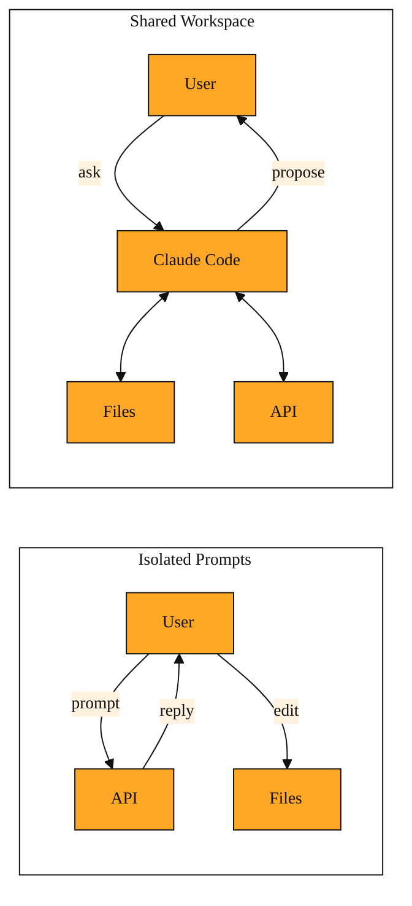
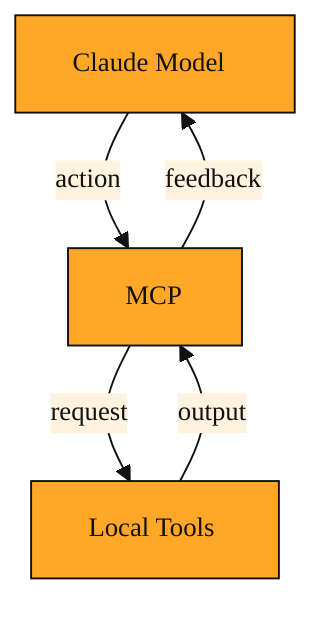

# Claude Code

So far in this course, you have sent messages to Claude through the Anthropic API. You built a prompt in your code. You waited for a reply. You copied that reply into your editor. That pattern is powerful, but it is also like talking to an architect through a mail slot. You can describe the house. You can slide blueprints back and forth. But the architect cannot walk the lot. They cannot check the foundation. They cannot swing a hammer.

Software engineering works the same way. When Claude only sees the text you paste into a prompt, it is blind to your file tree. It does not know which files import which. It cannot run your tests to see if a fix worked. You become the go-between. You copy errors out of your terminal. You paste code into the prompt. You paste the answer back into your editor. You do this again and again. That friction adds up fast. Small tasks start to feel like dictation exercises.

Claude Code exists to remove that friction. It is a command-line tool from Anthropic. You install it on your own machine. When you start it inside a project folder, Claude moves from the other side of the API into your actual workspace. It can read your files. It can run shell commands. It can propose edits. And it does all of this by using the Anthropic API behind the scenes. You stop writing API calls by hand. Instead, you ask for help in plain language, and the tool handles the rest.

## From Isolated Prompts to a Shared Workspace

An API call is a single transaction. You send a block of text. You receive a block of text. The connection closes. If you want Claude to know about a second file, you paste that file into a new prompt. If you want it to fix a bug, you paste the error, then paste the code, then paste the fix back where it belongs. The conversation is trapped inside whatever you choose to share.

Claude Code changes the shape of that conversation. Because it lives in your terminal, it can look around on its own. You might ask it to refactor a function that is used across several modules. Instead of forcing you to paste every file into a chat window, Claude Code reads those files directly from your disk. It sees the imports. It sees the tests. It builds its own understanding of your project structure. Then it proposes changes. You review them. You approve them. The tool edits the files for you.

This turns Claude from a chatbot into a coworker who shares your desk. The difference goes deeper than convenience. When a model can inspect your package manifest, your configuration files, and your directory layout, its suggestions stop being generic. They become specific to your stack, your conventions, and your codebase.

*Figure: The shift from isolated prompts, where the user copies every message, to a shared workspace where Claude Code reads and edits files directly.*

## A Terminal That Reads and Acts

The tool is not a separate application with buttons and menus. It is a command-line interface. You type. It types back. That simplicity is intentional. Developers already live in terminals to run git, install packages, and start servers. Claude Code simply joins that environment. It does not replace your editor. It does not replace your shell. It sits alongside them.

Once it is running, it relies on the Anthropic API to do its thinking. Every question you ask and every file it reads travels back to Anthropic's models. The tool can call different models depending on the task. For everyday coding, it might use Claude Sonnet 4.6. That model is fast and cost-effective for routine edits. For harder problems, like untangling a complex algorithm or planning a large refactor, it might call Claude Opus 4.8. Opus 4.8 is built for deep reasoning.

Anthropic's lineup also includes Claude Fable 5 for demanding long-horizon work and Claude Mythos 5, which shares similar capabilities. For most engineering tasks inside Claude Code, however, you will primarily see Claude Sonnet 4.6 and Claude Opus 4.8. You can check Anthropic's model comparison chart to see the exact differences in capability, and their pricing page to understand how each choice affects cost. The tool handles the switching and the streaming responses. You do not write JSON payloads. You do not parse token counts. The API is always the engine under the hood, but Claude Code is the driver.

## The Bridge to External Tools

Reading files is useful, but real engineering work also means running commands. You need to execute tests. You need to check git status. You need to install dependencies. Claude Code does not have these powers on its own. It uses a system called the Model Context Protocol.

Think of this protocol as a universal adapter. It lets Claude ask your computer for help in a standardized way. When Claude wants to run your test suite, it does not magically execute shell commands on a whim. It sends a structured request through the protocol. The tool receives that request, runs the command in your terminal, and feeds the results back to Claude. The same happens for editing files or searching code. The protocol creates a safe, repeatable bridge between Claude's reasoning and your machine's tools.

Without such a protocol, every action would need custom glue code. The protocol keeps the model and the tools separate. The model decides what to do. The protocol decides how to ask. The tool decides how to execute. The model never touches your machine directly. It asks. The tool decides whether to obey. That layer of indirection means you stay in control. We will explore exactly how that protocol works in the next lesson.

*Figure: How the Model Context Protocol creates a controlled bridge between Claude's reasoning and your local tools.*

<InlineQuiz
  id="quiz-s3-l4-model-context-protocol"
  question="Claude Code wants to run your test suite after fixing a bug. According to how the Model Context Protocol works, what happens next?"
  options='["The Claude model executes the shell command directly on your machine without any intermediate layer.","The model sends a structured request through the Model Context Protocol, and the Claude Code tool executes the command and returns the output.","You must first write custom glue code to link the model to your test runner before any command can run.","The protocol independently decides which tests are relevant and runs them automatically before telling the model."]'
  correct="1"
  explanation="The correct option reflects the separation of responsibilities the lesson describes. The model decides what it wants done, but it never touches your machine directly. Instead it issues a structured request through the Model Context Protocol. The tool then executes the command and feeds results back. Option A is wrong because the protocol exists specifically to prevent the model from executing commands directly. Option C confuses the purpose of the protocol, which eliminates the need for custom glue code rather than requiring it. Option D is wrong because the protocol does not make decisions; it standardizes how the model asks for tools, while the model retains control over what is requested."
  courseSlug="claude-for-developers-beginner"
  lessonSlug="04-claude-code"
/>

## When to Invite Claude Into Your Terminal

Not every task needs a tool like this. Sometimes you just want a quick explanation of a regular expression. A single API call or web chat is perfect for that. Claude Code shines when the work lives inside your project.

Imagine you rename a database column. The change breaks six different files. Without Claude Code, you hunt through the code manually. You open each file. You search and replace. You hope you did not miss a reference in a template or a migration script. With Claude Code, you describe the rename. It finds every occurrence. It proposes the edits. You review the diff. The whole task takes minutes instead of an hour.

Or picture a failing test. You paste the error into a web chat, and Claude guesses at the cause. Then you apply the fix and run the test again. If it still fails, you start over. With Claude Code, the tool runs the test itself. It sees the full error trace. It inspects the source. It edits the code. It runs the test again to confirm. The loop is tight because Claude is inside the workspace, not outside it.

You can also use it to onboard yourself to a new codebase. Instead of spending hours reading folders and drawing mental maps, you ask Claude Code to summarize the architecture. It reads the entry points, the configuration, and the test structure. It gives you a guided tour in plain language.

There is a trade-off to consider. Because Claude Code sends your files to the Anthropic API, you should be thoughtful about where you run it. Do not start it inside a folder full of private keys or secrets. And because it uses real API calls, long sessions with large codebases can cost more than a few quick chat messages. For sensitive or trivial tasks, a manual API call or the web interface is still the better choice. You should also pick your model with cost in mind. A broad survey of a huge repository with Claude Opus 4.8 is powerful, but it is not free. For a small project, the cost is tiny. For a monolith, it adds up. Sonnet 4.6 is usually the safer default for exploration.

<InlineQuiz
  id="quiz-s4-l4-terminal-invitation-tradeoffs"
  question="You need to rename a utility function that appears in twelve files across a large monorepo. The refactoring is straightforward and you want to keep costs low. Which approach best fits the trade-offs described in this lesson?"
  options='["Use Claude Code with Claude Opus 4.8 so it can perform deep reasoning across the entire repository at once.","Use a single web chat prompt and manually copy each suggested edit into the correct file yourself.","Use Claude Code with Claude Sonnet 4.6 to find the occurrences, propose the edits, and let you review and apply them.","Paste the entire monorepo into a single Anthropic API prompt as a large text block and parse the response manually."]'
  correct="2"
  explanation="This scenario is exactly the kind of multi-file project work where Claude Code shines, because it can read files directly and propose edits without manual copying. Sonnet 4.6 is the safer default for routine exploration and straightforward refactoring, while Opus 4.8 is reserved for harder reasoning tasks and would be unnecessarily expensive for a large monorepo sweep. Option B describes the painful isolated-prompt pattern that creates friction for multi-file changes. Option D ignores the purpose of Claude Code entirely by forcing you to act as the copy-and-paste intermediary you are trying to avoid."
  courseSlug="claude-for-developers-beginner"
  lessonSlug="04-claude-code"
/>

## The Mental Model

Think of Claude Code as a skilled teammate who sits at your terminal. They can read your code. They can run your commands. They can edit your files. But they still phone home to the Anthropic API to think. The API is their brain. Your terminal is their hands and eyes. And the Model Context Protocol is the set of signals they use to ask your computer for tools.

When you need answers, talk to Claude through an API or a browser. When you need work done inside a project, invite Claude into your terminal. That is the dividing line.

That teammate can only help if they remember what they are looking at. Claude Code keeps your whole project in mind during a session. How it manages that memory, and how the Model Context Protocol standardizes the requests between thought and action, are the two ideas we will explore next.
