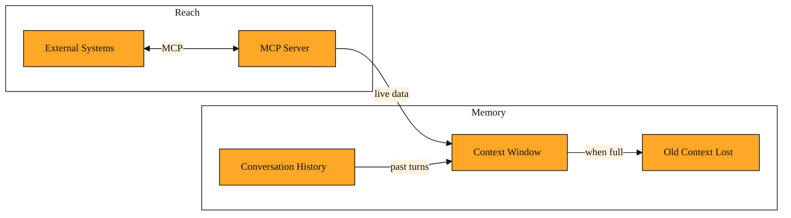

# Model Context Protocol and Context Window

You have been refactoring a payment module in Claude Code for the last forty minutes. The conversation is long. You ask, "What did we decide about error handling for failed webhooks?" Claude suggests retry logic with exponential backoff. You stare at the screen. Twenty minutes ago, you both agreed to use a dead-letter queue instead. A moment later, you ask Claude to check the latest bug ticket in Jira to confirm the priority. It apologizes. It cannot open Jira. It can only see the files you have opened and the words you have typed into this terminal session.

These two moments expose the same truth. Claude is powerful, but it lives inside a box. The box has two walls. One wall blocks it from the outside world. The other wall limits how much of your conversation it can hold at once. This lesson is about those two walls, and the tools that let you work with them.

## Why Claude Needs Bridges and Boundaries

By default, Claude Code is like a brilliant colleague who sits in a quiet room with no windows. You slide files under the door. They read them, think hard, and slide back code. But they cannot make phone calls. They cannot check a calendar. And if your conversation goes on too long, they start forgetting what you said at the beginning.

The first limit is reach. Claude reads text. It does not browse the web, query your database, or open Slack on its own. If you want it to know about a ticket, you must copy and paste the ticket. If you want it to know about yesterday's pull request, you must feed it the diff.

The second limit is memory. Every model has a context window. Think of it as a desk with limited space. You can spread out only so many pages before you have to clear some away to make room. When the desk is full, Claude must push old pages off the edge to read new ones. That is why, in a long session, Claude might forget an earlier decision. The words did not vanish from the chat log on your screen. They simply fell off the model's working desk.

These two ideas sound like restrictions, but they are also the map to using Claude well.

## Reaching Outside with the Model Context Protocol

The Model Context Protocol, or MCP, is a protocol. That means it is a set of rules that lets Claude talk to systems outside its quiet room. Anthropic open-sourced this standard so that anyone can build a connector for it.

Here is how it works. An MCP server acts as a translator for a specific tool. One server might speak Jira. Another might speak PostgreSQL. Another might speak your company's internal API. When you connect Claude to an MCP server, you are giving it a dedicated phone line to that service.

In the Messages API, you can hand Claude a list of these connections. You provide a server name, an address, and an authorization token. When you ask, "Show me high-priority bugs assigned to me," Claude does not guess. It places a call through the MCP server, reads the response, and answers you with fresh data.

This changes how you work. Without MCP, your workflow is export, copy, paste. You become the bridge between Claude and the world. With MCP, Claude can ask follow-up questions directly. If the bug ticket links to a design doc in another system, and that system also has an MCP server, Claude can fetch that too. The data is live, not a snapshot frozen in time.

But bridges need maintenance. Each connection requires setup, security tokens, and trust. You should not connect Claude to every system just because you can. You connect the ones that save you the most manual fetching. The rest can stay as copy and paste.

## The Context Window as Working Memory

The context window is the amount of text a Claude model can consider in a single request. In Claude Code, you can watch it fill up. The status bar shows a token percentage. Tokens are pieces of words. When that percentage climbs toward the top, you are running out of desk space.

When the window is nearly full, Claude's behavior changes. It might miss a detail from ten messages ago. It might suggest a function name you already renamed. It might generate code that contradicts the plan you wrote in the first message. This is not a bug. It is a physical limit. Old text gets pushed out so new text can come in. Some things, like your project rules, are kept automatically, but old parts of the conversation may be lost.

There are a few ways to manage this. You can use the `/compact` command in Claude Code. This asks Claude to summarize the conversation so far, replacing the long back-and-forth with a shorter set of notes. The summary stays on the desk, freeing up space. The catch is that nuance can get lost. A one-sentence note that says "we chose the queue approach" might not capture why you rejected retries.

Another approach is to start a new session. This clears the desk completely. You bring Claude back to the project with a fresh prompt that includes only the current goal and the relevant files. It is clean, but you lose the thread of the conversation. You have to re-establish context.

The smartest approach is often prevention. Break large tasks into chunks. Work on the authentication layer in one session. Start a new session for the payment layer. Feed Claude only the files it needs right now. The more files you load, the faster the desk fills.

## When Reach and Memory Collide

These two limits do not stay in separate boxes. They interact. Here are three moments you will recognize.

You are debugging a customer issue. You could paste the last fifty lines of the log into the chat. It is quick, but the log is huge and fills the context window. Instead, you set up an MCP connection to your log aggregator. Claude queries for exactly the error traces it needs. The result is smaller and fresher than a static paste. The trade-off is setup time. You pay once to build the bridge, then save tokens on every future query.

Later, you are in a two-hour architecture session. The token meter hits eighty percent. Claude suggests importing a library you already decided against. You have a choice. You can run `/compact` to summarize the session so far. This frees space and keeps the conversation alive. But summaries lose detail. If the architecture is subtle, you might restart with a clean session instead. You spend five minutes writing a focused prompt that lists the current decisions and files. The trade-off is flow versus precision. Compaction is faster but riskier. Restarting is slower but cleaner.

Finally, you connect Claude to three MCP servers: Jira, GitHub, and your internal docs. In one request, Claude fetches a ticket, reads a pull request, and scans a wiki page. The data is perfect, but it consumes a quarter of your context window in one shot. Now you have less room for code. You learn to fetch only what you need. You ask for the ticket summary, not the full comments. You load three files, not thirty. The trade-off is completeness against memory. Live data is powerful, but every word it brings back costs space on the desk.

*Figure: How external data via MCP and conversation history feed into the finite context window, competing for the same limited space.*

<InlineQuiz
  id="quiz-s4-l5-mcp-context-tradeoff"
  question="You are in a long debugging session and the token meter reads 85 percent. You need Claude to examine recent error rows in your production database. Which strategy best balances getting live data with preserving your remaining context space?"
  options='["Copy and paste a full export of the errors table into the chat.","Connect an MCP database server and ask for every row in the errors table.","Connect an MCP database server and ask for only error rows from the last hour matching the current bug.","Start a new session and load the full database schema plus a week of application logs."]'
  correct="2"
  explanation="The correct choice uses MCP to get live data but keeps the result small and targeted. The lesson shows that live data is powerful yet every word it brings back costs space on the desk. By filtering to the last hour and the current bug, you get fresh information without dumping a huge static table or fetching an unbounded result set. The first option is wrong because pasting a full table export burns context window immediately with static data you may not need. The second option is wrong because MCP does not solve the context limit on its own; an unbounded query still returns too many rows and eats your working memory. The fourth option is wrong because starting fresh only helps if you feed Claude a focused prompt; reloading a full schema and a week of logs immediately refills the desk and wastes the clean slate."
  courseSlug="claude-for-developers-beginner"
  lessonSlug="05-model-context-protocol-and-context-window"
/>

## Seeing the Whole Machine

Over the last five lessons, you have learned to talk to Claude, to guide it with clear prompts, to work alongside it in Claude Code, and now to understand its edges. Claude is not a mind with infinite memory and universal access. It is a reasoning engine operating inside a context window, reading text that you or MCP feeds it.

The Model Context Protocol is the bridge that lets Claude step outside its room. The context window is the size of the room itself. You need both concepts to build a reliable workflow. Reach out when you need live data. Guard your working memory when the conversation deepens. When you manage both well, Claude stays sharp, current, and consistent.

That is the shape of working with Claude. You provide the direction. You manage the connections. You watch the limits. And within those boundaries, you can build fast.
