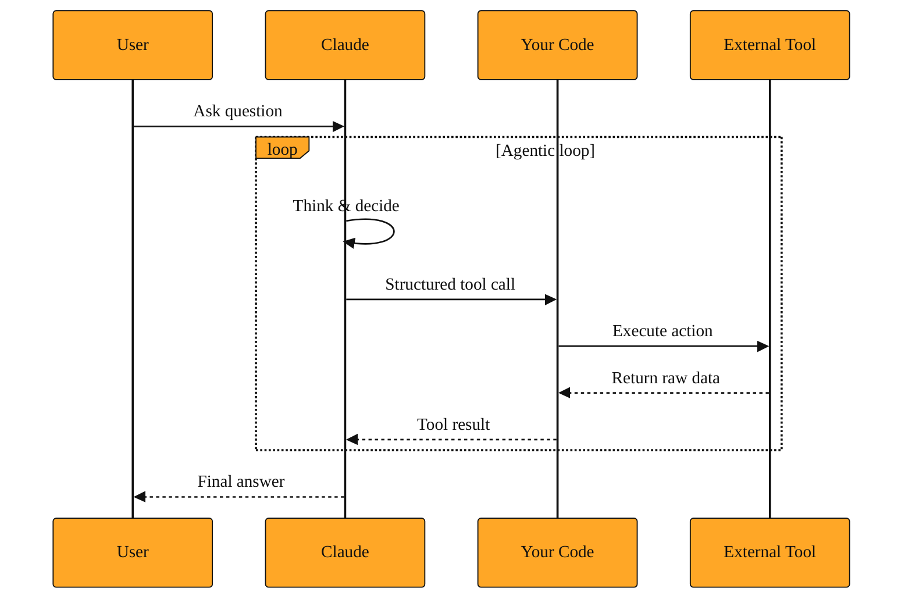

# Tool Use: Letting Claude Reach Beyond Text

So far in this course, you have worked with Claude as a writer. You send words in, and words come back. That pattern works beautifully for drafting emails, brainstorming ideas, or explaining a concept. But imagine you ask Claude to schedule your dentist appointment. It can draft a polite message, sure. It cannot check your calendar, see the dentist's open slots, or book the 3 p.m. cleaning. The reply stays trapped on the screen.

That is the hard boundary of plain text generation. Claude lives in a closed room. Everything it knows comes from its training data. It cannot check today's weather, run a precise calculation, or look up your company's live inventory. It can guess, and sometimes it guesses well. But guessing is risky when you need exact numbers, current facts, or an action to actually happen in another system. Developers hit this wall quickly. They build an AI that sounds smart, but it cannot actually do anything outside its own text.

Tool Use breaks that wall. It lets Claude reach beyond its own output and interact with external systems. You define tools, which are basically instructions for outside actions. Then Claude can decide to call them. It does not run the tools itself. Instead, it asks your application to run them. Your code does the work, hands the result back to Claude, and Claude uses that fresh information to craft its final answer.

## The Loop: Think, Call, Answer

This creates a simple back-and-forth that repeats until the job is done. The user asks a question. Claude thinks and realizes it needs live data. It responds not with a final answer, but with a structured request. It might say, in effect, "Call the weather API for Portland." The request is not freeform text. It follows the shape you defined. You might tell Claude that a weather tool needs a city name and a unit preference. Claude then produces a structured payload that your code can trust and parse. This contract between the model and your application is what makes the whole system reliable.

Your code sees that request, runs the actual API call, and returns the result: "62 degrees and cloudy." Claude then writes the human-friendly reply: "You will need an umbrella in Portland today."

If the task is complex, the loop can run more than once. Claude might call a tool to list your calendar events, see a conflict, then call another tool to find the next open slot. Each time, your code executes the real work and feeds the result back. Claude handles the reasoning and planning. Your code handles the reality.

This pattern is described in the documentation as the agentic loop. The word agentic just means Claude is acting as an agent. It makes choices about how to satisfy your request. It judges whether a tool is needed, which tool to pick, and what information to pass in. You are not writing a script that says "do this, then do that." You are giving Claude capabilities and letting it decide when to use them.

Your job as the developer is to build the bridge between Claude and the outside world. You define what the tool is called, what inputs it expects, and you write the code that executes the real work when Claude asks for it. The model stays focused on thinking. Your application stays focused on doing.

*Figure: The agentic loop separates Claude’s planning from your application’s execution, repeating until the task is complete.*

## Freedom or Certainty: You Can Choose

Most of the time, Claude decides on its own whether to call a tool. That flexibility keeps conversations natural. If a user asks for a poem, Claude knows it does not need a calculator. If the user asks for a stock price, Claude reaches for the market tool. This freedom is the default, and it works well for open-ended chat.

But some jobs cannot tolerate maybe. If you are building a feature that must extract a shipping address from an email and save it to a database, you do not want Claude to skip the tool and just reply with friendly prose. You can force it to use a specific tool using a setting called `tool_choice`. This gives you a hard guarantee rather than a gentle nudge. The conversation becomes more robotic, but the output becomes predictable. That is the right trade-off when the rest of your application expects a machine-readable result.

There is also strict tool use. In the normal flow, Claude might wrap a tool request inside conversational text. Strict mode tightens this up so the output is purely the structured tool call. The trade-off is clarity for your code at the expense of conversational warmth. Strict mode is built for moments when the tool call itself is the deliverable, not a step toward a chatty paragraph. Use it when you are piping Claude's output directly into another system that has no patience for small talk.

<InlineQuiz
  id="quiz-s2-l4-strict-tool-choice"
  question="You are building an order processing system that reads customer emails and must pass structured SKU and quantity data to your warehouse API. The warehouse API cannot handle conversational text. Which approach should you use?"
  options='["Let Claude respond naturally and parse its text to find the SKU and quantity.","Define an extraction tool, force its use with tool_choice, and enable strict mode.","Force the extraction tool but allow Claude to add conversational text around the structured call.","Prompt Claude to output structured data directly in its reply without defining a tool."]'
  correct="1"
  explanation="Forcing a specific tool with strict mode guarantees the output is purely structured data with no conversational wrapping, which protects your warehouse API from unexpected text. Letting Claude respond naturally forces you to parse freeform text, which is fragile and unreliable when exact fields are required. Forcing the tool without strict mode still allows Claude to add friendly prose around the call, which your API cannot handle. Outputting structured data without a defined tool skips the contract between your code and the model, removing the validation and reliability that make Tool Use predictable."
  courseSlug="claude-for-developers-beginner"
  lessonSlug="04-tool-use-letting-claude-reach-beyond-text"
/>

## Three Jobs That Need a Tool

Concrete examples make the trade-offs clearer.

First, consider precise math. You are building an expense splitter. Claude could divide $347.50 by six in its head and get very close. But close is not good enough for money. You give it a calculator tool. The tool call adds a small delay while your code runs the calculation and returns the exact figure. You gain mathematical certainty. Your users get the right cents, not an approximation dressed up in confident language. The cost is a round-trip to your code, but for financial accuracy, that cost is trivial.

Second, imagine a hiring assistant that schedules interviews. Without tools, Claude can suggest times blindly based on generic advice. It might recommend 2 p.m. on Tuesday without knowing that the conference room is already booked. With a calendar tool, it can query real availability before proposing a slot. The trade-off is that you must build and secure the calendar connection. You also add a dependency on an external service that might be down. But the user gets a real booking instead of a polite fiction. The assistant moves from sounding helpful to actually being helpful.

Third, picture a support desk that receives messy customer emails. You want Claude to read each email and output a clean structured record with fields like urgency, department, and sentiment. By forcing a tool with a strict shape, you turn chaotic text into structured data every single time. You lose the chance for Claude to add casual observations or ask follow-up questions. The interaction feels less human. But you gain reliability for the rest of your workflow. The system gets exactly what it expects, and your automation can route the ticket without parsing paragraphs.

At larger scale, patterns like Tool Search let Claude access thousands of tool definitions without stuffing your context window. Programmatic Tool Calling lets Claude orchestrate tools through code. The classic example is Claude for Excel, which reads and modifies spreadsheets with thousands of rows without overloading the model's context window. These advanced patterns matter when your application grows beyond a handful of tools, but the core idea remains the same. Claude thinks, the tool acts, and the user gets a better answer.

## Claude the Coordinator

Tool Use changes how you should think about Claude. Before, it was a writer. Now it is a coordinator. It can still craft beautiful sentences, but it can also pull in live facts, run exact calculations, and trigger actions in other systems.

This shift from writer to coordinator is the biggest mental leap in building with Claude. You are no longer just prompting for better paragraphs. You are designing a reasoning layer that sits above your existing services. The quality of your application depends as much on the tools you provide and the boundaries you set as on the words in your prompts.

The mental model is simple. Give Claude a tool when the answer must be accurate, current, or wired into the real world. Keep the conversation text-only when the job is creative, explanatory, or purely conversational. If you need both, let Claude move freely between talking and calling. Tighten the reins with forced tool choice when predictability matters more than charm. Reach for strict mode when your code is the next audience, not a human.

Once you start connecting Claude to many external systems, managing those connections by hand becomes tedious. You start wanting standard ways for different services to talk to Claude, and better interfaces for developers to orchestrate the whole dance. That is exactly where the ecosystem is heading. In the next lesson, we will look at how dedicated tools like Claude Code and standardized protocols make this orchestration far more systematic.
