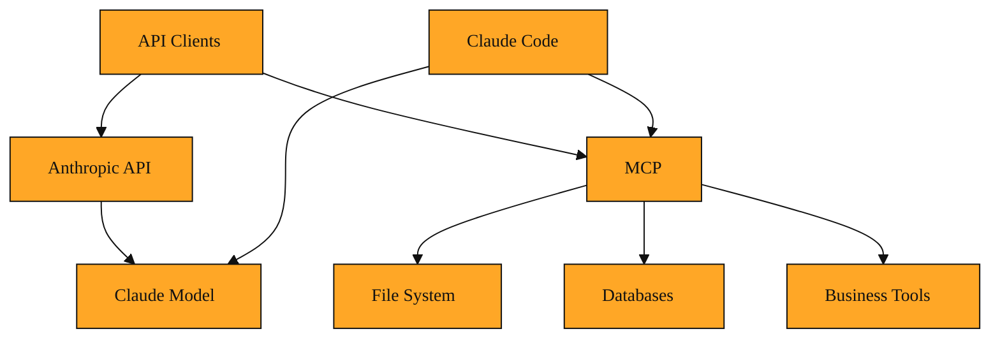

# Claude Code and Model Context Protocol

It's 3:00 PM. Your teammate asks you to rename a core utility across twelve files, run the test suite, and verify the last commit did not break the build. You open Claude in your browser and paste in the first few files. The suggestions look solid. Then you copy them back out by hand, run the tests, and paste the error log into the chat again. By the fourth round of copying and pasting, you realize the AI is giving you good advice, but it is still just advice. It cannot touch the files itself. It cannot run the commands. The busywork is still yours.

That gap between advice and action is exactly what Claude Code and the Model Context Protocol were built to close.

## Claude Code: your terminal becomes the workspace

Claude Code is a command-line tool from Anthropic that brings Claude directly into your terminal. Instead of working inside a browser tab, it works inside the same directory where your code already lives. You can ask it to read a file, suggest edits across multiple documents, run your test suite, or check your git history. It will do the work right there in your project folder.

Because it is built specifically for software engineering tasks, Claude Code is tuned for the messy details of real codebases. It can search through directories, understand dependencies between files, and execute shell commands. If the first edit breaks a test, it can read the failure, adjust the code, and try again, all without you copying text back and forth. Under the hood it draws on Anthropic's developer platform, and it uses capable models such as Claude Sonnet 4.6 or Claude Opus 4.8 to handle complex reasoning. You can find installation guidance and documentation through Anthropic's developer docs and platform.claude.com.

The shift is subtle but important. In the browser, Claude tells you what to do. In the terminal, Claude Code can just do it. It becomes a pair programmer who types in the same window you do.

## The protocol that gives Claude hands

But a text-generating model cannot run tests or query a database on its own. It needs a standard way to reach outside of itself and interact with external systems. That standard is the Model Context Protocol, or MCP.

A protocol is simply a shared set of rules that let two systems talk to each other. MCP is an open-sourced protocol that Anthropic released to let AI assistants connect to the systems where data actually lives. Think of it as a common language that lets Claude ask another program for information, or tell another program to take an action. Through MCP, Claude can reach into content repositories, business tools, and development environments. It turns Claude from a writer into a participant that can actually touch the tools around it.

Before MCP, connecting an AI to a new data source usually meant writing a custom integration from scratch. Every tool needed its own special connector, and those connectors were often brittle. MCP replaces those one-off connections with a single standard. Now, if a service speaks MCP, any AI client that understands the protocol can use it. The protocol is not locked inside Claude Code. You can also use MCP connectors directly through the Anthropic Messages API, pointing to remote MCP servers without building a separate client. That means MCP is a general layer of the ecosystem, not just a feature of one tool. You can explore the specification at modelcontextprotocol.io.

## How the tool and the wiring work together

Claude Code implements MCP to perform its work. When you ask Claude Code why a build is failing, it does not guess based on training data. It uses MCP to read your log files, inspect the relevant source code, and run diagnostic commands. The protocol is the wiring that carries the request from Claude to your file system, and the results back to Claude.

Imagine you are working on a web application and you need to know which database migrations have already run. You ask Claude Code. It uses MCP to query your local development database, reads the schema, and reports back. Without MCP, Claude would have no way to run that query. It would only be able to offer a generic explanation of how migrations usually work.

This partnership also means extensibility. If your company uses an internal bug tracker or a private documentation server, a developer can build an MCP server for that tool. Once that server exists, Claude Code can query it. Without MCP, integrating every new tool would require writing custom code for each connection. With MCP, you write the connector once, and any client that speaks the protocol, including Claude Code, can use it.

## Choosing the right layer for the job

You have now seen several ways to work with Claude, and each fits a different situation.

If you are building a product for end users and you need to manage every message and tool loop yourself, the Anthropic API is the right choice. It gives you full control over the conversation and the user interface. The trade-off is that you write the integration code and handle the infrastructure.

If you need a quick answer, a draft of an email, or help reasoning through a problem, the Claude web interface is fast and requires no setup. The trade-off is that you are the one moving information in and out of the chat.

If you are inside a codebase and you want the AI to handle file edits, test runs, and git operations without you writing any integration code, Claude Code is the better fit. It assumes you are comfortable in a terminal, but in return it handles the mechanical work of software engineering.

If you need Claude to talk to something custom, like your company's internal documentation system or a local database, you will need MCP. The trade-off is upfront setup. Someone has to configure or build the MCP server. But once that work is done, Claude gains abilities it simply did not have before. It can pull live data rather than relying on memory.

<InlineQuiz
  id="quiz-s4-l5-choosing-right-layer"
  question="You are in a terminal inside a git repository and need to refactor a utility across twelve files, run the test suite, and fix any failures without writing custom integration code. Which option is the best fit?"
  options='["Open the Claude web interface and paste files in and out manually","Build a custom client with the Anthropic API","Run Claude Code in the project directory","Deploy an MCP server to handle the file edits"]'
  correct="2"
  explanation="Claude Code is designed for exactly this terminal-based software engineering workflow; it edits files, runs tests, and iterates on failures without requiring you to write integration code. The web interface forces tedious manual copying and cannot execute commands. The Anthropic API is the right layer when you are building a product for end users, but it requires you to write and maintain the integration yourself. MCP is the wiring that enables external connections, not the tool you use directly for refactoring; Claude Code already implements that wiring."
  courseSlug="claude-for-developers-beginner"
  lessonSlug="05-claude-code-and-model-context-protocol"
/>

## The bigger picture

Think of Claude as the brain. The Anthropic API is the telephone line that lets your own applications call that brain. Claude Code is a workshop built around that brain, tuned for the messy work of real software projects. And MCP is the nervous system that lets the brain feel and move within the world around it, whether that world is your local file system, a remote database, or a custom business tool.

Over the course of these lessons, you have moved from understanding Claude as a conversational model, to calling it through an API, to seeing it act inside your development environment. The thread that connects it all is this shift from text to action. You now have a map of the landscape. Where you go next, whether that is writing your first API script or installing Claude Code in your terminal, is a matter of choosing the right tool for the job at hand.

*Figure: A conceptual map of the full Claude ecosystem, showing how MCP connects both Claude Code and API clients to external systems.*
