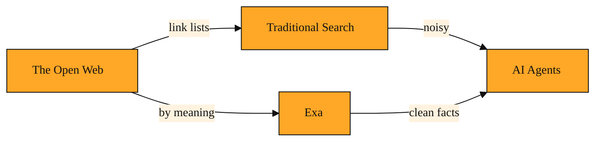

# Exa: A Search Engine Built for AI, Not Humans

Exa is a search engine built specifically for artificial intelligence. Google and Bing were designed for human eyes clicking through blue links. Exa was built so that AI applications can find, read, and use knowledge from the web directly.

If you are a developer building an AI agent, which is software that can take actions and make decisions on its own, you quickly hit a frustrating wall. Your AI might be excellent at reasoning, but it lives in a bubble. It does not know what happened yesterday. It cannot read the latest documentation, today's news, or a new research paper unless someone feeds it that information. The world keeps changing, but your AI is stuck with what it learned during training.

You might ask, why not just connect it to a normal search engine? The problem is that traditional search is built for a human workflow. It returns a ranked list of links. A human clicks, waits for the page to load, skims past ads and pop-ups, and reads the content. An AI does not click links. It cannot navigate a messy webpage full of navigation bars and cookie banners. It needs the actual information, cleaned up and ready to use.

Regular search results are also shaped by advertising, search-engine optimization tricks, and pages designed to keep human readers scrolling. That noise is a terrible fit for an AI that just wants a straight, factual answer. Exa exists to solve exactly this gap. It sits between the open web and your AI, acting as a bridge. Developers, researchers, and product teams use it when they want their applications to have live web knowledge without forcing their AI to wade through interfaces made for humans. Instead of giving your agent a page of links and hoping for the best, Exa gives it knowledge it can actually work with.

In the modern developer ecosystem, you already have language models, which are the AI systems that power text understanding and generation. You also have the entire web, which holds nearly everything humanity knows. Exa is the connective tissue between these two pieces. It makes the web accessible to machines in a way that generic search never could.

## How Exa understands the web

The big difference is that Exa searches by meaning, not just by matching keywords.

Most search engines look for the exact words you type. If you search for "jaguar," you might get results about the animal or the car. The search engine guesses based on the other words on the page. Exa uses something called embeddings. Think of an embedding as a map coordinate for meaning. Every webpage gets plotted on this map based on what it is actually about. When you ask Exa a question, it navigates this map to find pages that are conceptually close to what you meant, even if they use completely different words.

This meaning-based approach is especially important for AI agents because they often think in concepts, not just keywords. An agent trying to learn about keeping plants alive indoors should find articles about watering schedules and sunlight needs, even if those pages never use the exact phrase the agent asked about. The agent does not need a list of links. It needs sources that share the same idea.

Exa also offers a find-similar capability. You can hand it one good webpage, and it will roam the web to find other pages that mean similar things. This is powerful when you have one perfect source and want more like it.

<InlineQuiz
  id="quiz-s1-l1-meaning-based-search"
  question="Why does Exa use meaning-based search instead of traditional keyword matching?"
  options='["Because AI agents think in concepts and need sources that match an idea even when the words differ.","Because keyword search returns results too slowly for AI software to handle.","Because AI agents cannot read webpages that contain ads or navigation menus.","Because keyword matching cannot keep up with all the new pages published every day."]'
  correct="0"
  explanation="The lesson explains that AI agents reason in concepts rather than exact phrases, so Exa uses meaning-based search to find pages that share the same idea even when they use completely different words. Speed is not the issue, traditional search is actually fast at returning links. The inability to read messy pages is a separate problem solved by delivering clean content, not by the search method itself. And keyword matching can index new pages, it just fails to understand what the agent conceptually means."
  courseSlug="exa-a-beginner-s-guide-to-search-api-beginner"
  lessonSlug="01-exa-a-search-engine-built-for-ai-not-humans"
/>

## A research assistant that actually reads

Imagine you are building a research assistant for a team. A user drops a link to a blog post about a new way to manage remote teams, then asks, "Find me more thinking like this from the past year."

With a traditional search engine, you would get a list of links that happen to contain the words "remote" and "teams." Your AI would then have to visit each page, strip away the navigation menus and cookie banners, and guess whether the article is actually related. Most of those links would be noise. Some would be product pages. Others would be outdated tutorials. Your agent would waste time sorting through junk.

With Exa, you pass that blog post link to the find-similar feature. Exa reads the meaning of the post. It searches the live web and returns pages that are conceptually similar, even if they never use the same phrases. Your AI receives focused, relevant sources it can trust to build a real answer. The web stops being a pile of links and starts being a library your AI can actually read.

## The big picture

*Figure: How Exa fits between the open web and AI agents as a clean semantic bridge, compared to the traditional search path.*

Think of Exa as a research librarian who has read every book in the building. When your AI needs to know something, this librarian does not just point at the card catalog. It understands your request, finds the right material, and hands over the knowledge in a form your agent can use immediately. It turns the noisy, human-centric web into a structured knowledge source for machines.

In the next lesson, we will look at how Exa does not stop at finding the right pages. It can also pull out the exact sentences your AI needs, and deliver clean article text without the clutter. We will explore Highlights and the contents feature, which save your agent from having to read entire webpages just to find one fact.

---
[Next →](./02-highlights-teaching-your-ai-to-skim.md) · [Course home](./README.md)
