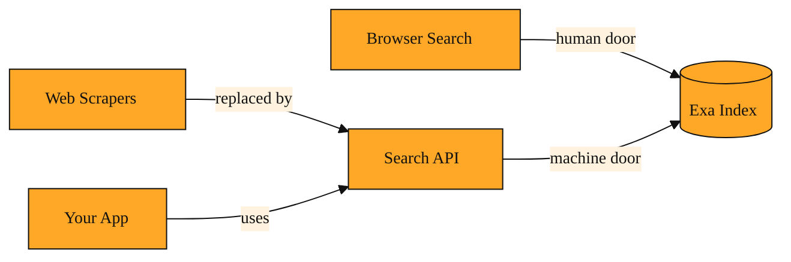

# The Search API: Your App's Direct Line to Answers

## Why this exists

You already know what it is like to search the web as a person. You open a browser, type a thought like "latest developments in LLMs," and a page of links appears. The results are built for your eyes. They have titles, descriptions, and rankings that make sense to a human reader.

Software cannot use a browser the way you do. A research bot, a homework app, or an automated news tracker does not have eyes. It cannot click, scroll, or copy links by hand. Yet these tools still need to find things on the web. They need to ask questions and get answers back in a format they can act on immediately.

In the past, developers solved this by writing fragile programs called scrapers. A scraper is a small program that tries to read human search pages automatically. Those scrapers broke whenever a layout changed. They also returned messy page-building code full of ads and formatting that a machine could not easily understand. There was no reliable way for a program to simply say, "Find me recent research papers on neural networks," and receive a clean list it could trust.

The Search API was built to solve exactly this problem. API stands for Application Programming Interface. That sounds complex, but the idea is simple. An API is just a doorway that lets one program ask another program for information. The Search API is the machine-friendly version of the search box. It lets any application send a plain-language question to Exa and receive structured, readable results back. No browser required. No copy and paste. Just a direct question from your code to the search engine.

## Understanding the idea

Picture the Search API as a messenger carrying notes between your application and Exa's search index. A search index is the giant catalog of web pages that Exa has read and understood.

When you search by hand, you are the messenger. You think of a question, you type it, and you read the results yourself. When your software uses the Search API, your code becomes the messenger. It writes a note in everyday language, such as "blog post about artificial intelligence," and sends it across the internet to Exa. Exa receives that note, understands its meaning using the same semantic approach you learned about earlier, and finds the best matches on the web. Then it packages those matches into a clean response and sends it back to your program.

Your code does not have to read and pick apart a visual webpage or guess which parts are ads. It receives a straightforward list of results. Each result comes with details your program can read, like a title and a web address. You can also include simple limits in your request, such as asking Exa to look only at news sites or to avoid certain websites. But the core transaction never changes. Your software asks a human-style question, and the API delivers a machine-friendly answer.

<InlineQuiz
  id="quiz-s2-l4-search-api-purpose"
  question="Your application needs to find recent articles about renewable energy and use the results immediately in its own code. What does the Search API provide that makes this possible?"
  options='["It lets your code send a plain-language question and receive back a structured list of results it can read and use directly.","It opens a visual browser window inside your program so the software can view and click web pages like a human does.","It builds and runs scraper programs that read human search result pages for your application automatically.","It translates your code into a human-style browser request so the search engine thinks a person is typing the query."]'
  correct="0"
  explanation="The Search API acts as a messenger that carries a plain-language question from your application to Exa and returns structured results your code can use immediately. Your program does not need a browser or eyes, which is why the second option is wrong. The third option is wrong because scrapers are the fragile approach the API replaces, not something it builds for you. The fourth option is wrong because the API does not disguise your code as a human browser request; it gives your program its own direct doorway to the search index."
  courseSlug="exa-a-beginner-s-guide-to-search-api-beginner"
  lessonSlug="04-the-search-api-your-app-s-direct-line-to-answers"
/>

## A simple example

Imagine you are building a morning briefing tool for teachers. Every day before class, the tool needs to find one fresh article about classroom technology. It cannot rely on links that were relevant last month. It needs to ask a new question every morning.

At six a.m., your code wakes up and sends a request to the Search API. It asks for "new classroom technology ideas for high school teachers." It adds a preference for educational blogs. The API receives the question, searches the current web, and returns a short list of the most relevant pages from the last few days. Your code picks the top result, formats it into a friendly email, and sends it to the teacher. The teacher sees a clean recommendation with a link. They never know that a piece of software asked the question, waited for an answer, and prepared the note while they were still asleep.

Without the Search API, you would have to type websites in by hand or maintain your own system for scanning the entire web. With it, your tool can behave like a curious assistant that reads the web every morning on its own.

## How to think about it

The Search API is how you move Exa's search power from the browser into your own applications. You already understand that Exa reads meaning rather than matching exact keywords. The Search API simply opens that same ability to any program, app, or service you write. You phrase the question in plain English. Your code sends it to Exa. Exa finds what matters and hands back a structured list your program can use right away. It is the bridge between a human question and a machine action.

*Figure: How the Search API fits in: it replaces fragile scrapers and opens the same Exa index to your code.*

## Where you'll see this next

Finding the right pages is a strong start. But often your application needs more than a list of links. It needs the actual text inside those pages, a summary of what they say, or specific facts pulled from the body of the article. The next step is learning how to retrieve and work with the contents of those search results. That is where we will turn our attention in the final lesson.

---
[← Previous](./03-mcp-the-reason-your-ai-can-ask-exa-for-help.md) · [Next →](./05-contents-api-reading-the-web-without-the-clutter.md) · [Course home](./README.md)
