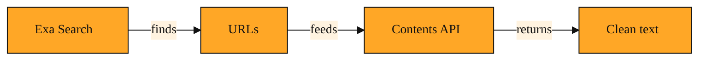

# Contents API: Reading the Web Without the Clutter

## The morning standup problem

Your team lead messages you at nine forty-five. She needs a summary of three competitor announcements by the ten o'clock meeting. You found the exact press releases yesterday using Exa Search, and the URLs sit in your notes. But now you have fifteen minutes. Opening each link means waiting for hero banners to load, dismissing cookie consent screens, and scrolling past video autoplay. You need the actual words, not the website experience. Copying text by hand would leave you with broken formatting and missing sentences. There has to be a cleaner way to turn those links into facts.

This is the exact moment the Contents API was built for.

## What it actually is

The Contents API is an Exa endpoint you reach through a call like exa.getContents() or a simple POST /contents request. Its job is straightforward. You send it a list of URLs you already have. It fetches the pages, removes the noise, and returns the actual content in a clean format.

Think of it as hiring a meticulous assistant to visit specific articles for you. The assistant walks past the billboards, navigation menus, and newsletter popups. They copy down the article text and note the title, author, and publish date. You get back a tidy package while the original page stays as cluttered as ever.

You can ask for the content in different amounts depending on your goal. Text mode delivers the full page as clean markdown, useful when you need complete context. Highlights mode pulls out the most relevant passages, which saves time when you only need key facts and want a shorter read. Summary mode generates a brief abstract of the entire page, ideal for quickly deciding if a long article is worth your attention. You simply pick the form that matches the job at hand.

<InlineQuiz
  id="quiz-s2-l5-contents-api-purpose"
  question="You have a list of URLs and need the actual information from those pages. Why does the Contents API exist?"
  options='["To find new web pages when you do not know where to look","To turn URLs you already have into clean readable text","To merge several articles into one combined summary","To remove clutter from the original websites permanently"]'
  correct="1"
  explanation="The Contents API is built for the moment when you already know where to look and simply need the text without the noise. It fetches the pages you specify and returns the content in a clean format. It does not search for new pages, combine multiple sources into a single report, or change the original websites. Search handles discovery, while Contents handles reading."
  courseSlug="exa-a-beginner-s-guide-to-search-api-beginner"
  lessonSlug="05-contents-api-reading-the-web-without-the-clutter"
/>

## A simple example

Picture a student writing a paper on renewable energy. Earlier in the week they used Exa Search to collect five articles about offshore wind. Now they need direct quotes and hard data to support their argument.

They send those five URLs to the Contents API and ask for Highlights. Back comes a list of key excerpts from each source. One passage notes a new turbine capacity record. Another quotes an engineer about winter maintenance costs. A third article is a forty-page industry whitepaper. The student does not want to read forty pages blindly, so they request a Summary for that URL. The abstract tells them the paper focuses on grid integration, which is not relevant. They skip it. For the two most promising articles, they request full Text. Within minutes they have clean, readable documents to cite, without ever battling a paywall or comment section.

## How to think about it

The Contents API is the second half of the research loop. Search finds the needles in the haystack. This tool lets you hold the needles without the hay. You use it whenever you already know where to look and simply need what is written there.

In practice, you will almost always see it paired with search results. You search, you collect URLs, and you immediately feed those addresses into the Contents API to make them readable. Where Search answers the question "what is out there," Contents answers "what does it actually say." That distinction keeps your workflow focused. You are not browsing the web. You are extracting knowledge from it.

*Figure: The research loop: Exa Search finds the URLs, then Contents API turns them into clean, readable text.*

## Bringing it all together

Across these five lessons, the full picture has built itself piece by piece. You started with the idea that Exa searches the web by understanding meaning rather than just matching keywords. You learned how it finds pages that truly fit your intent, even when your words are imprecise. You explored how results are ranked and filtered so the best candidates rise to the top. Now you have seen how to read those candidates without touching the mess of the modern web.

That is the complete arc. First Exa finds what matters in the noise. Then it hands you the content in a form you can actually use. Search and content work as two halves of the same habit. You locate the right doors, and then you walk through them cleanly.

With both in hand, the sprawling, chaotic web becomes a library you can navigate with confidence. You are no longer clicking and hoping. You are asking, finding, and reading with purpose. That is what Exa makes possible.

---
[← Previous](./04-the-search-api-your-app-s-direct-line-to-answers.md) · [Course home](./README.md)
