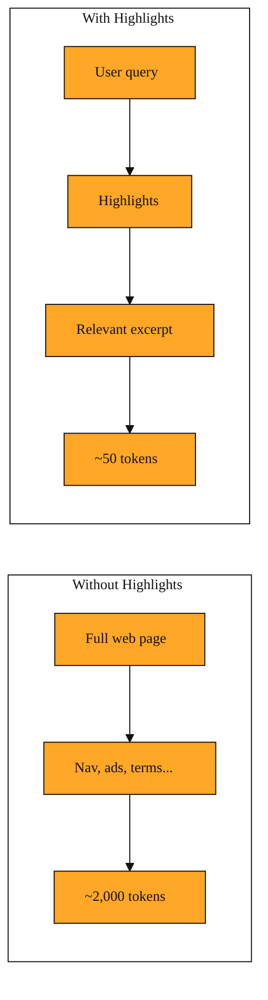

# Highlights: Teaching Your AI to Skim

In the last lesson, you saw how Exa can find the right pages on the web. Finding the page is only the first step. Once your AI has the address, it still has to read what is on the other side. That is where things get messy.

Most web pages are noisy. They contain navigation bars, cookie banners, sidebars, advertisements, and long introductions before they ever get to the point. If you feed the entire page into an AI, you burn through tokens. Tokens are the small chunks of text that models count like currency. You end up paying for words that have nothing to do with the question you asked. Tokens add up quickly. A single long article can cost thousands of them. When an AI has a strict budget for how much it can read at once, wasting tokens on navigation menus means less room for actual facts.

The AI gets slower, more confused, and sometimes misses the answer entirely because it is buried on page three of a blog post.

For an assistant that needs to check fifty pages to plan a trip or research a topic, reading everything is like drinking from a fire hose. It does not need the author's life story, the comment section, or the footer links. It needs a fact. There had to be a way to get only the relevant parts without downloading the entire digital clutter of the modern web.

## How Highlights works

Highlights is an option that tells Exa to read a page for you and return only the passages relevant to your query. You can think of it as handing a highlighter to a very fast research assistant. You ask, "Does this hotel allow pets?" The assistant opens the page, ignores the photos, the banner ads, and the chef's biography. It marks only the sentence that says, "Dogs under 25 pounds are welcome in select rooms for a fifty-dollar fee."

This happens after Exa has already pointed you to the right web address. You simply ask for Highlights when you retrieve the content. Exa uses your original question to decide which sentences are worth keeping. The result uses roughly ten times fewer tokens than the full page. That makes it perfect for quick factual lookups.

Because the excerpt comes straight from the source, you can trust the wording. You do not get a summary that might drift from the original meaning. You get the exact sentence as it appeared on the page, trimmed to fit your question. The AI is not making things up. It is simply reading faster and staying focused on your question.

## A trip to the hotel policy page

Imagine you are building a travel assistant. A user asks, "Can I bring my dog to the Seaside Inn?"

Your assistant searches the web and finds the hotel's official policy page. Without Highlights, it retrieves the entire page. It wades through the navigation menu, the photo gallery captions, the restaurant hours, the full terms and conditions, and finally, halfway down, a note about pets. That is two thousand words to find one fact. It might even hit a token limit before it reaches the answer.

With Highlights, the assistant asks Exa to return only the relevant excerpts from that same address. What comes back is a single paragraph: "We welcome dogs under 25 pounds in designated pet-friendly rooms. A non-refundable cleaning fee of $50 applies." That is it. The assistant gets its answer immediately, uses fewer tokens, and moves on to the next question.

This is the difference between memorizing a textbook and skimming it for a single fact. Highlights gives your AI the ability to skim.

You can now think of Exa as doing two distinct jobs in order. First, it finds the right needle in the haystack. That is the search you learned about before. Then, if you only need to know what the needle says, Highlights pulls out just that thread instead of handing you the whole bale of hay. You reach for Highlights whenever your assistant needs a fact, a quote, or a specific detail. You reach for full content only when you need the broader context.

Soon, you will see how these assistants plug tools like this into their own reasoning. The next lesson covers a simple standard that lets an AI discover and use outside help without requiring custom setup for every single service. Highlights is exactly the kind of focused, efficient output that makes such connections worthwhile.

*Figure: A side-by-side look at retrieving a full noisy page versus using Highlights to pull only the relevant excerpt.*

<InlineQuiz
  id="quiz-s2-l2-highlights-purpose"
  question="Your assistant already has the official specs page for a laptop and only needs to know if the keyboard is backlit. What should it do next?"
  options='["Retrieve the full page so the AI can read every spec to avoid missing context.","Ask for Highlights to pull only the passages about the keyboard from that known page.","Use Highlights to search the web and discover the official specs page.","Request a summary of the entire page so the AI can paraphrase the specs."]'
  correct="1"
  explanation="Highlights is meant to extract specific relevant excerpts from a page you already have, not to search for pages or rewrite content. Since the assistant already knows the address and only needs one fact, Highlights saves tokens by skipping navigation and unrelated specs. Retrieving the full page wastes tokens on information you do not need, using Highlights to search confuses it with the earlier search step, and a summary would paraphrase rather than give the exact trustworthy wording."
  courseSlug="exa-a-beginner-s-guide-to-search-api-beginner"
  lessonSlug="02-highlights-teaching-your-ai-to-skim"
/>
