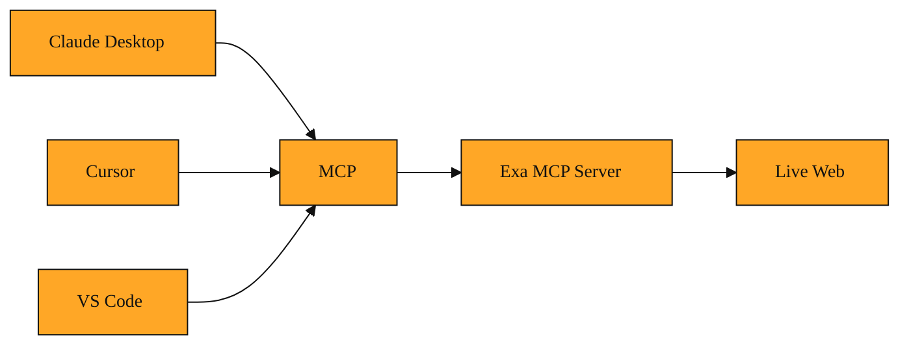

# MCP: The Reason Your AI Can Ask Exa for Help

## Why this exists

Have you ever wished your AI assistant could just Google something for you?

You are deep in a coding session. You ask Claude Desktop or Cursor about a new error. It gives you a confident answer, but you suspect the information is outdated. So you stop. You open a browser. You search Exa. You find three fresh articles. You copy the links. You paste them back into the chat. Only then does the assistant give you something useful.

You have become the human copy-paste bridge between your AI and the live web. This breaks your focus. It wastes time. Every time you context-switch, you lose the thread of your original problem. The assistant should fetch the context, not the other way around.

This happens because most AI assistants are brilliant but isolated. They know what they learned during training. They cannot reach outside their own window to check today's documentation or yesterday's release notes.

Connecting them to outside tools used to mean custom code for every pair of assistant and service. That is like needing a different charging cable for every single device in your home. It does not scale. The developer experience is terrible.

Something needed to sit in the middle. Not another fragile adapter, but a single standard that everyone could agree on.

## Understanding the idea

That standard is called MCP, or Model Context Protocol.

Think of MCP as a universal translator and a common wall outlet combined. Before MCP existed, every AI assistant spoke its own dialect. Every external tool listened on a different frequency. If you wanted Claude, Cursor, or VS Code's built-in assistant to talk to Exa, someone had to build a special bridge for each combination.

MCP creates one shared language. Any assistant that speaks MCP can plug into any service that speaks MCP. No custom wiring required. You can connect Claude Desktop, Cursor, VS Code, and many other assistants to the same Exa MCP Server without learning a different setup for each one.

In our context, Exa runs something called the Exa MCP Server. It lives at `https://mcp.exa.ai/mcp`. This server acts as a calm middleman. When your assistant needs fresh web data, it sends a request in standard MCP language. The Exa MCP Server hears that request, performs the search, and returns the results in the same standard language. Your assistant understands the answer immediately because it already knows the protocol.

It is not magic. It is simply an open agreement about how to ask questions and how to format answers. Because the protocol is open and reusable, the connection is stable. You are not relying on a hidden hack. You are using a public standard that connects AI assistants to Exa's search power.

*Figure: MCP acts as a shared language that lets any compatible assistant ask Exa for live web data through a single standard connection.*

<InlineQuiz
  id="quiz-s2-l3-mcp-core-concept"
  question="What is MCP at its core?"
  options='["A database that downloads the entire web so assistants can answer without searching.","An open standard that acts like a universal language between AI assistants and external tools.","A speed upgrade that makes AI assistants generate text faster.","A content filter that removes outdated search results before the assistant sees them."]'
  correct="1"
  explanation="MCP is fundamentally an open agreement and shared language between assistants and tools. The Exa MCP Server speaks it, Claude speaks it, Cursor speaks it, so they can all connect through the same standard without custom cables for every pair. It does not store the whole web locally, it does not make the assistant think faster, and it does not judge which pages are fresh or stale. It simply gives the assistant a safe, standard way to ask Exa for live data when it needs to."
  courseSlug="exa-a-beginner-s-guide-to-search-api-beginner"
  lessonSlug="03-mcp-the-reason-your-ai-can-ask-exa-for-help"
/>

## A simple example

Meet Sam. She is a junior developer working in Cursor on a React project. Her build fails with an error about a hook she has used a hundred times before. She asks the AI assistant inside Cursor why it is breaking.

The assistant was trained months ago. It does not know that the library maintainers deprecated that hook last week. In the old world, Sam would sigh, switch to her browser, search Exa for the changelog, copy the relevant link, and paste it back into her editor. Then she could get help.

But Sam's team connected Cursor to the Exa MCP Server. So when she asks about the error, the assistant itself reaches out to Exa through the MCP connection. It searches the live web. It finds the official deprecation notice published five days ago. It reads the recommended replacement. Then it turns back to Sam inside the same chat and says, "That hook was deprecated last week. Use this new pattern instead." The assistant even highlights the exact line in Sam's code that needs to change.

Sam never left her editor. She never copied a single URL. The assistant did the research for her because MCP gave it a safe, standard way to ask Exa for help.

## How to think about it

MCP is the polite handshake that lets two strangers cooperate without confusion. It turns your AI assistant from a closed encyclopedia into a curious teammate that can look things up when it needs to. You do not need to be a protocol engineer to benefit from it. You only need to remember that when an assistant is linked to Exa via MCP, it gains the ability to query the live web in real time. It replaces a tangled drawer of custom cables with one standard connection that simply works.

## Where you'll see this next

Now you can see the bridge. MCP is how your assistant gets permission and language to talk to Exa. But once that bridge is open, another question naturally arises. What actually happens on the Exa side when the assistant asks a question? How does Exa find the answer out on the web? That power lives in the Search API. That is where we will head next.
