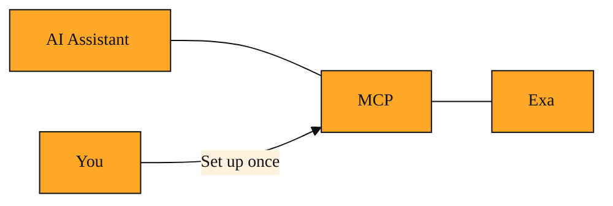

# MCP: Giving Your AI a Direct Line to Exa

Why can't my AI assistant just search the web for me?

You have seen it write poems, explain homework, and sound like it knows everything. Ask what happened at last night's awards show, and it pauses. It apologizes. Its knowledge has a cutoff date.

You already know Exa can search the live web. You already know your assistant is helpful. So why are they not already talking to each other?

Right now, they cannot, because they do not speak the same language. Your assistant lives in its chat window. Exa lives on the web. They are like two neighbors who have never been introduced.

Without a bridge between them, you are the messenger. You open Exa in a browser, run the search, copy the results, paste them back into the chat, and only then can the assistant use those facts. Every time you need current information, your flow breaks. You leave the conversation, gather the facts yourself, and return. It is like having a brilliant friend who is locked in a room with no windows. You have to run outside, read the news, and bring it back to them. That constant context switching is exactly the friction MCP was built to remove.

## Understanding the idea

MCP stands for Model Context Protocol. Let us break that down.

A model is your AI assistant. Context is the background information it needs to give you a useful answer. A protocol is simply a shared rulebook that two systems agree to follow so they can talk to each other.

Think of MCP as a phone line installed between your assistant and Exa. Both sides agree on the same rulebook. The assistant can say, "I need current information about X." Exa hears that request, performs the search, and hands the results back in a format the assistant understands immediately. The assistant does not need to learn how Exa works. Exa does not need to know which assistant is calling. They only need to trust the shared rulebook sitting between them.

You set up this connection once. After that, the assistant does not need you to copy and paste anything. It can reach out to Exa on its own, grab live context, and keep working. From the assistant's point of view, it has simply gained a new skill. From your point of view, the conversation never stops.

*Figure: MCP sits between your AI and Exa as a shared bridge, translating requests and results so both sides can trust the same rulebook.*

<InlineQuiz
  id="quiz-s1-l3-mcp-core-purpose"
  question="What is the main problem MCP was built to solve?"
  options='["It updates the AI’s training data so it knows facts beyond its original knowledge cutoff.","It creates a shared rulebook that lets the AI ask Exa for live web results automatically.","It teaches Exa to recognize every different AI assistant so they can communicate.","It replaces Exa with a built-in search engine inside the AI assistant."]'
  correct="1"
  explanation="MCP is a shared protocol, like a phone line or bridge, that lets your AI and Exa talk to each other directly so you do not have to copy and paste search results yourself. Option A is tempting because the AI does get fresher answers, but MCP does not retrain the model; it fetches live context on demand. Option C is wrong because Exa never needs to learn about individual assistants; both sides only need to trust the shared rulebook. Option D is wrong because MCP connects the AI to Exa rather than replacing Exa."
  courseSlug="exa-a-beginner-s-guide-to-search-api-beginner"
  lessonSlug="03-mcp-giving-your-ai-a-direct-line-to-exa"
/>

## A simple example

Imagine you are planning dinner and ask your assistant, "Is the new Thai restaurant on Main Street open tonight?"

Without MCP, the assistant searches its memory. It finds a news article from two months ago announcing the grand opening. It cannot tell you if the restaurant posted on its website this afternoon that the kitchen is closed for repairs. You would have to open Exa yourself, search for the restaurant's latest update, and feed that information back into the chat before the assistant could help.

With MCP connected to Exa, the workflow changes entirely. The assistant recognizes that this question needs fresh facts. It sends a request through the MCP bridge. Exa searches the current web, finds today's post on the restaurant's page, and delivers it back. The assistant reads that result and tells you, "They posted at four o'clock that they are closed until Friday." You get an answer grounded in right-now reality instead of last-month memory.

You did not open a browser. You did not run a separate search. The assistant simply picked up the phone and called Exa for you.

## How to think about it

MCP turns Exa from a separate tool you visit into a skill your assistant can use. You already know that Exa finds things on the web. Now you can picture MCP as the polite handshake that lets your AI ask Exa to do that searching automatically. When your assistant suddenly seems less forgetful and more up to date, MCP is usually the reason why. You can think of it as the wiring that makes Exa part of the assistant's world rather than a destination you have to visit on your own.

## Where you will see this next

Now that you understand how MCP opens a line of communication between your assistant and Exa, a natural question follows. What exactly is the assistant asking Exa to do? How does Exa know what to look for, and what does it send back? That is exactly where we are headed next.

---
[← Previous](./02-highlights-reading-only-what-you-came-for.md) · [Next →](./04-search-api-letting-your-code-ask-the-web-questions.md) · [Course home](./README.md)
