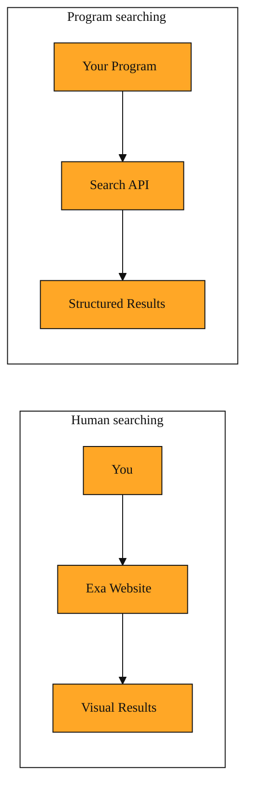

# Search API: Letting Your Code Ask the Web Questions

## Why this exists

You already know how to search the web. You open a browser, type what you want, and read the results. But what happens when a computer program needs to do the same thing? A piece of software cannot click a mouse, read a screen, or decide which blue link looks promising. Without a structured way to search, a program is stuck. It can only use information that someone already typed into a spreadsheet or hard-coded into a file.

Developers sometimes try to work around this by making a program pretend to be a human browser. That approach is fragile, slow, and usually breaks the rules of the website being scraped. There needed to be a cleaner path. The Search API is that path. It gives your code a sanctioned way to ask Exa for web pages using natural language, and get back a clean, organized answer that a machine can use. Instead of a human reading a list of links, your application receives the results directly. It can then summarize them, store them, or pass them along to another part of your project. The Search API bridges the gap between human curiosity and machine action.

## Understanding the idea

Think of the Search API as a search box that accepts messages from software instead of fingers. Your program sends a plain English question across the internet to Exa. The question is called a query. It might be something like "latest developments in LLMs" or "blog post about artificial intelligence." Because Exa understands meaning rather than just matching keywords, you can phrase the query the same way you would ask a friend.

The key difference between using Exa on a website and using the Search API is who is doing the asking. On the website, you are the user. Through the API, your application is the user. The results come back in a tidy package, usually a list of links with titles and short descriptions. The response is designed for machines, not human eyes. Each result sits in a simple slot that your code can read directly. It never has to untangle a complicated page or guess where the title and link are hiding. Your program knows exactly where to find each piece of information because it arrives in a predictable layout.

You can also add simple instructions to narrow things down. For example, you can tell Exa to look only inside certain websites, or to skip web addresses you do not trust. You can also focus on a particular kind of content, such as news, research papers, company pages, or personal sites. These extra instructions travel right alongside your query, so the search stays focused without your code having to filter through junk later.

*Figure: Human and program searches side by side: both ask Exa questions, but the API returns structured data your code can read directly.*

<InlineQuiz
  id="quiz-s2-l4-search-api-concept"
  question="What changes when a program uses the Search API instead of a human searching on the Exa website?"
  options='["The program receives structured data with titles and links in a predictable format, while the human gets a visual page to read.","The program must write queries in a special technical language rather than plain conversational English.","The API returns the complete text of every article so the program never needs to visit the links.","The program must open a hidden browser window and read the page visually like a human user."]'
  correct="0"
  explanation="The correct answer is that the program receives structured data while the human gets a visual page, because the lesson describes the API response as a tidy package with a predictable layout designed for machines rather than human eyes. The second option is wrong because the API accepts plain English queries just like the website, not a special technical language. The third option is wrong because the Search API returns links and short descriptions, not full article text, which is why the next lesson covers retrieving page contents. The fourth option describes web scraping, which the lesson says is fragile and breaks website rules, whereas the API offers a sanctioned path for code to search."
  courseSlug="exa-a-beginner-s-guide-to-search-api-beginner"
  lessonSlug="04-search-api-letting-your-code-ask-the-web-questions"
/>

## A simple example

Imagine you are building a small research assistant for a group of students. Every week, the students need five recent articles about renewable energy. You could bookmark pages yourself and email them around, but you want the program to do this automatically.

Each Monday morning, your program sends its query to the Search API. The query says "recent renewable energy breakthroughs." It also asks Exa to focus only on news sources, and to skip a few sites that are always behind paywalls. Exa receives the message, searches the web, and returns a handful of the most relevant news articles. Instead of a visual web page full of ads and navigation menus, your program gets a neat package containing headlines, links, and brief descriptions. Your program takes those results and drops them into a shared document. The students never touch a search box. The program handled the entire conversation with the web.

That is the Search API in action. It does not open a browser on your screen. It simply lets your software ask a question and receive a curated list of answers it can act on immediately.

## How to think about it

The Search API is best understood as a remote research assistant for your code. You already know that Exa finds things on the web by meaning rather than exact keyword matching. The API opens that same ability to any application you write. Whenever your project needs fresh, outside information and you do not want to copy and paste links by hand, this is the tool you reach for. It turns a human task, browsing the web, into a single step inside your program. You would use it whenever your application first needs to discover what is out there before it can analyze, summarize, or present anything.

## Where you'll see this next

Right now, your program knows where the good pages live. It has links, titles, and short snippets. But knowing the address of a page is not the same as knowing what is inside it. What if your code needs the actual text of the article, not just the link? That requires going one level deeper. In the next lesson, we will look at how to retrieve the full contents of those pages so your application can read and work with the text itself.

---
[← Previous](./03-mcp-giving-your-ai-a-direct-line-to-exa.md) · [Next →](./05-contents-api-reading-the-web-without-the-mess.md) · [Course home](./README.md)
