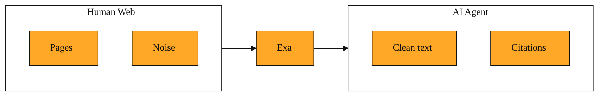

# Exa: The Search Engine Built for AI Agents

If you ask an AI app about something that happened yesterday, it probably will not know. Most AI models learn from old data. They cannot browse the web on their own. To fix this, developers usually give their AI a search tool. But there is a mismatch. The search engines we use every day were built for humans, not for machines.

When you search the web, you get a page of links. You read the titles. You click. You read the article. The engine is built for that journey. It shows ads and snippets meant for human eyes. For an AI, those ten blue links are nearly useless. An AI agent is simply a program that thinks and acts on its own. It cannot click. It needs the actual information. It needs to understand ideas, not just match exact words. And it needs that information delivered in a clean, compact way it can process.

This is why Exa exists.

Exa is a search engine built specifically for AI applications and agents. It does not try to keep visitors on a homepage. Instead, it fetches and organizes web knowledge so another program can read it, reason about it, and cite it. Think of it as a research layer that sits between the noisy open web and your AI.

In the modern software world, AI agents are moving from chatbots that only know their training data to systems that can act on live information. Exa is the infrastructure that gives them that live information. It is not a website you visit with a browser. It is a tool that developers plug into their agents, just like they might plug in a database or a payment service.

Why not just use generic web search? A traditional search tool usually gives you a link, a title, and a short blurb. If you are building an agent, you then have to write extra code to visit those pages, strip out ads and menus, and figure out which parts matter. That is slow and brittle. Exa skips much of that pain by understanding the meaning of a question and returning clean results an AI can read immediately. It can even take a web address you already trust and find other pages that talk about the same ideas, even if they use completely different words.

## Understanding the idea

At its heart, Exa is about meaning. Traditional search looks for the exact words you typed. If you search for "tips for leading a remote startup," a keyword engine hunts for pages containing those exact words. Exa can do that too, but its special power is that it grasps the idea behind your words. It finds pages that are about the same topic, even when the vocabulary differs.

Imagine you want arguments against open-plan offices. A meaning-based search might surface an essay titled "Why programmers need quiet caves to think." That essay never says "open-plan offices," but it is clearly about the same topic. Exa makes that connection because it reads the meaning of pages, not just their text. It knows that "quiet caves" and "open-plan offices" live on opposite ends of the same idea.

<InlineQuiz
  id="quiz-s1-l1-meaning-based-search"
  question="Why can Exa find an essay about quiet caves when you search for arguments against open-plan offices, even if that essay never uses the words open-plan offices?"
  options='["Because Exa hunts for exact keywords and treats quiet caves as a direct synonym for open-plan offices","Because Exa grasps the meaning and ideas behind words rather than only matching exact text","Because Exa employs human reviewers to read pages and assign topic labels before returning results","Because Exa only searches a small set of pre-approved websites where topics have been manually categorized"]'
  correct="1"
  explanation="Exa is built around meaning-based search. It understands the underlying ideas on a page, so it can connect related concepts even when the vocabulary differs entirely. Option A is a tempting misconception because it assumes meaning search is just better keyword matching, but Exa connects ideas rather than swapping words. Option C is wrong because Exa is an automated service for AI agents, not a human-curated system. Option D is wrong because Exa searches the open web rather than a limited hand-picked list of sites."
  courseSlug="exa-a-beginner-s-guide-to-search-api-beginner"
  lessonSlug="01-exa-the-search-engine-built-for-ai-agents"
/>

## A simple example

Imagine you are building an AI research assistant. A user asks, "What are the latest practical lessons from small companies that switched to four-day workweeks?"

With a traditional search tool, you might get ten links with short blurbs. Your AI would then need to visit each page, wade through cookie banners and navigation menus, and guess which paragraphs matter. Many pages would be cluttered with ads and pop-ups. Your AI would waste effort sorting through noise. It is like sending someone to a library and only giving them the card catalog.

With Exa, your application sends the question exactly as the user asked it. Exa searches by meaning, not just by the phrase "four-day workweek." It finds blog posts, podcast transcripts, and industry reports that discuss shorter schedules, compressed hours, and three-day weekends, even if they never use the exact term. It returns clean text and citations. Your AI can immediately synthesize an answer. The user gets a solid, sourced response. You do not have to build tools that pull text from each page yourself. Exa handles the messy work.

## How to think about it

Exa is best understood as a translator between the messy, human-facing web and the structured mind of an AI. When your application needs to know something that happened after its training data was cut off, Exa goes and fetches that knowledge in a form the AI can actually digest. Instead of forcing your AI to browse like a human, you let Exa do the browsing and deliver just the meaning. You will encounter it whenever you are building agents that research, summarize, or enrich data from live sources. It is not a website for humans to browse. It is infrastructure for builders who want their software to understand the world as it is right now.

*Figure: Exa sits between the messy human web and your AI, delivering clean meaning instead of links.*

## Where you will see this next

Now that you see how Exa finds the right knowledge, the next question is how much of that knowledge your AI actually needs to read. In the coming lesson, we will look at how Exa lets you pull just the key excerpts from a page, or the full article text, so your agent can stay fast and focused without drowning in words.
