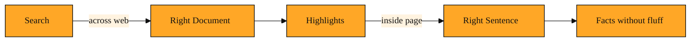

# Highlights: Reading Only What You Came For

## Why this exists

Highlights is a way to pull only the relevant sentences from a web page instead of fetching the entire thing. That sounds simple, but it exists because the alternative is genuinely painful. Reading the whole web works fine for a human with time and a browser. For an AI agent, it is slow, expensive, and messy.

In the last lesson, you saw how Exa finds the right links across the web. But a link is only a doorway. Once your AI agent steps through it, it still has to make sense of the room inside.

Most web pages are not built for machines. They are built for human eyes scrolling through browsers. That means every page carries extra weight. There are navigation menus, cookie banners, advertisement blocks, footer links, and sprawling sidebars. Even the main article might start with a long anecdote before it gets to the point.

If you feed an entire raw page into an AI agent, the agent has to read all of that. It burns through tokens. Tokens are the small chunks of text that AI models process. Every menu item, every ad, and every stray paragraph costs tokens. The agent might get lost in the fluff. It might hit a limit before it ever reaches the paragraph that actually matters. Worse still, all that extra clutter can confuse the agent and lead it astray. You asked a simple question, but the agent is drowning in page clutter and hidden formatting code.

There had to be a better way to get answers from a page without downloading the whole thing. That better way is Highlights.

## Understanding the idea

Think of Highlights as a smart highlighter that knows your question before it touches the paper. When Exa fetches a page for you, Highlights reads the text and pulls out only the sentences or short passages that answer what you asked. You do not get the full article. You get a few bright stripes on a page, not the entire book. The result is easy to scan and ready to use.

Exa can fetch a web address in two main ways. One way returns the full page text. The other way returns Highlights. Because Highlights uses your question as its guide, the snippets stay on topic. They also use far fewer tokens than a full page, often around one tenth. Your agent reads faster, thinks clearer, and stays within its limits. You spend less on processing, and you get the answer sooner. That efficiency matters when you are checking dozens of pages at once.

## A simple example

Imagine you are building an agent that monitors climate policy. The agent searches Exa and finds twenty recent articles about a new energy bill. Your user asks one thing: does the bill include tax credits for home solar panels?

Without Highlights, your agent would fetch every full article. It would have to wade through author biographies, unrelated sections on offshore drilling, and comment debates. It would waste tokens on paragraphs that never mention solar power. The agent could easily miss the one line that matters because it is buried near the bottom. By the time it finishes, the user might have lost patience.

With Highlights, your agent sends those web addresses to Exa along with the essence of the question. Exa reads each page and returns only the sentences that discuss home solar tax credits, the amounts, and the eligibility rules. Your agent sees the answer immediately, stripped of distraction. It does not need to guess what is important. It is the difference between reading twenty newspapers cover to cover and having a knowledgeable friend underline the one paragraph you need in each.

## How to think about it

Highlights is a relevance filter that works inside the page, not just across the web. Search finds the right document. Highlights finds the right sentence inside that document. When your agent needs to verify a fact across many sources, or when it simply does not need the full context of an article, Highlights keeps the signal loud and the noise silent. You can use it anywhere you want facts without fluff. It turns a mountain of text into a small pile of useful answers.

*Figure: Highlights acts as an inside-the-page filter that follows search, narrowing a whole document down to the sentences that matter.*

<InlineQuiz
  id="quiz-s4-l2-highlights-vs-search"
  question="Your agent just used Exa to find a relevant web page. What does Highlights do next?"
  options='["It reads that specific page and returns only the sentences inside it that answer the agent’s question.","It searches across the entire web to find more pages related to the same topic.","It removes advertisements and menus from the page and returns the full remaining article.","It ranks the pages found by Exa search so the agent knows which link to open first."]'
  correct="0"
  explanation="Highlights is an inside-the-page filter. After search finds the right document, Highlights narrows that document down to the specific sentences that matter. The second option describes search, not Highlights. The third option is close but wrong because Highlights does not return the full article minus ads; it returns only the small passages that are relevant. The fourth option also describes search ranking, which happens before Highlights ever sees the page."
  courseSlug="exa-a-beginner-s-guide-to-search-api-beginner"
  lessonSlug="02-highlights-reading-only-what-you-came-for"
/>

## Where you'll see this next

Highlights shrinks the web down to the parts that matter, but your agent still needs a standard way to reach Exa in the first place. In the next lesson, we will look at MCP, the open protocol that lets AI systems plug into external tools without custom wiring for every integration. Once you see how that connection works, you will understand how a feature like Highlights becomes a natural part of an agent's everyday toolkit.
