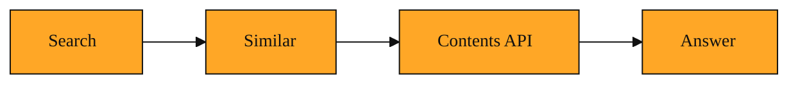

# Contents API: Reading the Web Without the Mess

You’re halfway through a research task. Your search returned a dozen links that look perfect. You open the first one. A cookie banner slides down. A newsletter pop-up blocks the text. You close three auto-playing videos just to find the two paragraphs you actually need. By the fourth tab, you are fighting the web page instead of learning from it.

This is the moment the Contents API was built for.

## Why this exists

Finding a web page and reading it are two different jobs. Search gives you the address. It tells you where the information lives. But the modern web wraps that information in layers of clutter. Navigation bars, advertisements, comment sections, and background code slow everything down. If you are building an app, that raw page code is nearly unusable. You do not want to write software that digs through hidden instructions just to pull out a clean sentence.

Without a dedicated tool, your choices are tedious. You can open every link by hand. You can try to extract the text yourself with custom code, which breaks whenever a site redesigns its layout. Or you can settle for search snippets, which are often too short to be useful. The gap is simple. You have the web addresses, also called URLs, but you do not have the knowledge inside them.

The Contents API closes that gap. An API is simply a way for one program to ask another program for data. In this case, it is Exa’s way of fetching the actual content from specific URLs and returning it in a clean, ready-to-use format.

## Understanding the idea

Think of the Contents API as a research librarian who runs to the shelf, pulls the exact books you asked for, and removes every sticker, bookmark, and margin note before handing them over. You give it a list of URLs. It visits each page, extracts the meaningful text, and strips away the surrounding noise. You do not receive buttons, banners, or menus. You receive the article, the post, or the story itself.

You access it by asking Exa to read the pages for you. You pass in the addresses you care about. The service visits each one and hands back the text. You can ask for the full text of the page if you want deep context. Or you can ask for just the highlights, which are the key excerpts most relevant to your topic. The core idea never changes. You point at addresses. The tool brings back readable content.

<InlineQuiz
  id="quiz-s2-l5-contents-api-purpose"
  question="What is the core job of the Contents API?"
  options='["To discover new web pages that match a topic you describe.","To visit URLs you already have and return their clean text without clutter.","To combine many sources into a single synthesized answer.","To find pages that are similar to one URL you already like."]'
  correct="1"
  explanation="The Contents API is a reading tool, not a discovery tool. You give it specific web addresses and it fetches the article text while stripping away ads, banners, and code. Option A describes search, option C describes the Answer tool, and option D describes the Similar tool. The key mental model is that the Contents API closes the gap between having a URL and actually reading what is inside it."
  courseSlug="exa-a-beginner-s-guide-to-search-api-beginner"
  lessonSlug="05-contents-api-reading-the-web-without-the-mess"
/>

## A simple example

Imagine you are planning a family trip to Japan. Earlier in this course, you learned how to search Exa for travel blogs about Tokyo with kids. Now you have ten URLs. You do not want to read ten entire blogs cover to cover. You just want the practical tips about subway passes, kid-friendly neighborhoods, and rainy-day activities.

You send those ten URLs to the Contents API. You ask it to pull out the parts that mention "traveling with children." A few seconds later, you receive a neat bundle of excerpts. Each one is a clean paragraph pulled straight from the original posts. There are no sidebars about hotel ads. No comment sections. Just the sentences that matter to your trip.

If you were building a travel helper app, you could feed those same excerpts straight into a writing assistant to draft a personalized itinerary. The Contents API turned a pile of links into a pile of useful facts.

## How to think about it

The Contents API is the reading step that follows the finding step. Search and similar tools show you where to look. The Contents API actually looks and reports back what it saw. Whenever you have a specific set of URLs and need the substance inside them, this is the tool to reach for. It transforms addresses into knowledge.

## Bringing it all together

Over the last five lessons, you have walked through the core of Exa’s research toolkit. You started with search, learning how to discover pages that match an idea. You explored finding similar pages to wander from one good source to related ones. You saw how Answer can synthesize information and reason across sources for you. And now you have seen how the Contents API fetches the clean text from any address you choose, turning the messy web into readable material.

Taken together, these pieces form a complete workflow. You can find information, explore connections, read the details, and reason about what you found. Whether you are automating research for an app or just trying to stay sane while reading the internet, the mental model is the same. First you locate the doors. Then you walk through them. The Contents API is what lets you walk through without tripping over the clutter.

*Figure: Exa's four tools form a continuous workflow from finding pages to reading them cleanly to reasoning across them.*
