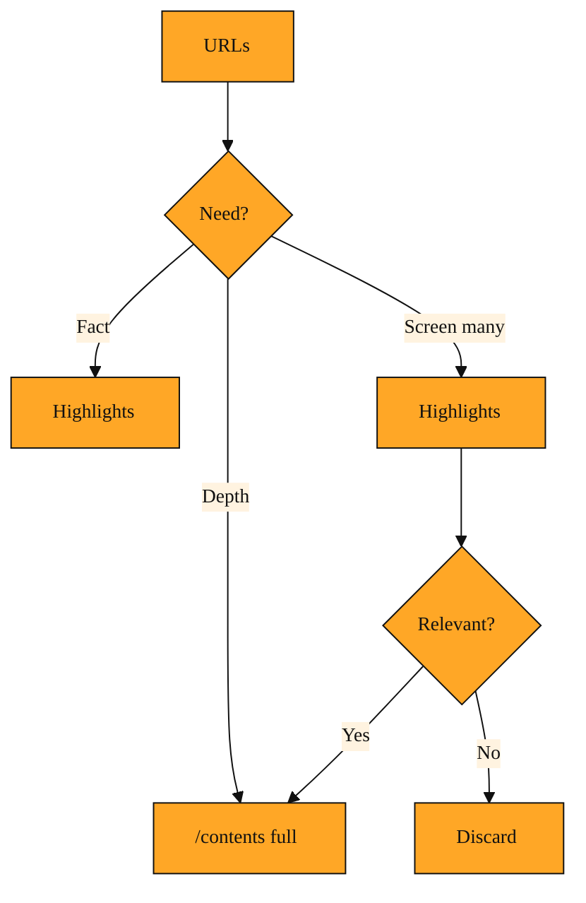

# Reading the Web with /contents and Highlights

In the previous lesson, you learned how to ask Exa to find pages on the web. You give it a query, and it hands back a list of URLs. That solves the first half of the problem. But a list of links is not an answer. Your agent still has to read what is on those pages, and reading the open web is harder than it looks.

Many modern pages are built with JavaScript that only runs inside a real browser. If you try to download them with a simple script, you get blank pages or half-loaded templates. Some documents are PDFs. Others are trapped inside complex layouts with navigation bars, sidebars, cookie banners, and footers. Even when you do get the raw HTML, it is a tangle of tags and scripts. Feeding that directly into a large language model forces the model to waste hundreds or thousands of tokens sorting through formatting noise before it finds a single fact.

And then there is the problem of scale. A typical blog post or documentation page might run thousands of characters long. Sending an entire 8,000-character article into your model just to answer one factual question is expensive. It eats up your context window and slows down your agent. You need a way to turn the chaotic web into clean, readable text. And sometimes, you need to do it without swallowing the whole page.

Exa solves this with two connected tools. The first is `/contents`. It fetches pages you already know about and returns clean, structured text. The second is Highlights. It lives inside `/contents` and returns only the short excerpts that matter for your query. Together they let your agent either study a page deeply or glance at it quickly.

## /contents: Clean pages from messy URLs

When you already know the address of a page, you do not need to search again. You need to read it. That is what `/contents` does. You hand it one or more URLs, and Exa retrieves the page, renders any JavaScript, extracts text from PDFs, strips away layout clutter, and gives you back structured content.

Think of `/contents` as a professional translator. It takes the chaotic dialect of the modern web and converts it into plain markdown that your agent can actually read. The response includes useful metadata such as the title, the URL, the author, the published date, a favicon, and an image. It also includes the body text, which you can cap in length.

You can configure the request to fit your needs. If a documentation site splits material across subpages, you can ask for specific sections. If you only want recent content, you can limit results by age in hours. If you want to keep your context window small, you can set a maximum character count for the returned text. This lets you pull exactly the amount of material your agent can handle, without writing a custom web scraper or fighting rendering engines yourself.

The trade-off is tokens. Full pages cost more. If you fetch three long articles, you might fill up your model's context window before you even begin asking questions. That is where Highlights becomes valuable.

## Highlights: The relevant sentence, not the whole book

Highlights is a content mode within `/contents`. Instead of returning the full text of a page, it returns a short excerpt that answers your specific query.

Here is why that matters for agents. On benchmark tests like SimpleQA, Exa found that roughly 500 characters of Highlights delivered the same factual accuracy as the first 8,000 characters of the full page. It used sixteen times fewer tokens to do it. For an agent that needs to ground its answer in real web data, that difference is enormous. You can search ten pages, pull highlights from all of them, and still use fewer tokens than one full page would have cost.

Highlights is not a generic summary. It is query-dependent. If you ask about a funding round, the highlight extracts the sentence about the raise. If you ask about an API limit, it pulls the paragraph about rate limits. This makes it ideal for agent workflows that need to verify facts quickly without reading entire whitepapers or blog posts.

The trade-off is context. A highlight gives you the needle, but it hides the haystack around it. If your question requires understanding a broader argument, or if the excerpt only makes sense with the surrounding section, a highlight might be too narrow. In those cases, you want the full page that `/contents` provides.

## Choosing your workflow

The best way to see how these tools differ is to watch them handle real tasks.

Imagine you are building an agent that answers questions about startup funding. A user asks, "How much did Exa raise in its Series C?" Your agent uses Search to find the announcement. Now it has a URL. If it calls `/contents` with the default full-text option, it gets the entire blog post. The answer is in there, but so are several thousand characters of background, team quotes, and vision statements. The agent will find the right fact, but it will burn tokens and time to do it.

If instead the agent requests Highlights, Exa returns a tight excerpt that mentions the exact amount. The agent gets its grounding, uses almost no tokens, and responds instantly. For a factual lookup, Highlights is the clear choice. The only risk is that if the user had asked, "Why did Exa raise that money?" the highlight might not include the surrounding context about the company's strategy. You would need the full post for that.

Now imagine a different tool. A developer pastes a link to your documentation and asks, "How does authentication work for the embedding endpoints?" Here, a single sentence will not do. You need the full authentication section, plus maybe the related code examples. You call `/contents` on the URL, perhaps targeting subpages like "api" and "embeddings," and you set a generous character limit. You need breadth, not a narrow excerpt. The extra tokens are worth it because the user asked for an explanation, not a single number.

A third pattern combines both. Your agent searches the web and gets back ten candidate pages. It does not know which ones are useful. Reading all ten in full would be wasteful. So it pulls Highlights from each one. In milliseconds it sees that only two pages actually discuss the topic in detail. It then uses `/contents` to fetch the full text of those two winners. This two-stage approach keeps costs low during exploration and spends tokens only when depth is required.

*Figure: Decision tree for choosing Highlights, full /contents, or a two-stage mix based on what the agent needs.*

<InlineQuiz
  id="quiz-s3-l2-workflow-selection"
  question="Your agent receives ten URLs after searching for a specific API error. It needs to determine which pages have detailed explanations before writing a troubleshooting guide, and it must keep token usage low while screening. Which workflow fits best?"
  options='["Fetch full contents from every URL right away to avoid missing anything","Request Highlights from all ten URLs, then fetch full contents only for the relevant ones","Request Highlights from all ten URLs and write the guide using only those excerpts","Fetch full contents from the first URL and stop there if it mentions the error"]'
  correct="1"
  explanation="The correct choice is the two-stage workflow described in the lesson. Requesting Highlights from all ten URLs keeps token costs low during exploration and quickly reveals which sources actually discuss the API error in detail. After screening, fetching full contents only from the relevant pages gives the agent the breadth and depth it needs to write a complete troubleshooting guide. Fetching all ten pages in full from the start wastes tokens on irrelevant sources. Relying solely on Highlights skips the surrounding context and code examples that a guide usually requires. Checking only the first URL ignores the other nine candidates and risks building the guide from an incomplete or shallow source."
  courseSlug="exa-for-developers-beginner"
  lessonSlug="02-reading-the-web-with-contents-and-highlights"
/>

## A simple mental model

Search finds the doors. `/contents` opens them and hands you the clean text inside. Highlights opens them and points to the one sentence that matters.

When your agent already knows where to look and needs to understand a whole document, use `/contents`. When your agent needs to check a fact across many sources and move fast, use Highlights. When you are unsure, use Highlights to screen, then `/contents` to study.

So far, your agent has talked to Exa through direct API calls. You decide when to search, when to fetch, and how to feed the results into your model. But the world of AI tools is moving toward standard ways for any system to hand capabilities to another. In the next lesson, we will look at MCP, a protocol that lets AI agents discover and use tools like Exa without custom wiring for every integration.
