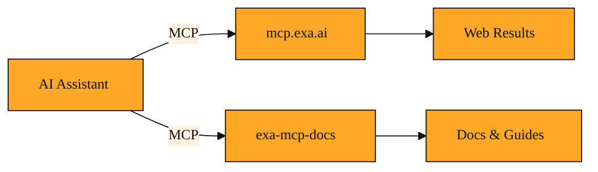

# Connecting Your AI Assistant to Exa with MCP

If my AI assistant is supposed to help me code, why can't it just look up Exa's documentation on its own?

You have spent the last lessons learning how Exa finds meaning on the web. That power is impressive. But here is the awkward truth. When you are actually coding in VS Code or Cursor, your AI assistant sits right next to you, yet it cannot reach Exa by itself. It is trapped inside your editor. It only knows what it learned during training. Anything newer, or any detail too specific, is out of reach. You ask about a recent API change. The assistant pauses. Then it admits it does not know. Or worse, it describes an old endpoint that no longer exists. You sigh. You open a browser. You search, copy, paste, and lose your train of thought. That wall between your editor and the live web is exactly the problem that the Model Context Protocol was built to tear down.

## The Wall Between Your Editor and the Web

The pain is not just the copy and paste. It is the context switching. Your brain has to drop the coding problem, switch to research mode, find the answer, then switch back. After three or four lookups, your afternoon feels fragmented. The assistant is smart, but it has no senses. It cannot see outside its window. It cannot pick up a phone and ask Exa a question. Every time you need fresh data, you become the messenger. You fetch the context. You carry it back. That is not how pair programming should feel.

## A Phone Line for Your Assistant

Here is where the solution appears. There is an open standard called the Model Context Protocol, or MCP. Think of it as a safe phone line between your AI assistant and the outside world. Before MCP, your assistant was in a silent room. MCP gives it a small directory of trusted numbers it is allowed to call. One of those numbers is Exa.

When your assistant needs something, it picks up the line. It asks Exa a question. Exa answers. The assistant uses that answer to help you write code. You never leave your editor. You do not copy and paste. The conversation flows in one place.

MCP is a protocol. That word just means a shared set of rules. Just as HTTP lets your browser talk to websites, MCP lets your AI assistant talk to tools and data sources. It keeps you in control. The assistant cannot dial random numbers. It can only call the services you explicitly plugged in. And it usually tells you before it makes the call.

## The Exa MCP Setup

Exa gives you two main ways to connect through MCP. Together, they form what we call the Exa MCP Setup.

The first is live web search and code search. Exa runs an MCP server at `mcp.exa.ai`. When your assistant connects there, it gains the ability to search the live web using Exa's neural engine. It can find current articles, GitHub repos, or API references that did not exist when the AI was trained.

The second is documentation and examples. There is a package called `@waldzellai/exa-mcp-docs`. This acts like a direct line to Exa's own docs, code samples, and integration guides. It even exposes a complete documentation index at `/docs/llms.txt`. Your assistant can browse that index first, then fetch the exact page you need.

You can think of the first as a window to the entire internet. The second is a private library of Exa's own knowledge. Both use the same MCP wiring. They just answer different kinds of questions.

*Figure: The two parallel Exa MCP servers and what each returns to your assistant.*

## Plugging It Into Your Editor

The good news is that many tools you already use speak MCP. Claude Desktop, Cursor, VS Code, and Claude Code all support it. The setup is usually just pointing your editor at the right address.

Claude Code users can add the Exa web search server by pointing to `https://mcp.exa.ai/mcp`. Claude Desktop users can do the same through their configuration. Cursor and VS Code users can often paste that URL directly into their MCP settings. For the docs server, you can install `@waldzellai/exa-mcp-docs` so your assistant reads Exa's official guides instead of guessing.

Once the connection is live, your assistant simply knows it has new abilities. You do not write API calls. You do not manage tokens. You ask a question in plain English, and if the assistant needs fresh data, it reaches out through the MCP line automatically.

## When to Let Your AI Make the Call

MCP is powerful, but it is not always the right tool for every job. Here are three moments when connecting your assistant to Exa shines, along with the trade-offs.

First, imagine you are building a research tool and you need to check Exa's latest query syntax. Instead of leaving your editor, you ask your assistant how to filter by date. Because it is linked to `@waldzellai/exa-mcp-docs`, it retrieves the exact specification. The downside is that this works best for targeted questions. If you need to read ten pages of documentation to understand a broad concept, browsing yourself may still build deeper understanding faster than receiving a condensed summary.

Then, suppose you are writing a news aggregator and you need today's headlines. Your assistant uses the web search MCP to ask Exa for real-time results through `mcp.exa.ai`. The data is fresh because it comes from the live web. The catch is trust. You should verify critical facts yourself rather than blindly accepting the assistant's summary of what Exa returned.

Finally, consider building a RAG application with Exa. Your assistant needs to know best practices for chunking and retrieval. It fetches the official guides and code examples automatically while you stay focused on architecture. The risk here is comprehension. MCP speeds up prototyping, but you still need to understand the code the assistant writes. Do not let the convenience become a crutch.

<InlineQuiz
  id="quiz-s5-l3-mcp-tool-selection"
  question="You are coding in your editor and want your assistant to confirm the exact syntax for Exa's date filter. Which combination of MCP connection and trade-off is the best fit?"
  options='["Use exa-mcp-docs to pull the official specification, keeping in mind that this works best for targeted questions and browsing yourself may still build deeper understanding faster for broad concepts.","Use mcp.exa.ai to search the live web for recent date filtering articles, keeping in mind that you should verify critical facts yourself rather than blindly accepting the assistant’s summary.","Use mcp.exa.ai to search GitHub repos for date filtering examples, keeping in mind that the convenience risks becoming a crutch that replaces your own comprehension.","Use exa-mcp-docs because it serves as a window to the entire internet, keeping in mind that live data should always be fact-checked."]'
  correct="0"
  explanation="The lesson pairs targeted syntax lookups with exa-mcp-docs and notes that while this excels at targeted questions, browsing yourself may still build deeper understanding faster for broad concepts. Option 1 applies the correct trust trade-off but to the wrong tool, since live web search is designed for fresh real-time data like news headlines rather than official syntax specs. Option 2 misapplies the crutch warning from the RAG scenario; while understanding code is always important, the docs server is the direct line for official syntax. Option 3 confuses the two servers entirely, because mcp.exa.ai is the window to the live web while exa-mcp-docs is the private library of Exa's own knowledge."
  courseSlug="exa-for-developers-beginner"
  lessonSlug="03-connecting-your-ai-assistant-to-exa-with-mcp"
/>

## Giving Your Assistant Senses

Without MCP, your AI assistant is like a talented coworker locked in a room with no windows and no phone. It can reason. It can write code. But it cannot see the world outside. An Exa MCP Setup changes that. It installs a safe phone line to the web and a private line to Exa's own documentation. Your assistant can now look things up, verify facts, and pull examples without you acting as the messenger.

You remain in control. The assistant asks before it dials. The connection is explicit and limited to the servers you trust. But the friction disappears. You stay inside your editor. Your flow stays intact.

Now that your assistant can talk to Exa, you might wonder what actually happens on the other end of the line. When your assistant asks Exa to search, how does Exa find the answer? What levers can you pull to shape those results? Those questions belong to the Search API. And that is exactly where we are headed next.
