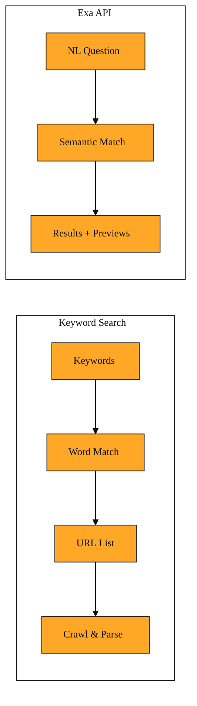

# Search API

If you have ever used a public search engine, you probably typed a few keywords and hoped the algorithm guessed your intent. You might have typed “LLM benchmarks 2024” and then clicked through a list of blue links to find the article you wanted. That approach works for humans, but it is fragile for software. A traditional keyword search returns a pile of URLs, and your code still has to figure out which pages matter, open each one, strip out navigation menus and ads, and extract the one paragraph it actually needs. It is slow, brittle, and expensive.

The Exa Search API flips that workflow. Instead of sending a string of keywords, you send a full sentence or question written in natural language. You POST that sentence to https://api.exa.ai/search, and the API returns results that match the meaning of your question. It can also return summaries, short relevant excerpts, or even structured data. In other words, it hands you more than a map. It can also hand you a preview of what is inside each building.

## Ask a Question, Not Just Keywords

With a conventional search, choosing the right keywords is half the battle. If you want blog posts about artificial intelligence, you might try “AI blog” and then refine. With the Search API, you simply ask for “blog post about artificial intelligence.” The API treats the query as a concept, not as a bag of words.

This difference matters because software cannot improvise the way a human can. If a keyword search misses a synonym, your application gets nothing. Natural language queries are more forgiving. You state your actual need, and the API interprets the intent behind it. The request itself is straightforward. You include your API key in the x-api-key header and pass your query as a natural language string. The API then returns a list of results ranked by relevance to your question. Each result contains a URL and basic information about the page so your application knows where to go next.

*Figure: Keyword search requires your code to bridge the gap between URLs and usable content, whereas an Exa natural-language query returns meaning-matched results and previews directly.*

## Match the Work to the Mode

Not every question deserves the same amount of effort. The Search API gives you three modes that trade speed for depth.

The first is called deep-lite. It finishes in about four seconds and returns a lightweight synthesized answer, which means it pulls information together into a short response. This is useful when you are building a chat widget and users expect a snappy answer. For example, if someone asks “What is the capital of Norway?”, you do not need a long investigation. You need a fast, correct sentence.

The second mode is deep. It takes roughly four to fifteen seconds. It performs multi-step reasoning, which means it connects facts across several sources to answer complex questions. Imagine a user asking “Compare the energy efficiency of electric aviation startups from the last two years.” The API needs time to find, weigh, and connect several pages. Deep mode is built for that.

The third mode is deep-reasoning. It can run from twelve to forty seconds, but it synthesizes dense or conflicting information into a thorough answer. This is the right choice for hard research tasks, like analyzing competing claims about a new medical study.

The trade-off is always the same. Faster responses keep users engaged. Slower, deeper responses give you more reliable answers for complex topics. Choosing the right mode means matching the cost of the wait to the value of the answer.

<InlineQuiz
  id="quiz-s2-l4-search-mode-tradeoffs"
  question="You are building a medical research assistant. A user asks: Compare the conflicting claims in recent studies about caffeine and long-term heart health. Which mode should you use?"
  options='["deep-lite because the user is chatting with an assistant and expects a fast response.","deep because it performs multi-step reasoning across several sources for complex questions.","deep-reasoning because it synthesizes dense or conflicting information into a thorough answer.","deep-lite with highlights enabled so the user sees the raw excerpts and decides for themselves."]'
  correct="2"
  explanation="The user wants you to compare conflicting claims, which the lesson explicitly gives as a job for deep-reasoning. deep-lite is wrong because speed matters less than accuracy when evidence conflicts, and four seconds is not enough to synthesize competing studies. deep is tempting because it handles complex multi-source questions, but the lesson distinguishes deep for multi-step reasoning from deep-reasoning for dense or conflicting information. Requesting highlights with deep-lite is wrong because excerpts are not a substitute for synthesis; the API still needs the reasoning depth to resolve contradictions."
  courseSlug="exa-for-developers-beginner"
  lessonSlug="04-search-api"
/>

## Get Back What You Actually Need

Finding the right page is only half the job. You also need to decide how much of each page you want to read.

By default, the Search API gives you a list of results with URLs and titles. But you can ask for highlights. Highlights are short excerpts pulled from each page. They show exactly the sentences that relate to your query. Think of them as sticky notes attached to the exact paragraph you care about. Because they are short, they save bandwidth and cost less if you later feed them into another language model.

You can also request a summary. A summary gives you an overview of what the page contains, so you can understand the main point without opening the full text. This is helpful when you want to show a preview card in your app before the user decides to dig deeper.

If your application needs to feed search results into a database or another API, you can use structured outputs. You provide an output_schema, which is just a simple JSON shape you define, and the API returns the information already formatted that way. For example, you could ask for the latest research in LLMs and receive an object with title, authors, and URL already filled in. Instead of receiving a block of text and writing regular expressions to pull out names and dates, you get a clean object you can use immediately. The trade-off is that you must plan the schema ahead of time. But once you do, you skip all the messy text parsing.

## Keep Results Inside Trusted Corners

The open web is huge, and not every corner is useful for every project. The Search API lets you narrow the field by including or excluding specific domains.

Imagine you are building a medical reference tool. A query like “latest evidence on sleep and blood pressure” could return personal blogs, news aggregators, or hospital research pages. By using the include_domains option, you can limit results to major medical institutions and government health sites. This raises the quality of your answers, because you are searching inside a pre-approved library instead of the entire internet.

You can also use exclude_domains to block sites you know are unreliable, such as content farms or outdated wikis. This is useful when you want broad coverage but need to filter out noise.

The cost is scope. If you fence the search too tightly with include_domains, you might miss a relevant paper on a small university server or a new preprint repository. The right balance depends on your application. A news app might want a broad net. A clinical assistant needs a narrow one.

Bringing it all together, think of the Search API as a research assistant that understands full sentences and lets you set the rules. You ask in plain English, choose how deep you want it to think with modes like deep-lite or deep-reasoning, decide whether you want highlights, a summary, or structured data, and tell it which neighborhoods of the web are worth searching. It handles the discovery and the first layer of reading so your application does not have to.

That said, the Search API is primarily about finding and previewing. It points you to the right pages and can hand you useful excerpts. But when your application needs to systematically pull the complete text of those pages into your own pipeline as a dedicated next step, you need a tool built specifically for retrieval. That tool is the Contents API, and it is where we turn next.
