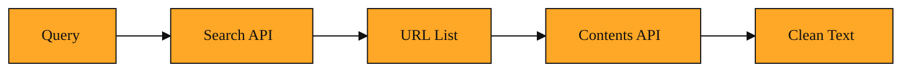

# Contents API: Reading What You Already Found

Your teammate slacks you a list of twenty URLs. They are all candidate sources for a report you are writing on carbon capture. You already know these pages exist. In fact, you found most of them last week using Exa’s Search API. You typed a query, and Exa returned a set of promising links with titles and summaries. That was the discovery phase. Now you need to move into the reading phase.

You open the first link. A banner asks you to accept cookies. You close it. You scroll past three ads, a video thumbnail, and a newsletter sign-up box to reach the article text. You copy the text into your notes, but the formatting breaks. Half the links turn into messy underlines. The heading sizes are lost. You open the second link. The website layout is completely different. The article starts below a sidebar full of unrelated stories. By the fifth link, you are spending more time fighting the website than thinking about carbon capture. You have the addresses, but getting the actual words is still a chore.

This is the exact moment Contents API was built for.

## From URLs to clean text

Contents API is Exa’s tool for retrieval. While Search API answers the question "What pages are out there?" Contents API answers the question "What do those pages actually say?" You give it a list of URLs you already know. It fetches those pages, strips away the visual noise, and returns the actual content in a structured form.

You can call it through the Python SDK with `exa.get_contents()`. Under the hood, the service lives at the `POST /contents` endpoint. The input is simple: an array of URL strings. You do not need to write a query. You do not need to describe what you are looking for. You only need to point.

The API does the difficult work of loading each page, rendering the underlying content, and converting it into markdown text. Markdown is a plain-text format that uses simple characters for formatting. Headings become lines with hash symbols. Links become bracketed text. The result is clean and predictable. The API removes navigation bars, sidebars, cookie banners, advertisements, and footers. What you get is the article, the blog post, or the documentation page as it was meant to be read. If you plan to feed the text into a summarization tool or a large language model, this clean format saves you hours of preprocessing.

## What the response holds

For every URL that succeeds, Contents API returns a structured result object. The center of that object is the `text` field. This field contains the full page content as markdown. If the original page had headings, lists, block quotes, and hyperlinks, they survive as readable markdown syntax. You can store this text directly in a database, pass it to an analysis pipeline, or display it in your own application without writing a custom web scraper.

Alongside the text, you get a rich envelope of metadata. The `title` field gives you the page title as the author intended it. The `author` field names the writer when the page exposes that information. The `publishedDate` tells you when the content first appeared, which helps you judge whether the source is still relevant. You also receive `url` and `id` fields that point back to the original source. If you later need to cite the page or check it manually, you have the exact address.

For builders who want to display results to end users, the API includes `image` and `favicon` fields. These hold URLs to visual assets from the page. You can use them to render a polished result card in your own interface. Even if you ignore these extras, having them bundled in the same response keeps your data pipeline simple. You do not need a separate tool to look up who wrote an article or when it was published. Contents API brings the context along with the content.

Every response also carries a `requestId`. This is a unique string that identifies the exact fetch operation. If a result looks strange or if you need help debugging, this ID lets you trace what happened during the call.

## Dials you can turn

Contents API does not force you to take the entire page every time. It offers optional parameters that let you shape the fetch to fit your specific job.

One of the most useful controls is `text.max_characters`. By default, the API tries to give you the complete page text. But sometimes you only need the opening paragraphs to decide if an article is worth your full attention. Setting a character limit keeps the response small. That means faster network transfers, less memory usage in your application, and lower cost if you are passing the text into another service that charges by the token. It is a simple way to stay focused.

Another control is `max_age_hours`. This acts as a freshness filter. You can tell the API to return content only if it was indexed within a certain window, such as the last twenty-four hours. This is powerful when you are watching a known URL for updates. If the page has not changed recently, the API will not hand you stale text. Instead, the lack of a fresh result tells you that nothing is new yet. You avoid wasting time rereading old material.

Finally, there are the `subpages` and `subpage_target` options. These are designed for structured websites like documentation hubs or help centers. Instead of fetching a single page, you can ask the API to fetch up to a set number of related subpages. You can also name targets, such as "api" or "models," to guide which branches of the site matter most. This turns one API call into a small research bundle. It is especially handy when you know the root of a documentation site but do not want to manually map every child page yourself.

## Three moments to choose Contents API

Imagine you ran a Search API query yesterday to find articles about sustainable packaging. You received ten URLs with promising titles. Today, your goal is to compare the arguments in those articles. You could try to work from the short snippets that Search returns, but snippets are thin. They often capture the opening sentence or a random paragraph. They might miss the central argument entirely. Instead, you pass the URL list to Contents API. You get back the full text of each article. The trade-off is that you are making a second round of API calls and handling larger payloads. The reward is real comprehension instead of guesswork. When you need to understand what a page says rather than simply knowing it exists, Contents API is the right next step.

Consider a second situation. You are monitoring a competitor’s public roadmap. The page lives at a fixed URL. It changes every few weeks when they ship new features. You do not need to search the whole web for mentions of the roadmap. You need to read that exact page, and you need to know if it changed today. You call Contents API with `max_age_hours` set to a low number. If the API returns fresh text, you analyze it immediately. If the page has not been reindexed, you know nothing is new yet. Using Search here would be noisy. Search might find blog posts talking about the roadmap, or social media discussions, but Contents API goes straight to the source you specified.

For a third example, picture yourself integrating with a third-party service. Their documentation is spread across many subpages under one root domain. You know the main docs URL, but the information you need is scattered across sections on authentication, error handling, and rate limits. Rather than listing twenty individual URLs, you call Contents API with `subpages` set to fifteen and `subpage_target` aimed at keywords like "authentication" and "errors." You get back a cluster of relevant docs in a single request. The trade-off is breadth over surgical precision. If the API’s idea of a relevant subpage differs slightly from yours, you might get an extra page or miss a narrow corner case. When you need absolute control, you should list the URLs yourself. When you want to explore a known tree quickly, subpages are the right tool.

<InlineQuiz
  id="quiz-s4-l5-contents-api-monitoring"
  question="You need to watch a competitor public roadmap page that lives at a fixed URL and changes sporadically. Your application should act only when the content is actually fresh. Which approach does the lesson recommend?"
  options='["Call Search API daily with a query for the competitor roadmap and scan results for the exact URL.","Call Contents API with the known URL and a low max_age_hours value, acting only when fresh text is returned.","Call Contents API with subpages set to ten to collect related blog posts alongside the roadmap.","Call Contents API with the known URL every hour and reprocess the full text each time to compare against your stored copy."]'
  correct="1"
  explanation="The lesson presents monitoring a known URL with max_age_hours as the recommended pattern for this exact problem, where a low freshness filter ensures you only analyze recently indexed text and the absence of a fresh result means nothing is new yet. The first option is wrong because Search API would bring in noisy secondary mentions instead of going straight to the source. The third option misapplies subpages, which are designed for documentation trees rather than watching a single page. The fourth option describes a manual diff strategy that the lesson does not recommend, since max_age_hours exists specifically to spare you from repeatedly fetching and comparing full text when nothing has changed."
  courseSlug="exa-for-developers-beginner"
  lessonSlug="05-contents-api-reading-what-you-already-found"
/>

## The full shape of Exa

Over these five lessons, you have moved from asking broad questions to handling precise answers. You started by understanding what Exa is: a search engine that grasps meaning rather than just matching keywords. You learned how Search API finds pages that fit an idea, even when the wording differs. You explored how to shape those searches, filter the results, and make sense of what comes back.

Now you have seen the second half of the workflow. Contents API does not discover new territory. It reads the ground you have already marked. It turns the messy, ad-filled, visually complex web into clean, structured text that your application can actually use.

The mental model is simple. Search API is the scout. It maps the territory and brings back coordinates. Contents API is the excavator. It digs at the exact spots you mark and brings up the material. You would not send an excavator to explore an unknown field. You would not send a scout to do the heavy lifting at a known site. The two tools are meant to work in sequence. Discover, then retrieve. Find, then read.

That is the complete journey. You can start with a question in plain English, discover the best sources on the web, and extract their full meaning into your own code. No cookie banners. No broken copy and paste. No formatting wars. Just the words that matter, delivered the way you need them.

*Figure: The two-phase Exa workflow showing how Search API feeds URLs directly into Contents API for clean text retrieval.*
