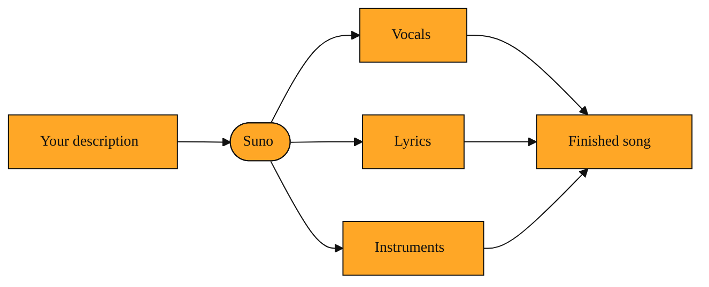
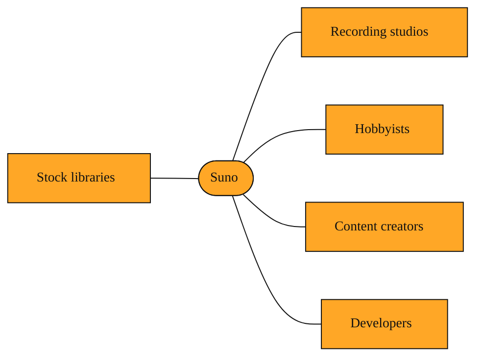

# What Is Suno and Why Would You Use It?

## Why making music is usually out of reach

Imagine you want a song for your friend's birthday video. If you do not play an instrument or sing, your options are limited. You can search the web for existing songs, but then you must worry about copyright claims and licensing fees. You can hire musicians, but that takes time and money most people do not have. Even for developers who need a soundtrack for an app or a game, getting original music often means dealing with rights, budgets, or stock libraries that sound generic and overused.

That gap between having an idea and hearing it played is exactly the problem Suno was built to solve.

## What Suno is in plain words

Suno is an AI music generator. You describe what you want in everyday language, and it creates a complete, original song. You might type something like "a calm acoustic song about walking through rain" or "upbeat electronic track for a morning workout." Suno then produces vocals, lyrics, and instrumentation that match your description. Nothing is copied from existing songs. The result is a brand new audio file made on the spot.

Think of it like a very fast collaborator. Instead of learning to play the piano or booking a recording studio, you describe a feeling and get a finished track back in seconds. You do not need to read sheet music or operate complex production software. You do not choose notes from a menu or drag loops across a timeline. You simply write a description, and the system composes melody, harmony, rhythm, and voice on its own.

The technology behind this is called generative AI. That is a broad label for systems that create new content rather than simply searching for what already exists. Suno is a specific kind of generative AI focused entirely on sound.

*Figure: How Suno turns your description into a finished song with multiple parts.*

<InlineQuiz
  id="quiz-s2-l1-suno-generative-ai"
  question="What happens inside Suno when you describe a song in everyday words, such as asking for a calm acoustic track about walking through rain?"
  options='["It searches through a catalog of existing tracks to find one that matches your description.","It samples and remixes pieces of popular songs to create a new version.","It composes an original song with new lyrics, vocals, and instruments tailored to your description.","It converts your text into musical notation and asks you to perform the piece yourself."]'
  correct="2"
  explanation="Suno is a generative AI system that creates brand new audio rather than retrieving existing tracks. When you type a description, it composes original melody, harmony, rhythm, and vocals specifically for your request, producing a finished song in seconds. Option A describes a search engine or stock music library, not a generative tool. Option B is a common misconception about AI music, but Suno does not copy or remix existing songs; it builds original audio from scratch. Option D describes notation software that requires human performance, whereas Suno is designed so you do not need to read music or play an instrument."
  courseSlug="suno-a-beginner-s-guide-to-prompt-beginner"
  lessonSlug="01-what-is-suno-and-why-would-you-use-it"
/>

## Who it is for and where it fits

Suno is for anyone who needs music but does not have a band on call. Hobbyists use it to hear their ideas come to life. Content creators use it to score videos without risking copyright strikes. Developers use it when they need soundtracks that react to what a user is doing. For developers, this means you can create dynamic soundscapes without maintaining a library of licensed files. For non-musicians, it means you can finally hear what that melody in your head sounds like with real instruments behind it.

In the broader ecosystem, Suno sits between static music libraries and full recording studios. Stock audio sites offer pre-made tracks, but thousands of other people may already be using the same loop. A generic web search gives you songs that already exist, locked behind usage rules and fixed arrangements. Suno invents new audio tailored to your request. A wellness app can generate a calming lullaby after a user says they cannot sleep. A game can summon a battle anthem the moment a player enters a boss fight. A teacher can create a catchy song to help students memorize vocabulary. The music is fresh, customized, and ready to use.

*Figure: Where Suno sits in the world of music options and who typically uses it.*

## What you can build with it

Because Suno creates original work, you are not borrowing someone else's art. You can generate background music for a podcast, a jingle for a small business, or a soundtrack for an indie film. You can iterate quickly. If the first result is too slow, you ask for a faster version. If the lyrics need to be about dogs instead of cats, you change a few words and generate again. Because every generation is unique, you can also produce multiple variations of the same idea. You might generate five different pop songs about space travel and pick the one that fits your video best. None of them existed before you asked.

This flexibility opens doors for builders and creatives alike. You can prototype an experience with sound that matches your exact mood, story, or brand without waiting weeks for a composer. A developer might generate ten different moods and let players pick their favorite. A filmmaker might create a temporary soundtrack to see how a scene feels before hiring a composer for the final version. The goal is to remove the blank page and give you something to react to immediately.

## Where you will go from here

Now that you understand what Suno is and why it exists, the coming lessons will explore how it works under the hood. We will look at how to steer the style of a generation, how vocals are shaped, and how you can upload your own audio to extend or transform a track. We will start with the simple levers that let you choose the sound itself.

---
[Next →](./02-how-to-tell-ai-what-style-of-music-to-make.md) · [Course home](./README.md)
