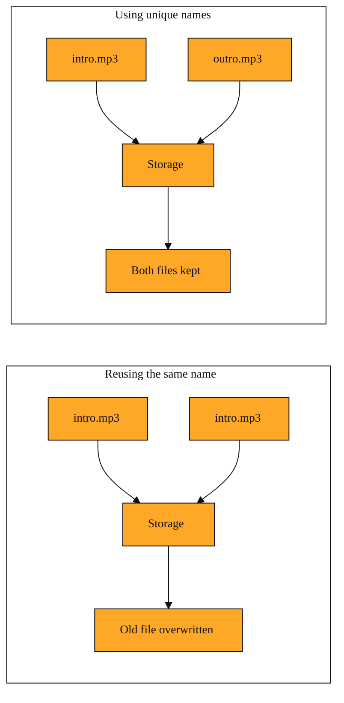

# Giving Your AI Track a Name That Sticks

## Why naming your track matters

In the last few lessons, you learned how to ask Suno to create music. You send a request. The API spins up a Music Generation Task. The AI builds your audio track. Then what?

The finished audio does not fly straight into your downloads folder. It lands in the API’s own storage first. Think of it like a temporary locker at a train station. The platform holds your file until you pick it up. But every locker needs a number. If you do not choose one, the system may use a default. And if your next request uses the same default, or if you reuse a name by accident, the new file lands in the same locker. The old file gets overwritten.

This happens because of caching. The system uses the fileName as a key to identify what is in storage. Two requests with the same key are treated as the same file. That is why the fileName parameter exists. It is an optional string that lets you decide the name and extension, like "monday-jingle.mp3". When you provide it, you claim a specific locker. When you skip it, you roll the dice on whether your next track will erase this one.

<InlineQuiz
  id="quiz-s1-l4-filename-storage-key"
  question="What is the main risk of sending two different music requests with the same fileName?"
  options='["The second request overwrites the first track because the name acts as a storage key.","The API rejects the second request to prevent accidental duplication.","The AI uses the name to decide the genre and creates a similar sounding track.","The platform keeps both tracks but automatically adds a number to the second name."]'
  correct="0"
  explanation="The lesson explains that the API treats fileName as a key for its storage cache, similar to a locker number. When two requests share the same name, the platform swaps the old file for the new one without any warning. The API does not reject duplicates, the AI does not use the filename to guide music creation, and the platform does not create numbered copies the way a desktop operating system might."
  courseSlug="suno-a-beginner-s-guide-to-prompt-beginner"
  lessonSlug="04-giving-your-ai-track-a-name-that-sticks"
/>

## What fileName actually is

fileName is simply the label you put on the finished audio before the system stores it. It is a string that includes the extension, such as ".mp3" or ".wav". You slip it into your request alongside other settings, like a Callback URL that tells the API where to send updates, or a Style Weight that nudges the mood of the music.

The easiest way to picture it is a moving box. When the AI finishes your track, it packs the audio into a file and places it on a shelf. The fileName is the label on the outside of that box. The platform looks at the label to decide where the box belongs. If a box with that label is already on the shelf, the platform swaps it out. No warning. No duplicate copies. Just a clean replacement.

Because the parameter is optional, beginners often ignore it. The request still goes through. The API Response still returns a Status Code and Response Data. The music still gets made. But ignoring the name means you are letting the platform pick the locker for you. That works once. Do it twice with the same name, and you have accidentally deleted your first track.

## A simple example

Imagine you run a small podcast. On Monday, you ask the API to generate a gentle intro jingle. You name the file "intro.mp3". The system stores it under that label. You download it. Everything is great.

On Wednesday, you generate a new outro clip. You are in a hurry. You leave the fileName blank, or you lazily type "intro.mp3" again because it is the first thing that comes to mind. The API finishes the job. The cache sees the same name. It already has a file called "intro.mp3". So it overwrites Monday’s jingle with Wednesday’s outro.

Your podcast folder now has the outro, but the intro has vanished. You did not get an error. The Status Code in the API Response might happily read 200. The Response Data might look perfect. The system thinks it succeeded because it did exactly what you told it to do. You told it to put a new file in the same slot.

If you had named Wednesday’s file "outro.mp3", both boxes would have stayed on the shelf. The lesson is simple. Treat fileName like a save-as dialog. Use a new name for each new piece of music, or at least know that reusing a name means you are willing to erase what came before.

*Figure: Side-by-side comparison showing how reusing a fileName silently overwrites the old track, while unique names let both files coexist in storage.*

## How to keep this straight

fileName is not decoration. It is the handle the API uses to store your result on its side. When you build your request, picture two separate jobs. One job is making the music. The other job is labeling the box so you can find it later without losing yesterday’s work.

You will see this parameter tucked into requests across many features, whether you are generating vocals, extending a track, or adding instruments. The behavior never changes. The name you choose becomes the storage key. Pick it with care.

Next, we will look at what the API says back to you after it accepts your request. You will learn how the response tells you whether your task was received, how to read that conversation, and how pieces like the callback URL and status messages keep you informed while your track is being made.

---
[← Previous](./03-can-you-pull-a-finished-song-apart.md) · [Next →](./05-the-sentence-that-starts-every-music-request.md) · [Course home](./README.md)
