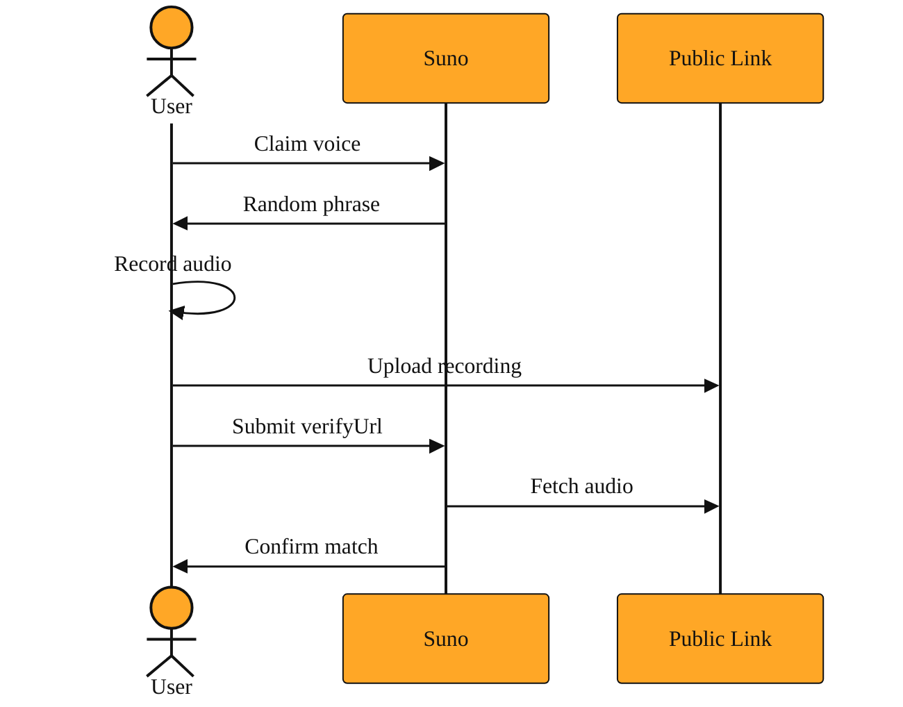

# Why Suno Makes You Sing a Secret Sentence

## Why Suno needs proof

Imagine you could hand an AI a ten-second clip of any singer from the internet and instantly release new songs in their voice. That power is remarkable, but it is also dangerous. Without a guardrail, a stranger could clone your voice without asking, or a prankster could forge a fake performance by a famous artist. Suno blocks this misuse with a simple trust check.

Voice cloning is powerful because it creates a digital copy of a real person's vocal tone. Suno treats that power seriously. Before the AI will learn a private voice, it insists on evidence that you can produce that voice on demand. The evidence is a short recording of you singing or speaking a specific sentence that Suno chooses for you. Because the sentence is random, you cannot prepare it ahead of time. You cannot dig up an old interview clip and hope it passes. You have to perform the exact words in the moment, which proves the voice is yours.

<InlineQuiz
  id="quiz-s1-l7-voice-cloning-proof"
  question="Why does Suno require you to sing or speak a randomly chosen sentence instead of letting you submit any audio clip you already have?"
  options='["Because a random sentence proves you can produce that voice on demand, so stolen or old clips cannot pass as yours.","Because random sentences contain more varied sounds, which helps the AI learn your full vocal range more accurately.","Because using a random sentence avoids copyright problems with existing songs or interviews.","Because a fresh recording of a random sentence creates a smaller file that is faster for Suno to download."]'
  correct="0"
  explanation="The correct answer captures Sunos goal: since the sentence is random and generated on the spot, you cannot prepare it ahead of time or dig up an old interview clip. You must perform the exact words in the moment, which proves the voice is truly yours. The first distractor confuses the security check with vocal training; while the lesson mentions that singing is recommended for clarity, the randomness itself is not about capturing range. The second distractor brings up copyright, which is a real concern in music AI but is not the reason Suno gives for the random sentence. The third distractor assumes the step exists for technical efficiency, yet the lesson never mentions file size or download speed as factors."
  courseSlug="suno-a-beginner-s-guide-to-prompt-beginner"
  lessonSlug="07-why-suno-makes-you-sing-a-secret-sentence"
/>

## The audio version of showing ID

Think of this step like showing ID at a security desk. You arrive and a guard hands you a code word written on a slip of paper. You step into a booth and record yourself saying that exact word into a microphone. Then you hand the guard the address where that recording can be played. The guard listens, matches the voice to your face, and lets you through. The address you handed over is the only proof the guard needs.

In Suno's world, that playback address is called the verifyUrl. It is simply the public web link where your proof recording lives. Here is how the check unfolds:

1. You ask Suno to clone a voice.
2. Suno sends back a short validation sentence, a random phrase you have never seen before.
3. You record yourself singing or speaking that exact phrase. Singing is recommended because it gives the clearest sample of your real vocal tone.
4. You upload that recording to any service that gives you a plain, public web link.
5. You paste that link into the verifyUrl field. Because the link is public, Suno's servers can fetch the audio directly and confirm it matches the voice you claim to own.

The phrase is usually just a line or two of text. You do not need a studio. A quiet room and a phone recording are enough. Without this link, Suno would have no way to know the audio came from you rather than from a random video found online. The verifyUrl is the bridge between your claim and the AI's trust.

*Figure: The verifyUrl creates a bridge that lets Suno independently fetch and verify your fresh recording.*

## A simple example

Sarah writes indie music and wants an AI harmony layer that sounds exactly like her. She opens her app and starts the custom voice process.

Suno sends back a short validation sentence it generated just for her. Sarah sings the phrase into her phone in one quiet take. She does not worry about making it perfect. The goal is not a polished track. The goal is to prove the voice is hers.

She uploads the recording to a file hosting service, which gives her a plain web link that anyone can open. She copies that link into the verifyUrl field of her request. Because the link is public, Suno's servers can fetch the audio without asking her for the file again.

Suno downloads the recording, listens to her sing the secret sentence, and confirms the voice matches her claim. If she had tried to cheat by submitting a clip of a famous singer, she would have failed. She cannot reproduce that singer's unique tone on a random phrase she has never practiced.

## How to think about it

The verifyUrl is temporary evidence. It is not your final voice model, and it is not a setting you keep forever. It is simply the address you hand over during the voice check. You will meet it anytime you want Suno to learn a private voice rather than use a public preset.

You already know that Suno can accept audio in different ways. In earlier steps you learned how to point the system to a sound file. The verifyUrl works the same way. It is just another address for audio, but this time the audio has one specific job: to prove you can speak in this voice on demand. Once Suno has checked it, that particular URL has done its job.

Because the verifyUrl must be public, you should not use a link that requires a password or a login. Suno's automated systems need to reach it directly, just like a visitor clicking a normal web page. This step sits right between your raw audio and the AI's training process. You are pointing Suno to a recording whose whole purpose is to say, "Yes, I can speak in this voice right now."

## Where this goes next

After Suno accepts your proof, it does not build your voice instantly. It launches a background job. In the next lesson, you will learn how to track that job and choose options that shape the final singer.

---
[← Previous](./06-making-your-ai-music-move-at-the-right-speed.md) · [Next →](./08-how-do-you-track-a-song-that-isn-t-finished-yet.md) · [Course home](./README.md)
