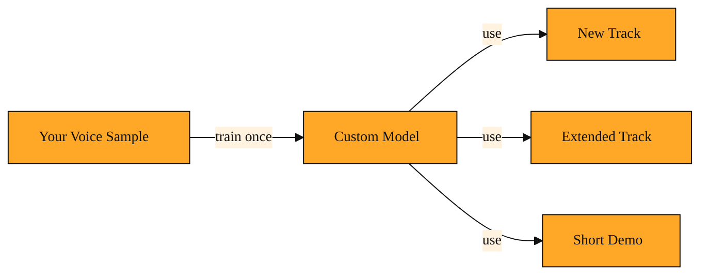

# When the Singer Sounds Like You

## Opening

So far you have learned how to generate music from a description, stretch a song longer, pull the vocals away from the instruments, turn a track into a clean WAV file, and even ask for cover art. You also learned how to check whether a job is finished by waiting for a notification or asking the system for an update. Each skill gave you more control.

But one thing never changed. The voice singing your lyrics was always chosen by Suno. It might sound good. It might match the style. But it is not yours. When you want the music to feel truly personal, a generic singer is not enough. You need the AI to sing with your tone, your breath, your character. That is the gap this final lesson fills.

## How to put yourself into the song

Suno offers a feature that lets you train a custom model on your own voice. Think of it like hiring a vocal coach who learns your voice so well that they can sing any song you write, in your style. You provide a short recording of yourself speaking or singing. Suno studies the unique texture of your voice. If the sample is clear enough, it builds a personal voice profile. Once that profile is ready, you can select it whenever you generate a new track.

The process follows the same rhythm you have already learned. You upload your sample. Suno works on it in the background. When it is ready, or if something went wrong, the system lets you know through the same notification or status-checking methods you used for vocal separation or cover art. You do not need to learn a new workflow. You are simply adding one more option to the menu: your own voice.

What matters most is the result. You get a voice model that carries your unique taste and vocal character. From that point on, Suno does not have to guess what kind of singer you want. It already knows.

<InlineQuiz
  id="quiz-s2-l9-custom-voice-model"
  question="What is the main purpose of training a custom voice model in Suno?"
  options='["To have the AI sing future tracks using your personal vocal tone instead of a default generic voice.","To clean up background noise and correct mistakes in your original voice sample recording.","To unlock new music genres and advanced instruments that are not available by default.","To convert your voice recording into a standard audio file for offline listening."]'
  correct="0"
  explanation="Training a custom voice model teaches Suno the unique texture of your voice so that every new track can be sung with your tone and character, making the music feel personally connected to you rather than generic. It does not repair or enhance your original recording, unlock hidden genres or instruments, or convert your file to a different format. The sample is only used to build a reusable profile that shapes how the AI sings."
  courseSlug="suno-a-beginner-s-guide-to-prompt-beginner"
  lessonSlug="09-when-the-singer-sounds-like-you"
/>

## A quick example: your voice, a new song

Imagine you have written lyrics for a birthday song for a close friend. You could generate it with one of Suno's default voices, and it would sound fine. The melody might be warm, the arrangement gentle. But you want something intimate, something only you could give.

You record yourself singing a short phrase into your phone, maybe twenty seconds in a quiet room. You upload that clip through the voice creation flow. Suno receives your sample and listens for the unique fingerprint of your voice: the pitch, the texture, the way your words flow together. It begins building your personal model.

During this process, Suno may generate a short test sentence using your voice to confirm the quality is strong and consistent. You can check the status the same way you checked on other tasks. Once the system confirms your custom voice is live, the real fun begins.

The next day, you create a new generation task. This time, instead of leaving the vocal style to chance, you tell Suno to use your custom voice model. The AI builds the instrumental, writes the melody, and sings the words using a voice that sounds like you. The gender, the tone, the little quirks, all shaped by that twenty-second sample. Your friend hears the track and recognizes your voice immediately, even though you never stepped into a recording booth to sing the final version. The music is not just generated. It is genuinely yours.

## How to think about it

The mental model is simple. You are not editing a recording. You are teaching Suno what "your singer" sounds like. Once the lesson is learned, every future track can call on that singer. It is the difference between renting an instrument and owning one that is tuned exactly to your hands. You will reach for this whenever you want brand consistency, a deeply personal gift, or simply the fun of hearing yourself sing a style you could never perform live.

Think back across the whole journey. You started by generating music from thin air. You learned how to extend a song, separate its vocals, convert it to a standard file format, and check on tasks until they finish. You learned that every task follows the same basic rhythm: submit a request, wait for the system to work, and collect your result.

Custom voice training is the capstone. It ties those skills together and adds the one ingredient no default setting can provide: you. Whether you are creating a brand new track, stretching it to eight minutes, or simply making a short demo, the pipeline is the same. Only the output has become personal.

You now have a complete picture of how to work with Suno. You can generate audio, extend it, separate it, convert it, cover it, and finally, you can make it sing with your own voice. That moves past simply using a tool. It turns the platform into your own studio.

*Figure: One voice sample creates a reusable model that personalizes every kind of track you make.*

---
[← Previous](./08-how-do-you-track-a-song-that-isn-t-finished-yet.md) · [Course home](./README.md)
