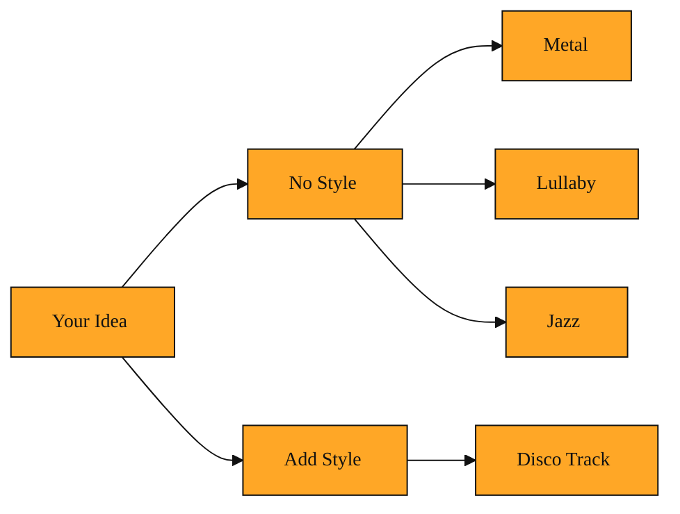

# How to Tell AI What Style of Music to Make

## Why you need to give the AI a direction

In the last lesson, you saw how AI can turn a loose idea into a full song. Once you have that power, you run into a new problem. The machine can make almost anything. It can produce heavy metal, lullabies, jazz, or synthwave. Without a clear signal, asking for a song is like spinning a wheel. You might get a gentle piano lullaby when you wanted an upbeat disco track. You might get electronic beats when you were hoping for acoustic folk. That uncertainty creates a real creative block. You have the tool, but you cannot aim it. It is the difference between a useful tool and a frustrating guessing game.

That gap between what you imagine and what the machine plays is exactly why music style matters. It gives the AI a target. It turns a vague request like "make me a song" into a specific direction the system can follow.

*Figure: Without style, a vague request can land anywhere; with style, you aim the AI at a specific sound.*

<InlineQuiz
  id="quiz-s1-l2-music-style-purpose"
  question="Why does adding a music style matter when asking the AI to create a song?"
  options='["It guarantees the AI will produce a finished track that sounds exactly like the one in your head.","It gives the AI a clear target so the result lands in the specific musical direction you want instead of being random.","It is a required setting that blocks generation until you tell the AI which genre to use.","It narrows the AI down to only one single possible song it can generate."]'
  correct="1"
  explanation="The lesson explains that without a style the AI could return wildly different results from the same request, making the output unpredictable. Adding a style gives the system a target to aim for and turns a vague idea into a specific direction. The first option overpromises because the lesson only says style closes the gap between your imagination and the output, not that it guarantees a perfect match. The second option is wrong because the lesson presents the absence of style as a cause of randomness, not as a blocked action. The third option is wrong because a style defines a musical world or direction, not a single locked result."
  courseSlug="suno-a-beginner-s-guide-to-prompt-beginner"
  lessonSlug="02-how-to-tell-ai-what-style-of-music-to-make"
/>

## Think of style like picking a radio station

Inside Suno, music style is the instruction that tells the AI what kind of sound to create. It wraps the genre, mood, and energy into one simple description.

Think of it like choosing a radio station or picking a playlist for a road trip. You are not dialing in each individual instrument by hand. You are choosing a musical world for the AI to work inside.

When you type a style, such as "melancholic indie folk with acoustic guitars," the AI goes beyond reading the words. It searches through the patterns it learned from countless songs and borrows the feel, not the actual notes, to shape your new track. The pace slows down. The instruments shift toward strings and soft percussion. The overall mood gets warmer. Even the empty space between notes changes. The result feels coherent because every piece belongs to the same imaginary room.

## A real example

Imagine you are making music for a friend’s birthday video. You want something happy and relaxed, with a vintage feel. You tell the AI you want a 1970s soul style, mid-tempo, with warm horns and a steady groove.

That single description becomes the blueprint. The AI selects sounds that fit that era. It keeps the drums tight and the mood light. The bass line walks with a classic feel. The overall mix gets that slightly fuzzy warmth you hear on old records. Your friend hears the track and instantly recognizes the vintage vibe, even if they cannot name the exact instruments. If you had left the style blank, the system might have defaulted to something completely different, like modern electronic pop. By naming the style, you steer the ship.

If you later decide to add a singer or extend a short clip of yourself humming into a full song, the style keeps everything consistent. The new parts will continue in that 1970s soul direction rather than jumping to a new genre.

## The simple way to keep this straight

From now on, treat style as your compass. It is the fastest way to move from a vague idea in your head to a specific direction the machine can follow. You do not need to know music theory or production jargon. You only need to describe a sound you have heard before, whether that is "lo-fi beats to study to" or "bright K-pop dance track." The AI maps your everyday words to its library of patterns and builds the track accordingly.

## Where this leads next

Once you can set a style with confidence, you are ready to bring in your own sounds. In the next lesson, you will learn how to upload a short recording you made on your phone and let the AI build around it. Setting a clear style first makes that process much smoother.
