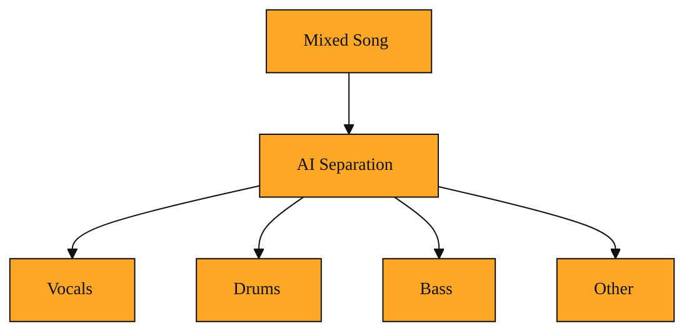

# Can you pull a finished song apart?

You have just used AI to create a complete song. Everything sounds great. The voice, the drums, the guitar, they all sit together in one single audio file. Then a thought hits you. What if you want only the background music for a video project? What if you need just the vocal track to drop into a remix? You open the file and realize it is all baked into one layer. You cannot simply click and drag the singer away from the band. They are fused together. So you ask the obvious question. Can you pull a finished song apart?

The answer is yes, and that is exactly what audio separation is for.

## Why this exists

When Suno or any AI music tool generates a song, it usually hands you a finished mix. Think of it like a photograph where every object has already been flattened into one image. You can look at it, but you cannot move the tree to the left because it is glued to the sky. A mixed audio file works the same way. The vocals, drums, bass, and other instruments travel through your speakers as a single stream of sound.

For a casual listener, that is perfect. For a creator, it can feel like a locked box. You might need the background music without the voice. You might want to isolate the vocals to add new effects. Doing this by hand used to require studio engineers, expensive software, and hours of careful editing. Even then, results were often messy. The problem is not a lack of tools. The problem is that sounds overlap. A singer's voice and a piano can hit the same notes and fill the same sonic space. Untangling them is genuinely hard.

Without audio separation, your only choice is to accept the final mix exactly as it is, or to go back and generate something new from scratch. Separation gives you a third option. It lets you keep the song you already have and simply unpack it.

## Understanding the idea

Audio separation is the process of taking that single, mixed recording and splitting it back into its original parts. The modern version, often called AI audio separation, uses machine learning. That is simply software that learns by studying huge collections of examples. In this case, it has listened to countless songs and learned what a voice sounds like compared to a drum kit or a bass line.

Picture a smoothie. You drop in strawberries, bananas, and yogurt, then blend. The result is one liquid. No human eye can pull the banana back out. But imagine a machine that had studied millions of smoothies. It learned what banana texture looks like even when mixed. It could strain out the banana, then the strawberry, leaving you with separate piles. AI audio separation does something similar with sound. It analyzes the mixed track and extracts clean components, commonly called stems. A stem is just one isolated part of a song. You might get one stem that is only the vocals, and another that is everything else.

The technology does not magically know the original recording session. It predicts. It listens for patterns that match what it learned during training, then rebuilds each part. The result is not always identical to the original isolated tracks, but it is usually clean enough to use in real projects. You would pick this when you already have a mixed file and you need the pieces inside it.

*Figure: How audio separation turns one mixed song file into separate, usable stem tracks.*

<InlineQuiz
  id="quiz-s2-l3-ai-audio-separation"
  question="When AI audio separation splits a mixed song into individual stems, what is actually happening?"
  options='["It unpacks the mixed file to reveal the original instrument and vocal tracks that were hidden inside it.","It analyzes the mixed audio and predicts what each stem should sound like based on patterns it learned, then rebuilds each part.","It removes the sounds you do not want by lowering their volume until only the desired instrument or voice remains.","It splits the stereo channels so that different instruments go to different speakers and can be saved separately."]'
  correct="1"
  explanation="The correct answer is that the AI predicts and rebuilds each stem. The lesson explains that the software does not know the original recording session. Instead, it listens for patterns that match what it learned during training and reconstructs each part, much like a machine that learns to strain banana out of a smoothie by recognizing texture rather than finding the original fruit. The idea that the mixed file simply hides original tracks is wrong because the sounds are fused together like a flattened photograph, not stored in layers. The idea that the tool just lowers the volume of unwanted sounds is also wrong because overlapping instruments and voices often share the same frequencies and sonic space, so turning them down would not create a clean stem. The idea that splitting left and right speakers isolates instruments is wrong because a finished mix already blends all parts into a single stream through both speakers."
  courseSlug="suno-a-beginner-s-guide-to-prompt-beginner"
  lessonSlug="03-can-you-pull-a-finished-song-apart"
/>

## A simple example

Imagine you run a small podcast. You use Suno to generate a short theme song. The AI returns a cheerful pop track with vocals singing your show name. You love the melody, but the voice feels distracting underneath your host's introduction. You need the music without the singer.

With audio separation, you send the finished song through a separation tool. A few moments later, you receive two files. One contains only the instrumental backing. The other contains only the isolated vocal. You drop the instrumental into your editing timeline. Now your host speaks over a clean bed of music, and the generated voice is set aside. You did not have to start over and create a brand new track. You simply unmixed what you already had.

## How to think about it

Audio separation is the undo button for a finished mix. It turns a single delivered file back into flexible pieces. When you work with AI music generation, you will often start with a complete song because that is the fastest way to hear an idea. Separation lets you step backward from that final product into something you can rearrange. It is not about fixing a mistake. It is about giving yourself options after the music already exists.

You will encounter this whenever you need parts instead of the whole. It connects directly to the idea of generating music, because generation creates the mix, and separation unlocks the pieces inside it.

## Where you'll see this next

Once you can split a song into parts, the next step is learning how to ask a system to perform this separation and how to collect the pieces it gives back. The coming lessons will walk you through that conversation.
