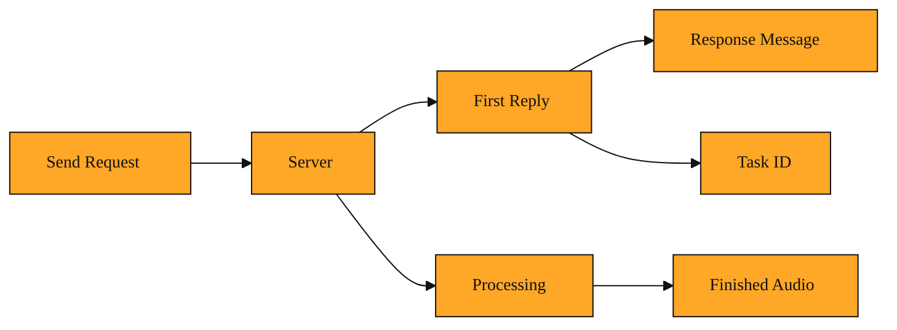

# The Sentence That Starts Every Music Request

You have just asked Suno to make a piece of music. You filled out a request, hit send, and now you wait. A moment later a small reply arrives. It does not contain the song. Instead it contains a short sentence in plain English telling you whether your request was accepted. That sentence is called the Response Message.

## Why the system sends you a note back

Imagine mailing a letter and receiving only a blank envelope in return. You would not know if your letter arrived, if it was readable, or if anyone planned to answer. When you work with an automated music system, that blank-envelope feeling is exactly the problem you face. You can send a detailed description of the music you want, but without a plain explanation coming back, you are left guessing.

The Response Message exists to end that guessing. It is a short piece of text that sits inside the very first reply the system sends. It describes what just happened. It might say that your task was created. It might tell you that a required detail was missing. Either way, it translates the machine's reaction into words a person can read.

This matters because Suno does most of its heavy work in the background. When you ask for a new melody or a change to an existing track, the finished audio is not ready instantly. The system takes your order, queues the job, and will deliver the results later. In that gap between asking and receiving, the Response Message is the only voice you have. It is the system looking up and saying, "I heard you."

## What a Response Message actually is

Think of the Response Message like the text a friend sends after you ask them to pick up groceries. They do not hand you the groceries instantly. Instead they reply, "Got your list, heading to the store now." That message does not contain the milk or bread. It simply confirms the plan is in motion and gives you confidence to stop worrying.

Inside the system's first reply, the Response Message plays exactly that role. It rides alongside technical details such as a new task ID. While other parts of the reply might simply confirm that the connection worked, the Response Message is more descriptive. It speaks to the specific operation you just attempted. It is the difference between a green traffic light and a friendly wave that says, "You can go ahead."

You will encounter this message no matter what kind of music request you make. Whether you are asking for an instrumental loop, a full song with lyrics, or a small edit to an existing track, the first thing you receive is this brief human-readable sentence.

<InlineQuiz
  id="quiz-s2-l5-response-message-purpose"
  question="What is the main job of the Response Message in the system's first reply?"
  options='["It delivers the finished audio file so you can listen to your new track right away.","It gives a short plain-English sentence describing what happened to your specific request.","It proves that your internet connection to the server is working properly.","It stores the technical task ID and background processing codes for the job."]'
  correct="1"
  explanation="The Response Message is a short human-readable sentence that describes what happened to your specific request, such as confirming a task was created or noting a missing detail. The idea that it delivers finished audio is wrong because the song is still being processed in the background when the first reply arrives. The idea that it just proves a connection worked is wrong because the message is specific to your operation and not merely a generic signal that the server is online. The idea that it is the technical task ID is wrong because those identifiers are separate pieces of data that travel in the same reply bundle."
  courseSlug="suno-a-beginner-s-guide-to-prompt-beginner"
  lessonSlug="05-the-sentence-that-starts-every-music-request"
/>

## Placing an order for a new song segment

Let us walk through one ordinary moment. You want to replace a short clip in the middle of a song. You send a request with the source track's identifiers and a description of the mood you want. You also provide a web address where the system can notify you when the new audio is ready.

Your request travels to the server. The server does not return the new audio immediately. Instead it returns a small bundle of information. Inside that bundle is your new task ID. And right next to it is the Response Message. It reads something like, "Segment replacement task initialized."

That is all. But that is enough. You now know the request was understood. You know you can stop watching the send button and start watching for the final result. Without that short sentence, you would be staring at a silent screen, wondering if your instructions were even received.

The Response Message does not carry the finished song. It does not hold the generated notes or the lyrics. It is simply the handshake. It closes the first part of the conversation so the second part, the actual creation, can begin.

Treat the Response Message as the system's voicemail greeting. It does not solve your problem or deliver your product, but it proves you called the right number and that someone is listening. Whenever you send a request to generate music or modify a track, look for this field first. It tells you whether the journey has started before you move on to waiting for results.

Now that you understand how the system talks back at the moment you submit a request, we can look deeper into the numbers and classifications inside that reply. In the next lesson, we will explore how the system labels the task itself, including codes that categorize what kind of work was ordered and how the final sound will be shaped.

*Figure: The request lifecycle, showing how the immediate reply contains the Response Message while the finished audio is created in the background.*
