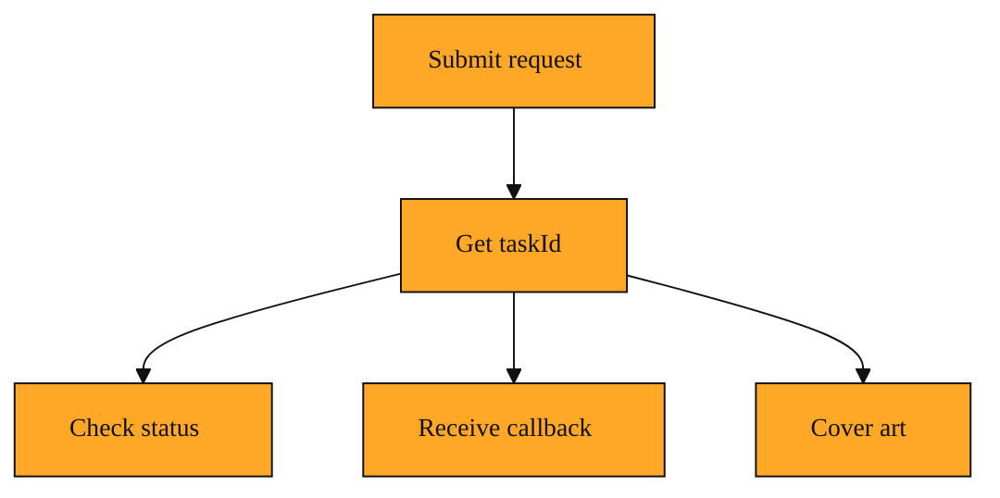

# How do you track a song that isn't finished yet?

You sent your prompt. You turned on Custom Mode, chose your style, and added your Negative Tags. You hit send. So why does the API not just hand you the finished MP3?

That is the first thing that confuses almost everyone. When you ask Suno to generate music, you are not ordering a ready-made sandwich from a deli. You are commissioning a small studio session. The instruments need to be arranged, the parts need to be recorded, and the final mix needs to render. That takes minutes, not milliseconds.

Because of this, the API does not block and wait. It accepts your request, puts your job in a queue, and immediately gives you a receipt. That receipt is called a taskId.

## Understanding the idea

Think of a taskId like a coffee-shop order number.

When you pay, the barista does not hand you the drink instantly. They give you a number. That number is not the coffee. It is your proof that you placed an order, your way to ask "Is mine ready yet?" and the link between you and whatever comes out of the machine.

In the Suno API, a taskId is a short code returned the moment you ask the system to generate a song. It is a simple string of letters and numbers that represents one specific job. Every time you request a new track, whether you are writing lyrics, generating an instrumental, or working in Custom Mode with a specific style, you get a fresh taskId.

This single identifier becomes your handle for everything that follows. Want to know if your song is still waiting in line, currently generating, or finished? You pass the same taskId back to check status. Did something go wrong and you need to ask for help? The details for that job are tied to this one ID.

You already know from earlier lessons that the API can also ping your callBackUrl when the work is done. The callback is like a waiter who brings the drink to your table. The taskId is the number you hold in your hand that lets you walk up to the counter and ask for an update anytime you want.

The same receipt can also unlock follow-up steps. For example, if you later want cover art for the track, the API can use the original taskId to know exactly which song to illustrate. Once you have that first code, the system can keep working on your behalf long after your initial request has closed.

*Figure: The same taskId connects your initial request to every later step: status checks, callbacks, and follow-ups like cover art.*

<InlineQuiz
  id="quiz-s1-l8-taskid-purpose"
  question="Why does the Suno API return a taskId immediately instead of waiting to send the finished song?"
  options='["Because generating music takes minutes, so the API gives you a receipt to track the ongoing job.","Because the taskId is an encoded preview of the audio file you can listen to right away.","Because the taskId tells the server which musical style and instruments to use for the request.","Because the API requires the taskId as payment before it will start generating anything."]'
  correct="0"
  explanation="The API returns a taskId because music generation is background work that takes minutes. The taskId is a receipt that lets you check status and link follow-ups like cover art to the exact job. Option B is wrong because the taskId is just a simple code and does not contain any audio data. Option C is wrong because style and instrument choices come from your original request and Custom Mode settings, not from the taskId. Option D is wrong because the taskId is given to you after you submit the request, like an order number you receive after paying, not something you hand over to start the job."
  courseSlug="suno-a-beginner-s-guide-to-prompt-beginner"
  lessonSlug="08-how-do-you-track-a-song-that-isn-t-finished-yet"
/>

## A simple example

Imagine you send a request for a chill acoustic track. Your prompt is ready, your lyrics are set, and you specified a gentle folk style because Custom Mode requires it.

The API answers in under a second. It does not send audio. It sends back a taskId.

You wait thirty seconds. Then you send that exact code back to the API in a status check. The response says the job is still running. You wait another minute, ask again with the same code, and this time the response says the song is finished. It gives you the link to the audio file.

Later, you decide you want cover art for that same track. When you set up that follow-up request, the API asks for the original taskId. You give it the same code you have been holding onto. The system now knows exactly which song to illustrate because that ID has followed the work from the first note to the final image.

None of this works if you throw away that first response. The taskId is the thread that ties every step together.

## How to think about it

A taskId is your claim check for background work. The API is a kitchen, not a vending machine. Your request goes in, the kitchen gets busy, and the taskId is the ticket that lets you claim the meal when it is ready. Whenever you see this term in the documentation, read it as "the specific song job I started." Hold onto it until you have the final file in your hands, because every follow-up question you ask the API will need it.

## Where you'll see this next

Now that you know how to hold your place in line, you are ready for the final layer: making the output truly yours. In the next lesson we will move from tracking jobs into customizing them. We will look at how to bring your own voice into a generation and how to fetch final details using the very taskId you now know how to keep. You have the receipt. Next, we learn how to customize what comes back.
