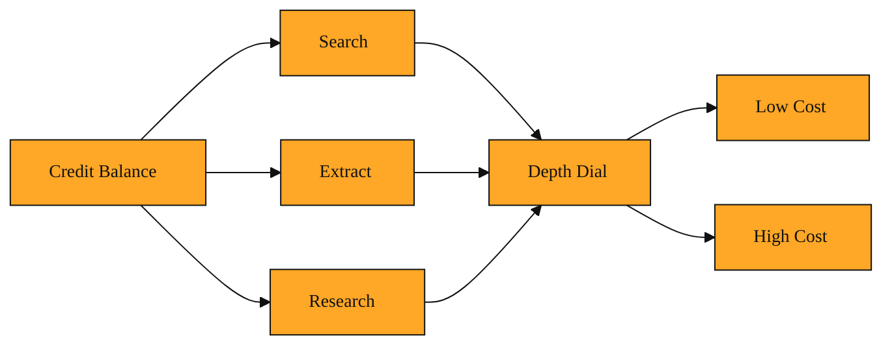

# API Credits

## Why this exists

Imagine you are building your first AI application. You want it to read the live web. Maybe it is a chatbot that answers questions about today's news. Maybe it is a tool that looks up company websites to enrich sales leads. You find Tavily, sign up, and get your API key. Now you face a billing question. If you pay a flat monthly fee, what happens when your app is quiet for two weeks and then explodes with traffic on launch day? You would either overpay during the quiet weeks or hit a hard limit during the spike. Traditional software pricing does not fit a world where every user question triggers a live search.

You need a way to pay only for the work Tavily actually does. You also need one simple wallet that works across every feature. That is the problem API Credits solve.

## Understanding the idea

Think of API Credits as tokens at an arcade.

You load a card with a balance. Each time you play a game, the machine deducts a certain number of tokens. A simple game costs one token. A more complex game costs two or three. You never change your membership tier just to play a harder game. You simply spend more tokens.

Tavily works the same way. Your API Credits are a prepaid balance that powers every request. When your application sends a query to search the web, Tavily deducts a small number of credits. When you ask Tavily to dig deeper into a page or run a larger research job, those actions also draw from the same balance.

The cost of each action depends on how much work Tavily performs. A fast search that returns short summaries costs less than a deep extraction that pulls tables, images, and rich content from a page. You choose how deep you want to go, and that determines the price for that single request. You turn the dial up when you need richer data, and you spend more credits. You turn it down when you need quick answers, and you spend less.

This means you do not need to manage separate bills for separate features. Whether you are running a simple chatbot or a complex research workflow, everything spends from the same wallet.

*Figure: One credit balance powers every Tavily feature, and the depth setting on each request determines how many credits you spend.*

<InlineQuiz
  id="quiz-s2-l1-api-credits-model"
  question="How do API Credits let you control the cost of a single request?"
  options='["You choose how deep the request goes, and Tavily deducts more credits for more work from the same balance","You switch between different monthly subscriptions depending on how complex the request is","You pay a flat fee for each Tavily feature and the cost never changes per request","You buy separate credit pools for search, page extractions, and research, then pick which pool to use"]'
  correct="0"
  explanation="The correct answer is A because API Credits work like arcade tokens. You have one balance, and the depth setting on each request determines how much work Tavily does. More work means more credits spent on that single call. Option B is wrong because you do not need to change plans for individual requests or traffic spikes. Option C is wrong because the cost does change based on the work performed. Option D is wrong because everything draws from the same wallet, not separate pools."
  courseSlug="tavily-for-developers-beginner"
  lessonSlug="01-api-credits"
/>

## A simple example

Picture a small team running an AI chatbot with real-time search.

On a normal Tuesday, users ask routine questions. The bot runs basic searches and returns short answers. The team spends maybe twenty credits all day.

On Wednesday, a major news story breaks. Traffic triples. Users ask complex follow-ups. The team needs deeper answers, so they ask Tavily to do more thorough searches and pull richer content from source pages. Credit spending jumps to two hundred for the day. But the team does not need to call sales or upgrade a plan. They simply draw more from the same pool.

If Thursday is slow again, spending drops back to nearly zero. The credits sit ready for the next busy moment. This is the flexibility the system is built for.

## How to think about it

API Credits are the common fuel behind everything Tavily does. One balance runs your searches, your page extractions, and your research jobs. When you choose a deeper setting for a request, picture it as a lever that changes the work performed. More work means more credits deducted for that single call. You are not buying separate products with separate bills. You are spending points from one account, and you control the cost by choosing the depth you need.

You start with free credits each month. If you grow, you can move to a monthly plan that refills your balance or stay on pay-as-you-go. Either way, the unit is the same. You check your balance in your account dashboard. When it runs low, you add more. The same balance works across every Tavily feature.

## Where you will see this next

In the coming lessons, you will meet the actual tools that spend these credits. You will learn how Tavily searches the web, extracts data from pages, and crawls sites. You will also see how developers plug these tools into AI applications and agent workflows. Every tool you use will draw from the credit balance you now understand. Once you see credits as your spending account, the rest of the journey is about deciding what to buy.
