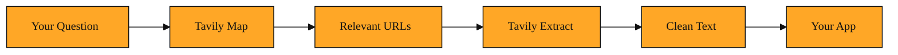

# Tavily Extract

Tavily Extract is the part of the Tavily platform that reads a specific web page and hands you back its clean text. You give it a URL. It returns the actual content, stripped of menus, ads, and clutter.

Before it makes sense to use it, you need to feel the problem it solves.

## Why this exists

In the last lesson, you learned how Tavily Map turns a broad question into a list of relevant URLs. That is excellent for discovery. But a URL is only an address. It tells you where a building is. It does not let you read what is inside.

In real workflows, addresses are not enough. Research agents, data pipelines, and AI models need the actual text from industry reports, documentation pages, and news articles. Without that text, you cannot summarize a market trend, compare two white papers, or answer a detailed question.

The obvious fallback is to fetch the page yourself. You could write a script that downloads the raw HTML, but HTML is noisy. It is packed with navigation bars, cookie banners, login buttons, and advertisements. The actual article might be buried inside a maze of tags and scripts. Stripping that away is harder than it looks. Websites also change their layouts without warning. A scraper that works today can break tomorrow. Doing this at scale quickly becomes a maintenance headache.

Tavily Extract exists to remove that headache. It visits a specific URL on your behalf, reads the page, and returns the clean body text. It turns the messy open web into something your pipeline can actually consume.

<InlineQuiz
  id="quiz-s1-l2-extract-vs-map"
  question="Why does Tavily Extract exist as a separate step from Tavily Map?"
  options='["Because a URL is just an address and does not contain the actual text you need to summarize or compare.","Because downloading raw HTML is impossible for most programming languages and servers.","Because Extract replaces Map by finding links and reading their content in one step.","Because Extract keeps the full HTML including menus and advertisements for complete accuracy."]'
  correct="0"
  explanation="The correct answer is that a URL is just an address and does not give you the actual text inside the page. The option claiming raw HTML is impossible is tempting because scraping is difficult, but the real issue is that HTML is noisy and hard to maintain, not that it cannot be downloaded. The option saying Extract replaces Map confuses the two steps: Map discovers links, while Extract reads a specific link you already have. The option saying Extract preserves menus and ads is the opposite of what it does, since its whole purpose is to remove that clutter and return clean text."
  courseSlug="tavily-for-developers-beginner"
  lessonSlug="02-tavily-extract"
/>

## Understanding the idea

Picture Tavily Extract as a research assistant with a highlighter. You hand them one exact link. Maybe it is a Wikipedia article or a PDF industry report. They open it, skip the menus and sidebars, and hand you back only the paragraphs that matter. No formatting noise, no advertisements, just the content.

Using Extract is straightforward. You send it a single web address. It sends back the cleaned text along with the original address so you always know where the information came from.

If the article is long, Extract can break the result into smaller pieces rather than dumping one giant wall of text. It can also give you a brief overview or a deep dive depending on what you need. These are the same ideas you saw in the previous lesson about handling large results.

Think of the difference between receiving a printed newspaper and receiving a document with only the sentences you care about. The newspaper includes sports scores, weather widgets, and classified ads. The document includes only the story. That is what Extract delivers. It saves you from wading through markup and distractions so you can focus on the information.

## A simple example

Imagine you are building a weekly research digest about artificial intelligence. Tavily Map has already given you a short list of promising links from university labs, industry blogs, and analyst firms.

One link points to a dense industry report hosted on a corporate website. You do not want your users to click away and read it themselves. You want your application to read it for them.

You pass that report's URL to Tavily Extract. It fetches the page, filters out the site header, the cookie banner, and the ad blocks, and returns the report's actual text. Your pipeline stores that text, summarizes it, and quotes key findings in your digest.

Now imagine you do this for three different reports. Because Extract gives you clean text from each one, you can compare them side by side. You can spot which firms agree on a trend and which ones disagree. Because the result includes the original source address, you can always point back to the original page for attribution.

The entire step is automated. You did not write a custom scraper. You did not copy text by hand. You did not have to update your code when the website changed its layout. You simply asked for the content, and you received it.

## How to think about it

Tavily Extract is the reading step in your web research workflow. Map finds the doors. Extract opens them. Whenever your code or your agent needs to ingest what a page actually says, this is the tool you use. It does the dirty work that makes automated research and data enrichment possible.

*Figure: Map finds the doors; Extract opens them. This is the two-step workflow that turns a question into usable content.*

## Where you will see this next

Soon you will learn how to call Tavily Extract and how to read the response it sends back. You will see how the platform tells you whether an extraction succeeded or failed. For now, remember this: discovery gives you links, but Extract gives you knowledge.
