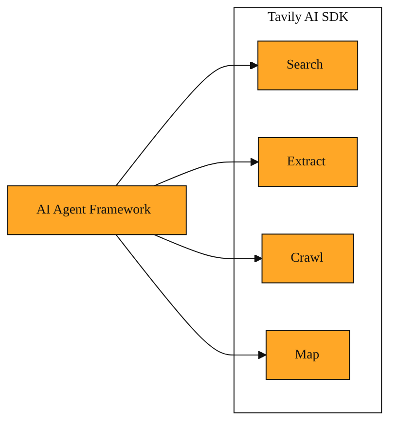
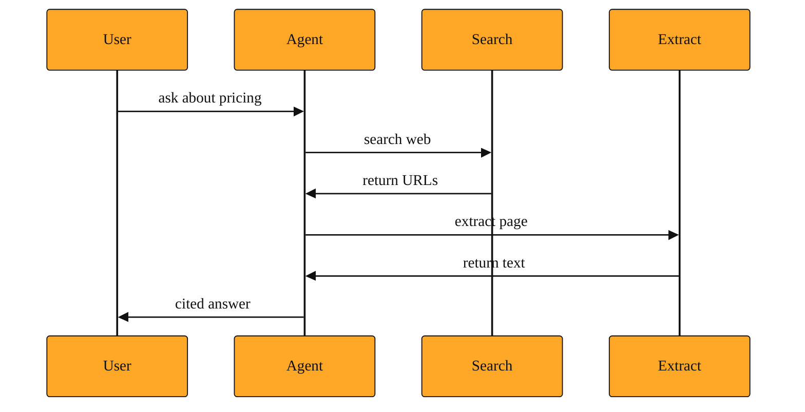

# Tavily AI SDK

## Why this exists: the glue code problem

By now, you know Tavily can search the web, pull clean text from a page, crawl an entire site, and map out every URL on a domain. Each of these is powerful on its own.

But there is a gap between having those powers and letting an AI assistant actually use them.

Imagine you are building a small AI helper that answers questions for users. Modern AI frameworks let the model hand off tasks to outside services. In these frameworks, a **tool** is simply a packaged job the model can choose to run. Think of it like giving a smart assistant a calculator. The assistant recognizes it needs numbers, picks up the calculator, and does the math for you.

If you want your assistant to use Tavily, you could write custom code that calls Tavily's API, formats the answer, and feeds it back to the model. That connecting code does not add new features. It just translates between Tavily and your AI framework. Developers call this **glue code**, because its only job is to stick two things together. Writing it by hand is tedious, and every developer ends up rebuilding the same connectors.

## Understanding the idea: a pre-wired toolbox

The Tavily AI SDK solves this by doing the wiring for you. It is published as the software package `@tavily/ai-sdk`, and it exports four ready-made tools: `tavilySearch`, `tavilyExtract`, `tavilyCrawl`, and `tavilyMap`.

Think of the difference between loose electronic parts and a controller that already pairs with your game console. The underlying hardware is identical. The SDK just packages that power so the AI framework can pick it up and use it immediately.

Each tool knows its own job. `tavilySearch` finds current information on the web. `tavilyExtract` pulls readable content from specific URLs. `tavilyCrawl` walks through a site and gathers content from multiple pages. `tavilyMap` discovers the structure of a site without extracting full content.

When you hand these tools to an agent, the agent sees clear labels and instructions. It knows what each button does, and it knows exactly how to press it. Because the tools are designed for AI frameworks like the Vercel AI SDK, they speak the same language as your model. You do not have to manually describe Tavily's API to the agent. The SDK carries that description inside each tool, so the framework understands how to call it and how to read the result.

*Figure: The Tavily AI SDK packages four ready-made tools that your AI agent can use immediately.*

<InlineQuiz
  id="quiz-s2-l3-sdk-toolbox-concept"
  question="What does the Tavily AI SDK mainly do for developers building AI agents?"
  options='["It adds new capabilities that Tavily’s regular API does not have on its own","It packages Tavily’s existing features as ready-made tools that AI frameworks can use immediately","It replaces your AI framework and handles the agent’s reasoning and choices for you","It merges the four tools into one universal command so the agent never has to choose"]'
  correct="1"
  explanation="The SDK takes Tavily's existing search, extract, crawl, and map capabilities and packages them as pre-built tools for AI frameworks. This removes the tedious glue code you would otherwise write to connect Tavily to your agent. The SDK does not add new powers, replace your AI framework, or combine the four tools into one. Each tool remains separate so the agent can pick the right one for the task at hand."
  courseSlug="tavily-for-developers-beginner"
  lessonSlug="03-tavily-ai-sdk"
/>

## A simple example: market research assistant

Imagine you are building a small AI assistant that helps a marketing team track competitors.

A user asks: "What are the latest pricing changes in our industry, and what do the details say on the official announcement page?"

To answer this well, the agent needs two different Tavily capabilities. First, it must search for recent news about pricing changes. Then, it must pull the full text from the most relevant official page so it can quote specifics and avoid making things up.

Without the SDK, you would write one manual API call for the search, parse the results, pull out a URL, then write a second manual API call for the extraction, and finally reformat everything into context the model can read. You are acting as the middleman.

With the Tavily AI SDK, you import `tavilySearch` and `tavilyExtract` as pre-built tools. You hand both to your agent. The agent decides to search first. It sees a promising URL in the results. Then it decides to extract from that URL. The SDK handles the shape of the data going out and coming back. The model receives clean, structured context it can summarize for the user.

You still control which tools the agent gets. You still provide your Tavily API key. But you skip the repetitive translation layer between Tavily and your AI framework.

*Figure: The agent calls Search, receives URLs, then calls Extract to read a specific page before answering.*

## How to think about it

The Tavily AI SDK is not a new set of superpowers. It is the same search, extract, crawl, and map you have already learned. The only difference is the packaging.

When you see `@tavily/ai-sdk`, picture a small set of labeled buttons sitting on your agent's desk. The agent can press "search," "extract," "crawl," or "map," and Tavily responds with results formatted for immediate consumption. You will encounter this whenever you build AI applications with frameworks that expect tool definitions. It saves you from writing the same integration code again and again.

## Where you'll see this next

Now that you understand how Tavily's capabilities are packaged into ready-made tools for AI agents, the next step is seeing how those tools get combined into larger workflows. In the coming lesson, we will explore the Tavily Research Agent and patterns like **RAG** (fetching relevant documents to ground the model's answers) and hybrid research. These are not extra gadgets you install. They are higher-level strategies that use the same four tools you just met, often through this very SDK, to produce finished, cited answers and complex research pipelines.
