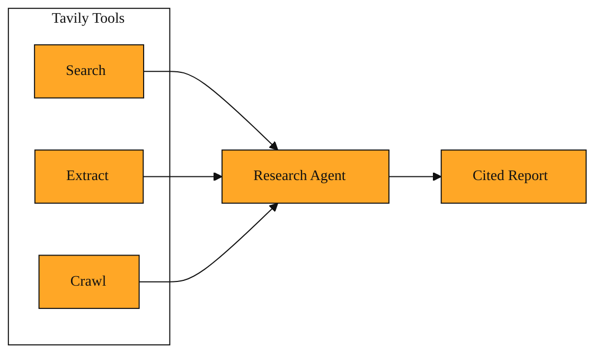

# Tavily Research Agent

In the last few lessons, you met Tavily Search, Extract, and Crawl. Those tools work like a sharp reference librarian. You point at a question, and you get back precise results, raw page content, or a map of a website. They are excellent when you already know exactly what you need.

But real research rarely works that way. Imagine you need to understand a sprawling topic like how new European rules affect electric vehicle battery recycling. A single search query is too thin. You would need to find the regulations, then search for industry reactions, then check for recent court cases, then look for expert analysis. You would read several pages, discover three new questions, and search again. Doing this by hand takes hours because one lookup does not build a full picture.

That gap between a quick reference check and a deep investigation is exactly why the Tavily Research Agent exists.

## What the Research Agent actually is

Think of the difference between looking up one book in a library and hiring a small research team. You give the team a broad topic. One researcher dives into recent news. Another checks government sources. A third looks for expert commentary. They work at the same time, share what they find, and a lead editor pulls it all into a single document with proper citations so you can verify every claim.

That is the mental picture. The agent does not simply return a list of links. It returns a finished report.

Under the hood, it takes your broad topic, breaks it into smaller questions, and searches for each one. It reads what it finds, notices gaps, and looks up more details when needed. Finally, it writes everything into a clear narrative and adds links to the original sources. Because it builds on the same Tavily Search, Extract, and Crawl capabilities you already know, it rests on the same reliable foundation. The difference is the coordination. The agent decides what to look up next based on what it already found.

You can use the Research Agent on its own, or you can plug it into larger AI applications so that other systems can hand it topics and receive reports automatically.

*Figure: The Research Agent coordinates Search, Extract, and Crawl to produce a single cited report.*

<InlineQuiz
  id="quiz-s1-l4-research-agent-purpose"
  question="You need to understand how new European rules affect electric vehicle battery recycling. How does the Research Agent approach this differently from Tavily Search?"
  options='["It submits a wider search query and returns a longer list of raw links","It splits the topic into smaller questions, researches each part, and writes a cited report","It searches only for court cases and ignores regulations and industry reactions","It finds the first relevant article and extracts its text for you to read"]'
  correct="1"
  explanation="The Research Agent exists to close the gap between a quick lookup and a deep investigation. Instead of returning raw links, it coordinates multiple searches, reads the results, fills gaps, and compiles a finished narrative with citations. The option about returning more raw links is wrong because the agent produces a report, not just a longer list. The option about searching only court cases is wrong because the agent explores broadly, not narrowly. The option about extracting one article describes the Extract tool, not the agent, which investigates across many sources automatically."
  courseSlug="tavily-for-developers-beginner"
  lessonSlug="04-tavily-research-agent"
/>

## One request, one report

Picture a product manager named Priya. Her company is considering entering the Brazilian solar market. She needs a briefing by tomorrow morning.

If Priya runs a single search for "Brazil solar market 2024," she gets a handful of recent articles. That is a start, but it is not a briefing. She still needs to understand local tariffs, major competitors, recent policy shifts, and financing trends. She would have to run six more searches, open dozens of tabs, and take notes herself.

With the Tavily Research Agent, Priya writes one sentence. "Give me a comprehensive overview of the Brazilian residential solar market, including recent policy changes, major competitors, and financing options."

The agent treats this as a project. It launches several research tasks at once. One task hunts for policy updates. Another gathers competitor names. A third looks for financing models. The agent reads the results, notices that a new tax credit was announced last month, and weaves that discovery into the narrative. After a few minutes, Priya receives a structured report with numbered citations linking back to the original sources. She did not write the sub-queries. She did not stitch the story together. The agent handled the investigation from start to finish.

## When to use it

The key thing to remember is this. Tavily Search is a lookup. Tavily Research Agent is a project manager. When you need a fast fact, use a search. When you need to investigate a topic and come back with a cited write-up, use the agent. It turns the raw building blocks of search, extract, and crawl into a finished thought. Because the agent runs on its own once you give it a topic, it is ideal for any workflow where you want to drop in a question and move on while the work happens in the background.

## Where this connects next

So far you have seen Tavily as a set of individual tools you call directly. Next, we will look at how to put the Research Agent into action. You will see how to send it a topic, follow its progress, and use the report it produces. Once you understand that flow, you will be ready to wire it into larger systems so it can power research features inside bigger applications.
