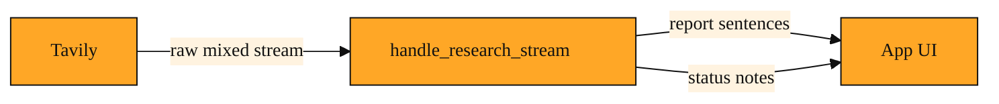

# Handle Research Stream

You are building an AI dashboard. A user asks, "What are the latest FDA approvals for diabetes drugs?" Your agent decides this needs deep research. That research might take a minute or more as it searches across sources, reads pages, and drafts an answer.

You do not want the user to stare at a silent loading bar for sixty seconds. Streaming lets you show sentences as they are written. But the data that arrives from the research engine is not neat. It is a jumble of half-finished sentences, notes about which source was just read, and pings that say the process is still running. If you send that jumble straight to the screen, the interface flickers and jumps.

Without something in the middle, you face a bad choice. You either buffer everything and reveal it at the end, which defeats the purpose of streaming. Or you push raw chunks straight to the screen, which makes the whole app feel glitchy. You need a layer that listens to the chaos and hands your app clean, orderly updates that are easy to display.

## Understanding the idea

Think of a live news broadcast. An anchor speaks quickly, field reporters cut in, and producers shout cues in the background. The captioner does not pass along every cough, half-syllable, or technical note. They smooth the feed into readable sentences that keep pace with the action.

`handle_research_stream` does the same for research output. It sits between Tavily's raw research feed and your application. The research service sends a fast, broken stream of mixed messages. This utility assembles the pieces and delivers calm, structured updates your interface can render without glitching.

Some Tavily actions return a complete result all at once. Deep research is different. It runs multiple searches and synthesizes a report. That takes time. Streaming lets you show progress. This tool makes that progress readable. No matter how your app is wired, a streamed report always needs a translator before it reaches the screen.

*Figure: How handle_research_stream sits between Tavily and your app, turning a chaotic raw feed into two clean output channels.*

<InlineQuiz
  id="quiz-s1-l5-research-stream-handler"
  question="What is the main job of handle_research_stream?"
  options='["To make Tavily’s deep research finish faster than it normally would.","To sit between the raw research feed and the app, turning mixed stream chunks into orderly sentences and status updates.","To store the complete research report so it can be shown all at once at the end.","To decide which sources Tavily should read during a deep research task."]'
  correct="1"
  explanation="The handler is a translator layer, like a broadcast captioner smoothing a live feed. It takes Tavily's jumble of partial sentences and process notes and delivers calm, structured updates that a user interface can display without flickering or jumping. It does not speed up the underlying research, because the searches and synthesis still take the same amount of time. It also does not buffer everything for a final reveal, since that would defeat the purpose of streaming, and it does not choose what to read, which is the research engine's job, not the stream handler's."
  courseSlug="tavily-for-developers-beginner"
  lessonSlug="05-handle-research-stream"
/>

## A simple example

Imagine a financial analyst using an internal AI agent to summarize yesterday's market-moving news. The agent starts a deep research task.

The first raw update might contain only the words "Following earnings from..." and then silence. The next might dump three source links at once. Another might simply say the tool is still reading a webpage.

Without a handler, the screen would flicker. It might show a partial sentence and then nothing for three seconds, followed by a sudden wall of links. The analyst would see the wiring.

With `handle_research_stream`, the application receives a steady drip of complete sentences and clear status notes. The analyst sees the report grow naturally in the sidebar, as if a colleague were typing it live. A small note like "Reading source 4 of 8" can appear between paragraphs because the handler separates status updates from the actual report text. The user sees smooth progress instead of raw chaos.

## How to think about it

Do not confuse this utility with the research itself. The research is the work. The stream is the delivery. This tool is the stage manager that makes the delivery watchable.

You reach for it whenever you want an agent to perform deep research and show its work in real time. The handler connects what Tavily gathers to what your users actually see, and it keeps that connection calm enough to run in a live product.

## Where you'll see this next

In the next lesson, we will step back and look at the Tavily Agent Toolkit itself, including tools like `stream_research`, `crawl_and_summarize`, and `search_and_answer`. You will see how those higher-level components rely on the streaming plumbing you just met. Once you understand how a raw feed is handled, the toolkit's design starts to feel obvious. It is built to give you powerful research that still feels smooth on the surface.
