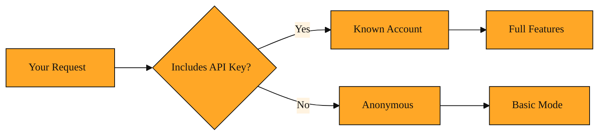

# Keyed Access

## The missing step after you get a key

You have already learned how to get a TAVILY_API_KEY and how the Tavily Search API turns a query into live web results. But simply storing the key on your computer is not enough. You have to show it to Tavily every single time you ask for data. Without that proof of identity, the API cannot unlock your account.

It is tempting to think of the key like a password you type once to log in to a website. An API key works differently. There is no login session that remembers you. Every request is a fresh conversation. If you send a question without your key, Tavily sees a stranger at the door. It may answer in a very limited keyless mode, but it has no way to apply your settings, track your usage, or give you the deeper results your plan includes. You might even get a response and think your setup is correct. But the moment you need richer results or more than a few calls, the cracks show. The key must travel with the request.

<InlineQuiz
  id="quiz-s1-l6-api-key-session"
  question="Why must your Tavily API key travel with every single request you send?"
  options='["Because Tavily has no login session memory, so each request must prove your identity from scratch.","Because the key acts as a search parameter that improves the quality of your query.","Because Tavily rotates and expires your key after every request for security.","Because the key encrypts your request so other developers cannot see your search terms."]'
  correct="0"
  explanation="The lesson explains that an API key works differently from a website password. There is no login session that remembers you, and every request is a fresh conversation. Without the key, Tavily cannot unlock your account, apply your settings, or track your usage. Option 2 is wrong because the key does not change or improve your query text. Option 3 is wrong because Tavily does not rotate your key after each request. Option 4 confuses authentication with encryption; the key proves identity, but it is not what encrypts the connection."
  courseSlug="tavily-for-developers-beginner"
  lessonSlug="06-keyed-access"
/>

## Your request needs an ID badge

Keyed access means attaching your key to every request. The standard way is a small line of text called an Authorization header, formatted as a Bearer token. If those words sound technical, picture a digital ID badge. The word Bearer simply means this token grants access. That badge clips onto your request before it leaves your computer.

When Tavily sees a valid key in that header, it looks up your account. It knows which features you paid for and which settings to apply. Your API Credits are deducted. Your preferences take effect. The key does not change the question you asked. It changes whose resources answer it. Without the badge, the request stays anonymous. It might receive a basic response, but it will miss the richer filtering and depth tied to your account. The difference is not inside the question. It is inside the identity that carries it.

*Figure: How the same request gets two different answers depending on whether your API key is attached.*

## A daily research run

Imagine a developer named Alex who runs a daily research job. Each morning her script asks Tavily for recent news about her product. She stores her TAVILY_API_KEY in an environment file, but she also makes sure her code attaches that key to the request as an Authorization Bearer header. Tavily recognizes her immediately, applies her advanced search settings, and returns rich results.

One morning Alex accidentally removes the header. Her script still reaches Tavily, but now the request is anonymous. It falls into keyless mode. The response is slower, stripped of advanced filtering, and stops after a handful of calls. Her dashboard shows no usage because the system has no account to link the call to. She adds the header back, resends, and everything returns to normal. That single header is the difference between borrowing a guest pass and swiping your own membership card.

## The invisible handshake

Whether you send requests manually or through a helper tool, the concept is identical. The key proves who is asking. The API answers according to that identity. This pattern is not unique to Tavily. Nearly every web service works the same way. You send a secret token so the system knows who to charge and what to allow. But on Tavily, it means your search depth, your filters, and your credit balance all follow you from call to call. As you use more capabilities in later lessons, keyed access is what keeps every request tied to your account and your limits.

## From manual headers to the Python SDK

In the upcoming lesson we will explore the Tavily Python SDK. You will see how the SDK wraps your calls and slips that Authorization header into place automatically. You will not have to build the header by hand. But even when the code hides the details, keyed access remains the invisible handshake that lets the API read your permissions and charge the right credits to your account.
