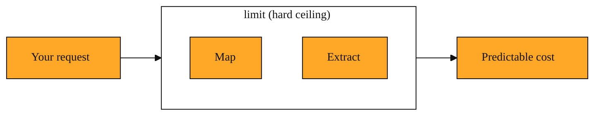

# Keep Your Crawls Predictable with limit

## Why this exists

"I pointed Tavily at a site and it just kept going. How do I make it stop before it costs me a fortune?"

If you have used Map to peel open a domain, you have felt how fast Tavily moves. You have also searched the live web and watched results stream in. Speed is useful, but it can also sweep you into an ocean of pages you never meant to visit.

Without a limit, automated web exploration is an open-ended job. The tool discovers pages, pulls content, and bills you for every step. You wanted a quick taste of a website. You got an all-you-can-eat buffet. The dashboard refreshes and your heart sinks. The missing piece is a simple knob that says "enough."

Tavily gives you that knob. It is called limit.

## Understanding the idea

Think of limit like a parking meter that counts cars instead of minutes.

You tell Tavily, "I will pay for five pages." Tavily pulls pages one by one. When the fifth page is done, it stops. It does not matter if the site has fifty pages or fifty thousand. Your meter is full. The job ends.

Limit is a parameter. That just means it is a number you hand in with your request. It sets a hard ceiling on how many pages get crawled. This is not a quality filter. It does not ask, "Is this page important?" It only asks, "Have I reached the cap?" That makes limit a pure cost-control guardrail.

Even a modest blog can hold hundreds of posts. A documentation site can hold thousands. Limit lets you sample without drowning.

Because the cap is so simple, you do not need to guess the shape of the site ahead of time. You do not need to list URLs by hand. You pick a number that matches your appetite and let Tavily work until it hits the wall.

If you omit it, Tavily assumes you want everything it can legally grab. That is sometimes useful, but usually overwhelming.

You already know that Tavily can Map a domain to discover URLs. You also know about Extract, which pulls clean content from a page. Both operations can run up a bill if they touch too many pages. Limit wraps a hard ceiling around them. It turns endless exploration into a predictable, finite task.

*Figure: How limit wraps a hard ceiling around both Map and Extract, making crawling predictable and finite.*

<InlineQuiz
  id="quiz-s2-l8-limit-hard-ceiling"
  question="You set limit to 5 before asking Tavily to crawl a large site. What happens?"
  options='["Tavily stops after crawling 5 pages, regardless of how large the site is.","Tavily crawls the entire site but returns only the 5 most important pages.","Tavily gathers every page first, then hides all but the first 5 results.","Tavily stops crawling after 5 minutes have passed."]'
  correct="0"
  explanation="The lesson describes limit as a parking meter that counts cars instead of minutes. It sets a hard ceiling on pages, so Tavily stops after 5 pages even if the site has thousands more. It is not a quality filter, so option B is wrong. It does not gather everything and truncate later, so option C is wrong. And it counts pages, not minutes, so option D is wrong."
  courseSlug="tavily-for-developers-beginner"
  lessonSlug="08-keep-your-crawls-predictable-with-limit"
/>

## A simple example

Say you are building a Friday afternoon demo. You want to show your team how a small knowledge base works on your company docs. You do not need the entire documentation archive. You need maybe ten pages to prove the idea.

You set limit to 10. Tavily fetches ten pages and hands them off. The demo runs in seconds. Your manager watches the screen. Everyone nods. Your account breathes easy. If you had forgotten the parameter, the same demo might churn for twenty minutes and mine the entire wiki. The team would still be waiting, and your monthly budget would be thinner.

That single number is the difference between a quick experiment and an expensive accident.

## How to think about it

Carry this mental model with you. Limit is the brake pedal, not the steering wheel. It does not choose where you go. It simply keeps you from going too far.

Think of it as setting a budget before you walk into a store. You decide what you are willing to spend. Then you shop without anxiety.

You can always raise the number later if the first sample is too small. Lowering it is how you test safely. Either way, you are driving with the brake within reach.

Make it a habit to set limit whenever you ask Tavily to explore more than a handful of pages. It keeps prototypes cheap and experiments safe. It also pairs nicely with what you already know about Streaming. Streaming delivers results live, and limit guarantees that stream has a clear end.

## Where this fits next

In the next lesson you will meet Query Routing. This is how Tavily decides whether a question needs a quick answer or deeper research. Now that you know how to cap a crawl with limit, you are ready to learn how Tavily routes the requests that happen inside that capped window.
