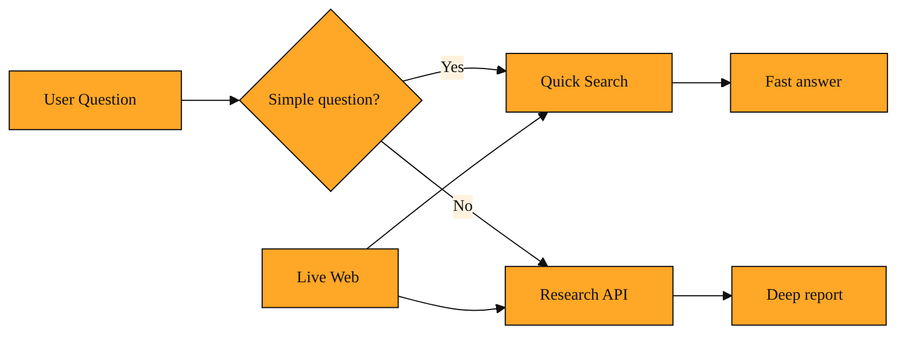

# Quick Search

## Why this exists

In earlier lessons we explored the Research API. That tool is built for depth. It plans, searches across many pages, maps sources, and extracts details. It is powerful, but not every question needs that much machinery.

Imagine asking a colleague for the time, and they respond with a twenty-minute presentation on the history of clockmaking. That is what happens when you send a simple factual question to a deep research engine. You still get a correct answer, but you wait longer than necessary. The system spins up sessions, analyzes page chunks, and maps relationships for a question that only needed a five-word answer.

There needed to be a lighter path for straightforward questions. That path is Quick Search.

## Understanding the idea

Think of Tavily’s search capabilities as two lanes at a help desk. One lane handles complex problems that need real investigation, like a traveler who lost a passport in a foreign country. The other handles quick facts that just need a reliable source and a short answer, like a traveler who simply wants to know if a visa is required. Quick Search is the fast lane.

When a question is narrow and factual, Quick Search handles it directly. The system performs a standard search, pulls the most relevant result, and returns a concise answer. It does not open a long-running session. It does not map sources across many pages. It simply finds the fact and hands it back.

Quick Search still draws from the same live web results and the same commitment to accuracy. It just skips the heavy steps. The difference is like looking up a phone number in a public directory versus hiring a private investigator to find it. Both get you the number. One takes seconds. The other takes days.

Because it is lighter, Quick Search is the natural choice for chatbots, assistants, and any interface where users ask rapid, simple questions. It keeps the conversation moving without forcing the user to wait for a full investigation.

*Figure: Quick Search and Research API are two lanes for the same live web data: one for fast facts, one for deep investigation.*

## A simple example

Picture a programming assistant that uses Tavily. A developer types, “When did Python 3.12 release?” That is a single fact hiding in a blog post or release note. The assistant sends this to Quick Search. Within moments it answers, “October 2, 2023,” with a link to the source. The developer did not need a report. They needed a date. The answer was immediate and kept the conversation flowing.

Later the same developer asks, “Compare the async performance improvements in Python 3.11 and 3.12 and suggest which is better for high-throughput web servers.” Now the question is broad, comparative, and opinionated. This deserves the Research API. That request spins up a session, searches multiple angles, and builds a reasoned comparison.

Same toolset, different depth. The first answer arrives in a blink. The second takes longer but earns its keep.

<InlineQuiz
  id="quiz-s3-l9-quick-search-selection"
  question="You are building a programming assistant that uses Tavily. Which user question is the best fit for Quick Search?"
  options='["What is the latest stable version of Python?","Compare Python 3.11 and 3.12 async performance and recommend which is better for high-throughput servers.","Trace the history of Python’s async features and their influence on modern web frameworks.","List every deprecated API in Python 3.12 and describe how to migrate each one."]'
  correct="0"
  explanation="Quick Search is designed for narrow factual questions that have a concise answer from a reliable source, such as a current version number. Option A fits because it asks for one specific fact. Option B is comparative and opinionated, requiring the deep analysis that the Research API provides. Option C asks for historical context and broad influence across many sources, which demands a full research session. Option D requires collecting and synthesizing many distinct items, which exceeds the scope of a quick factual lookup."
  courseSlug="tavily-for-developers-beginner"
  lessonSlug="09-quick-search"
/>

## How to think about it

Quick Search is your everyday lookup tool. Use it when you need a fact, a definition, a current event, or a single verified source. If a user asks what day a holiday falls on or what version of a library is current, that is a job for Quick Search.

When you need depth, reach for the Research API. When you need the contents of one specific page, reach for the Extract API.

The skill is not memorizing every option. It is matching the weight of the question to the weight of the search. A responsive application knows when to look up a quick answer and when to dig deeper. Quick Search gives you that responsiveness by default.

## Closing the loop

Over these nine lessons you have seen how Tavily turns the live web into structured answers. You started with basic search, moved to precise page extraction, and explored deep research with sessions and projects. Quick Search completes the picture by giving you a way to handle the simple questions without ceremony. You no longer have to choose between raw speed and real depth. You can have both, as long as you know when to use each.

Choose the right depth for the right question. That is the heart of using Tavily well.
