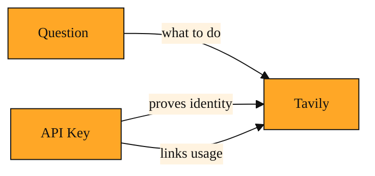

# The API Key

## Why your app needs fresh facts

Imagine you are building a chatbot that answers questions about current events. A user asks, "What happened in the markets today?" Your chatbot was trained months ago. It has no idea.

You could tell the user to go search the web themselves. Or you could try to build a full web browser inside your bot. Neither option is simple.

Tavily exists to solve this exact problem. It is a service that acts like a research assistant for your application. You send Tavily a question. It searches the live web, reads the pages, and sends back a clean, current answer. Your program stays small and simple, while Tavily handles the messy work of browsing.

Because Tavily lives on the internet, not on your computer, your app must reach it across the web automatically. That means sending a message from your code to Tavily's servers, even at three in the morning. Tavily also needs to know who is asking. It must send answers back to the right person, keep your data separate from everyone else's, and track how much you have used so it can manage your account fairly. If Tavily accepted every anonymous call, a stranger could read responses meant for you or use up your allowance.

You cannot sit at your keyboard and type a password each time your program runs. You need a single reusable credential that your code can show on your behalf. That credential is the API key.

## The key that speaks for you

API stands for Application Programming Interface. In everyday language, it is simply the way one piece of software asks another for help. Tavily offers an API, which means your projects can send it questions over the internet and receive answers back.

An API key is a long secret string that acts like a password for your application. You get yours from Tavily's website after you sign up, and it belongs only to your account. It is not meant for humans to memorize. It is meant for your programs to repeat.

Think of it as a membership card for a private workspace. The card does not tell the tools what to build. It simply unlocks the door and tells the front desk whose account to use. Whenever your app sends a request to Tavily, it includes this key in the background. You can picture it clipped to your app's pocket so Tavily's gatekeeper can scan it instantly.

Because the key is tied to your account, it does two jobs at once. It proves your identity, and it links every request to your account so Tavily knows which usage belongs to you.

*Figure: Every request to Tavily is made of two separate parts: what you want to know, and who is asking.*

<InlineQuiz
  id="quiz-s2-l1-api-key-purpose"
  question="When your app sends a request to Tavily, the API key travels along with the question. What is the key's main role?"
  options='["It tells Tavily what topic to search for and how deeply to read the web.","It proves which account is making the request and links usage to that account.","It scrambles the message so that only Tavily can read it over the internet.","It checks whether Tavily’s servers are online before the real request is sent."]'
  correct="1"
  explanation="The key works like a membership card. It proves your identity and links each request to your account so Tavily can send answers to the right place and track usage fairly. Telling Tavily what to search for is the job of the question, not the key. The key also does not scramble or encrypt the connection because web encryption is handled automatically by the underlying protocol. Finally, it is not a health check sent before the real request; the key travels alongside every actual request."
  courseSlug="tavily-for-developers-fast-track"
  lessonSlug="01-the-api-key"
/>

## A key in action

You sign up at Tavily and copy your API key. It looks like a random jumble of letters and numbers.

Next, imagine you open a visual workflow tool. You add a step that asks Tavily to search the web. That step has one empty box labeled API Key. You paste your key there and save.

Now when your workflow runs, it sends a question to Tavily along with that key. Tavily reads the key, recognizes your account, performs the search, and sends back snippets and answers. If the key is missing, Tavily returns a refusal that amounts to "I don't know you," and the workflow stops.

You can use the same key in multiple projects. One key opens every door inside your account. Whether you are building a chatbot, a spreadsheet helper, or a research agent, the key is the first thing Tavily checks. It travels in the background. You do not see the handoff, but it happens with every single request.

## Keep it secret

An API key is not a command. It does not tell Tavily what to search for or how deep to look. It is simply proof that your app is allowed to ask. Keep it secret, because anyone who holds it can speak to Tavily in your name and use your account.

Once the key is in place, the real conversation can begin. The coming lessons will show you what you can actually ask Tavily to do: search the live web, pull raw text from a page, and run deeper research tasks. The key opens the door, but what you do once you walk through is where the work starts.
