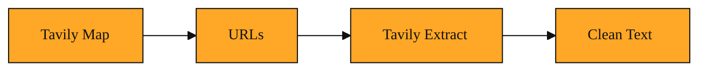

# Tavily Extract

In the last lesson, you learned how to find the right web pages with Tavily Map. You hand it a topic, and it points you toward URLs that matter. But a list of links is not a finished research report. It is just a set of doors.

Walking through those doors is harder than it sounds. Think about the last time you tried to copy an article from a website. You probably grabbed navigation menus, ads, cookie banners, and footer links along with the actual paragraphs. The text arrived with broken formatting and hidden clutter. Maybe you pasted it into a document and spent several minutes deleting extra lines. Now imagine doing that for dozens of pages inside a software application. The results would be unusable.

If you write a program that simply downloads a page, you get a mess. Web pages are built with three languages most browsers read. HTML is the structure. CSS controls the colors and fonts. JavaScript adds interactivity like pop-ups and animations. Together they create the layout you see. But if you grab the raw code, you get a tangle of tags, colors, and scripts instead of clean sentences. Cleaning that up by hand for one article is tedious. Doing it for many sources is impossible.

You need a way to turn a web address into plain, usable text without the surrounding mess. That is exactly the gap Tavily Extract was built to fill.

## Understanding the idea

Tavily Extract is a service that reads web pages and returns only the meaningful text. You give it one or more URLs. It visits each address, finds the actual content, and hands it back as clean text your application can read immediately.

Think of it like a research assistant who opens a book, ignores the publisher logos and footnotes, and types up only the paragraphs you care about. If Tavily Map is the card catalog that tells you which shelf to visit, Tavily Extract is the assistant who pulls the book and copies the relevant chapters.

The result is clean text that captures what the page actually says. This is especially useful for dense industry reports or long articles where you need the facts, not the formatting. It also works for news stories, blog posts, and documentation pages. Anywhere humans publish text on the web, Extract can pull it free of distractions.

Sometimes a URL will not load, or the site blocks access. When that happens, Tavily Extract does not crash your whole workflow. It simply notes which address failed and continues with the rest. You get a complete picture of what worked and what did not.

At its core, Extract does one job. It turns a messy web page into readable text.

*Figure: The two-step pipeline: Tavily Map discovers URLs, and Tavily Extract turns those pages into clean, readable text.*

<InlineQuiz
  id="quiz-s1-l2-tavily-extract-purpose"
  question="You have used Tavily Map to gather a list of article URLs. What does Tavily Extract add to your workflow?"
  options='["It visits each URL and returns only the meaningful text, stripped of ads, menus, and code.","It searches for additional URLs related to the ones Map already found.","It downloads the raw HTML, CSS, and JavaScript exactly as a browser would receive it.","It checks which URLs are broken and removes the failed ones from your list."]'
  correct="0"
  explanation="Tavily Extract solves the problem that raw web pages are cluttered with formatting, scripts, and navigation elements by visiting your URLs and returning clean, readable text. Option B confuses Extract with Tavily Map, whose job is to discover URLs rather than read their contents. Option C describes the messy raw download that Extract is designed to avoid, not the service itself. Option D overstates its error handling; Extract notes failures so the batch continues, but validating or pruning URL lists is not its main purpose."
  courseSlug="tavily-for-developers-fast-track"
  lessonSlug="02-tavily-extract"
/>

## A simple example

Imagine you are building a weekly briefing app for financial analysts. On Monday, your app uses Tavily Map to discover five new industry reports about supply chain trends. Your analyst needs to read them, but she does not have time to visit five different websites and scroll past pop-up surveys.

Your app sends those five URLs to Tavily Extract in a single batch. For four of them, it returns clean paragraphs ready for reading. For the fifth, the site requires a login. Extract skips that address and tells you why, so you are never left guessing. Your app shows the analyst the four good sources.

She opens her dashboard and sees the actual content of each report. No raw code. No broken layouts. No strange formatting. The text arrives ready for her to read or to pass along to another tool.

Without Extract, your app would need to build its own web reader. You would have to teach it to ignore ads, strip out menus, and handle login walls. Extract handles all of that for you.

## How to think about it

Whenever you have a URL and need what it actually says, Tavily Extract is the bridge between the web and your work. It turns addresses into text you can count, search, or organize. It handles the mess of the modern web so you do not have to.

You do not need to worry about how the page is built. You do not need to manage browser windows or copy text by hand. You simply hand over a list of links and receive the words that matter. This makes Extract a foundational piece of any workflow that starts on the web.

The input is a link. The output is the meaning inside it.

## Where you'll see this next

A single extraction gives you raw material. Soon you will want to know exactly how that material is packaged and how to organize larger research jobs. The next lesson looks at Extraction Results and the tracking tools Tavily provides, like Projects and Sessions, so you can monitor and structure your work at a higher level.
