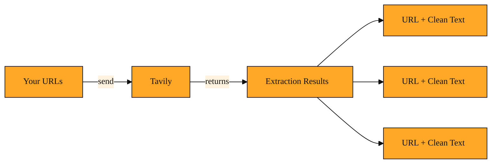

# Extraction Results

## Why this exists

You already know Tavily can search the web and bring back links. But sometimes you do not need more links. You already have them.

Imagine you are building a research assistant and your user pastes three web addresses, called URLs, about machine learning in healthcare. You do not need Tavily to search. You need Tavily to read those exact pages and hand you back something your code can actually use.

Here is the question every beginner faces: if you send Tavily a list of URLs, what exactly comes back? A wall of raw code? Just a status message? And if you send five URLs, how do you know which text came from which address?

Without a clear answer, you would be stuck cleaning up web pages yourself. Raw HTML, the code that tells a browser how to display a page, is messy. It contains navigation bars, cookie banners, advertisements, and styling instructions. If you had to strip that away yourself, you would spend hours writing fragile scrapers. When a site changes its layout, your code would break. You would also have to handle pages that load slowly or block automated tools.

Extraction Results exist to remove that burden. They are the clean, readable text Tavily pulls from the specific URLs you provide. Instead of giving you a wall of code, Tavily gives you the substance, organized by source, so you can focus on building your feature instead of fighting with someone else's web page.

## Understanding the idea

An Extraction Result is simply one item in a list. When you ask Tavily to process one or more URLs, the response contains Extraction Results. Each item pairs a URL with the meaningful content from that page.

Think of it like hiring a research assistant for an afternoon. You hand them a stack of printed web addresses. They visit each one, ignore the pop-ups and sidebars, copy only the article text, and place each copied page into a folder labeled with the original address. At the end of the day, they hand you back a neat stack of folders. That stack is your Extraction Results. You do not need to know how they opened each page or what software they used. You only need the folders.

The response may include small details alongside that stack, such as how long the work took. But none of that changes the main point. The star of the show is the Extraction Results: a list that says, from this URL, here is the text.

*Figure: How Tavily turns your URLs into a structured list of source-labeled text blocks.*

<InlineQuiz
  id="quiz-s2-l3-extraction-results-purpose"
  question="Your application receives three URLs and sends them to Tavily. What do Extraction Results provide?"
  options='["A list of new URLs found by searching the web.","Raw HTML, ads, and navigation bars from each page.","Clean article text from each URL paired with the source address.","A single combined text block with no way to tell which content came from where."]'
  correct="2"
  explanation="Extraction Results give you clean text from the specific pages you pointed to, organized so each block of text is paired with the URL it came from. Option 1 describes Tavily search, which discovers new links rather than reading ones you already have. Option 2 is the messy raw content you would face without Extraction Results, and avoiding that cleanup is exactly why the feature exists. Option 4 misses the key point that results are separate and labeled by source, so your code never confuses one article with another."
  courseSlug="tavily-for-developers-fast-track"
  lessonSlug="03-extraction-results"
/>

## A simple example

Suppose you are writing a small tool that summarizes competitor blog posts. Every morning, your tool has three URLs to process. You send those URLs to Tavily.

The Extraction Results come back as a list with three entries. The first entry holds the clean text from the first blog post, paired with its URL. The second entry holds the text from the second blog post. The third holds the text from the third. There are no HTML tags, no comment sections, no login prompts, and no navigation menus. Just the articles.

Because each entry carries its own URL label, your code never confuses the first article with the second. You can process them in order or pick them out by address. Your application can immediately pass this text into a summarizer, store it in a database, or display it to the user. You never had to write a web scraper. You never had to inspect a web page to find where the content lives. The Extraction Results gave you exactly what you needed: the words from the pages, organized by source, ready for whatever your application does next.

## How to think about it

Whenever you already know where to look and you need what is inside, Extraction Results are your shortcut. They turn messy web pages into plain, structured text you can actually use.

You will see them anytime you feed Tavily a specific set of URLs and ask for the content. Maybe you are building a research pipeline that collects readings for a weekly report. Maybe you are importing documentation from a handful of product pages. Maybe you are enriching a spreadsheet with descriptions pulled from company about-pages. In every case, the pattern is the same. You point at the pages. Tavily hands back the clean text. Your code takes it from there.

## Where you'll see this next

Understanding Extraction Results is the foundation for everything that follows. In the upcoming lessons, you will learn how to control what gets extracted and how these results feed into the rest of your application. For now, remember the core idea: point Tavily at a URL, and the Extraction Results give you back the clean text.
