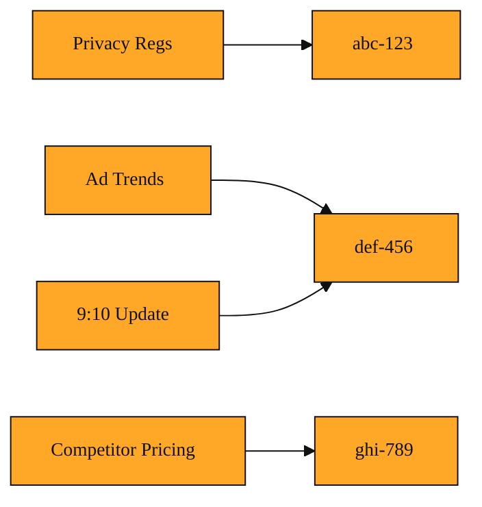

# The Request ID

## Why this exists

You already know that your API key is like your name tag. It tells Tavily who is making the call. You also know that your query is the actual question, such as "compare electric SUVs under $50k." But there is a gap between identity and question. Once you hit send, how do you talk about that specific ask?

Imagine you send five different research jobs in the same minute. Or imagine one research job takes a few minutes to finish because Tavily needs to crawl and read several pages. Later, you want to know if it is done. If all you have is the query words, you are stuck. Two jobs might use almost the same words. You might accidentally ask the same question twice. And if something goes wrong and you need to point to a specific transaction, saying "the one about SUVs" is not precise enough.

Without a way to point at one exact job, you cannot check its status, retrieve its final report, or match a late-arriving update to the right task. You need a receipt for the work.

## Understanding the idea

A request_id is that receipt. It is a unique tag that Tavily creates for every research task. It is not your API key. It is not your query. It is the identity of this one piece of work, generated by Tavily the moment it accepts your request.

Think of it like a ticket number at a busy deli. You walk in and order a sandwich. The clerk does not yell out, "Sandwich for the person who likes turkey." Instead, they hand you a ticket that says "47." Later, when your order is ready, they call "47," and you know exactly which meal is yours. Even if ten people ordered turkey, the number keeps every order straight.

In the same way, Tavily hands back a request_id inside the response. From that point on, that string of characters represents that exact job. If you check on progress later, Tavily knows which job you mean. Whenever Tavily sends an update while the job is still running, that update carries the same request_id so you know exactly which task it belongs to.

<InlineQuiz
  id="quiz-s2-l4-request-id-purpose"
  question="You send five research requests in the same minute. What problem does request_id solve?"
  options='["It gives each job a unique label so you can check on a specific one without confusing it with the others.","It tells Tavily who is making all five calls so they come from the same account.","It stores the exact query words so Tavily does not forget what you asked.","It marks the order in which the jobs were received so Tavily can process them one by one."]'
  correct="0"
  explanation="A request_id is a unique tag for one specific piece of work. It exists so you can point to that exact job later when checking status or matching updates, even if several jobs look similar. Your API key tells Tavily who is making the call, not the request_id. The query describes the research topic, not the request_id. And while the lesson uses a deli ticket as an analogy, the request_id is not about queue order or processing sequence; it simply gives every job its own distinct identity."
  courseSlug="tavily-for-developers-fast-track"
  lessonSlug="04-the-request-id"
/>

## A simple example

Picture a small marketing team that starts every Monday with three research briefs. They ask Tavily to research competitor pricing, summer ad trends, and new privacy regulations. All three requests go out at 9:00 AM.

Without request_ids, the team has no clean way to ask, "Is the competitor report done?" They would have to repeat the whole query and hope Tavily guesses correctly. But because Tavily issues a request_id for each job, the team gets three distinct labels. The privacy job might be request_id "abc-123." The ad trends job might be "def-456." The competitor job might be "ghi-789."

At 9:05 AM, a teammate asks if the privacy report is back. The team lead looks up "abc-123" and gets a clear yes or no. At 9:10 AM, an update arrives for one of the running jobs. Because it carries "def-456," they know it belongs to the ad trends job, not the competitor job. If they need to log costs or review what happened last Tuesday, they can search their records by request_id instead of trying to remember exact wording.

*Figure: Three simultaneous research requests each receive a unique request_id, so a later update routes instantly to the correct job.*

## How to think about it

Treat the request_id as the name of a single conversation between you and Tavily about one task. You can log it, check on it, or use it to line up results with the right question. It appears when a research task begins, and it stays with that task until the end. Whenever a job might take time, or whenever you are running many jobs at once, that little tag is what keeps your world organized.

## Where you'll see this next

Now that you can label an individual task, the next step is learning how to control what goes inside it. The coming lesson covers Search Depth and chunks_per_source. These two settings shape how much material Tavily gathers for a given request_id. Later, we will also look at session_id and human_id. Those labels sit above request_id and group many individual tasks into a broader conversation. Think of request_id as the label on one file folder, and the next ideas as the rules for what goes in the folder, and the shelf that holds the folders together.
