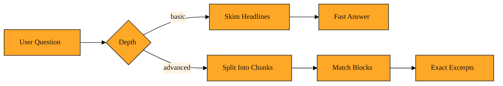

# Search Depth: Matching Effort to the Question

Imagine you are using a search feature in an app. You ask, "How does Company ABC price its enterprise plans?" The results arrive instantly. You open the top link, but the snippet only says "ABC offers flexible solutions for modern teams." It never mentions a price. You wish the search would actually read the pages and find the paragraphs that talk about dollars and tiers. That difference between a quick skim and a focused read is exactly what Search Depth controls.

## Why this exists

When Tavily searches, it does more than find links. It also reads the pages and prepares an answer your app can use. That reading step is where the real value lives. But not every question needs the same level of effort.

If you ask for the weather in Paris, a fast summary from the top result is enough. If you ask for a comparison of three CRM tools, you need the engine to dig into articles and extract the specific lines that compare features.

Without a way to set depth, every query would be treated the same. Simple questions would use more processing than they need. Hard questions would come back with thin summaries that miss the point. You would pay for maximum effort even when you only needed a quick confirmation.

Search Depth solves this by letting you choose how hard Tavily works after it finds the raw links. You can ask for a light pass. You can ask for a deeper pass that looks at small pieces of each page and picks the ones that match your question best. Tavily can even make that choice for you when it senses your question needs it.

<InlineQuiz
  id="quiz-s1-l5-search-depth-purpose"
  question="What problem does Search Depth solve?"
  options='["It limits how many web links Tavily returns for each search.","It balances speed and thoroughness so simple queries stay fast and specific ones get exact excerpts.","It sets the maximum word count for the final answer Tavily returns.","It changes which websites Tavily is permitted to search for results."]'
  correct="1"
  explanation="Search Depth solves the problem of treating every query the same. It lets you choose a light read when speed matters and a deeper read when you need exact facts buried inside long pages. The wrong answers confuse depth with unrelated ideas: limiting returned links, setting answer length, and choosing allowed websites are separate concerns that the lesson did not tie to Search Depth."
  courseSlug="tavily-for-developers-fast-track"
  lessonSlug="05-search-depth-matching-effort-to-the-question"
/>

## The two modes

Search Depth is controlled by a setting called search_depth. Think of it as a simple two-position switch: basic and advanced.

Basic depth is like reading the headlines. Tavily fetches the pages, summarizes them quickly, and returns those summaries. It returns fast and uses less processing. This is perfect when you want general context or when speed matters most.

Advanced depth is like hiring a research assistant. Instead of summarizing whole pages, Tavily breaks each page into small blocks of text. It checks each block against your question and returns the most relevant pieces first. It uses more processing because the engine is doing more work behind the scenes. You reach for this when your question is specific and the answer is buried inside a long article. Advanced depth can pull a relevant paragraph from the middle of a blog post even if the overall article is about something broader.

*Figure: The two search paths side by side, showing how Basic skims for a fast summary while Advanced breaks pages into chunks to find precise matches.*

## A simple example

Picture a travel app that answers spoken questions. A user asks, "What is the time in Paris?" The app calls Tavily with basic depth. It gets a quick answer and speaks it immediately. The interaction feels instant.

A minute later, the same user asks, "What are the cancellation policies for short-term rentals near the Eiffel Tower?" Now the app uses advanced depth. The results contain specific paragraphs from rental sites about refunds and deadlines. They do not just describe Paris apartments in general. The user gets a precise answer because the search went deeper.

The same idea applies to a support chatbot. "How do I reset my password?" stays basic. "How does your refund policy compare to industry standards?" goes advanced. The bot itself does not change. Only the depth switch does.

## How to think about it

Search Depth is the first dial you adjust when the quality of your results feels off. If your answers are on topic but too vague, advanced depth is likely the fix. If you are getting good answers but want them faster, basic depth is your friend.

Pick basic when speed matters most and the answer sits right on the surface. Pick advanced when your app must cite exact facts from deep inside a page. It is a single, clear choice that shapes every answer that follows.

No matter which tool sends the request to Tavily, the underlying choice is the same. How hard should Tavily work to find the exact sentence that answers the question?

## Where you will see this next

Now that you can control how deep Tavily searches, the next question is how much content you want back from each page. In the next lesson we will look at how to control the size of those returned pieces and how Tavily connects to larger app-building tools. Once you know the depth, you are ready to decide the breadth.
