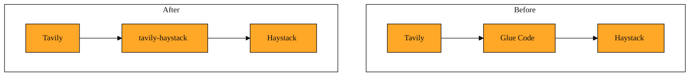

# Tavily for Haystack Pipelines

## The problem

Imagine you have built a question-answering system using Haystack. Haystack is a framework that lets you chain together steps so data flows from one stage to the next. Your pipeline already reads internal wikis, PDFs, and support tickets. Then a user asks about a product recall announced twenty minutes ago. Your internal sources find nothing. The answer is on the web, but your pipeline cannot reach it.

You already know Tavily can fetch live web results. But Haystack expects information in a specific shape. It likes structured text objects that carry both content and source details. If you wanted to use Tavily inside Haystack on your own, you would have to convert web results into that specific shape yourself. That means writing extra glue code every time. That is exactly the gap tavily-haystack fills.

## What tavily-haystack is

tavily-haystack is an integration package. It adds a ready-made Tavily search step to Haystack. Think of it as a travel adapter. On one side, it talks to Tavily's live web search. On the other side, it outputs information in the exact format Haystack expects. You place it inside your pipeline, feed it a question, and it returns web results that the next step can read immediately.

Because it behaves like a standard Haystack step, you configure it with your API key. When the pipeline runs, it fetches web results and packages them for you. You do not handle raw web responses or manual conversion. You simply treat the live web as another source inside your workflow.

Picture your pipeline as a simple assembly line. Every worker expects parts in the same kind of box. The web sends back loose items. tavily-haystack is the worker who collects those loose items, labels them, and places them in the standard box. The rest of the line keeps moving without special instructions.

*Figure: Before and after: tavily-haystack removes the need for manual conversion between raw web search and Haystack documents.*

<InlineQuiz
  id="quiz-s2-l6-tavily-haystack-adapter"
  question="You are building a Haystack pipeline and need it to include live web search results alongside internal documents. What does tavily-haystack do?"
  options='["It fetches live web results and reformats them so Haystack can treat them like any other source.","It replaces Haystack’s internal document search with a web-only search engine.","It requires you to write custom glue code to connect Tavily’s raw responses to each step.","It stores a cached copy of the web so your pipeline works without an internet connection."]'
  correct="0"
  explanation="tavily-haystack is an integration that acts like an adapter. It fetches live web results through Tavily and packages them into the exact structured format Haystack expects, letting you treat the web as another pipeline source without writing manual conversion code. Option B is wrong because the integration adds web search rather than replacing internal sources. Option C is wrong because the whole point of the package is to remove the need for custom glue code, not create it. Option D is wrong because it does not cache the entire web for offline use; it fetches fresh results when the pipeline runs."
  courseSlug="tavily-for-developers-fast-track"
  lessonSlug="06-tavily-for-haystack-pipelines"
/>

## A simple example

Picture a research assistant for a financial team. A trader types, "What is the latest guidance from the Federal Reserve?" The pipeline first checks internal reports and finds outdated material. The next step is the Tavily search piece from tavily-haystack. It forwards the question to Tavily, receives the top relevant web pages, and packages them as structured text with source links attached. A final stage reads those results and drafts a cited summary.

Without the integration, you would have to stop the pipeline, call Tavily separately, and reformat everything by hand. With tavily-haystack, the web search step looks like any other source. The pipeline stays continuous and readable.

## How to think about it

tavily-haystack is an adapter, not a new API. It lets Haystack treat the live web as just another source of information. When you see it in practice, it usually appears in systems that blend internal files with fresh external data. The component relies on the same Tavily Search API you have already learned. The only difference is that you do not touch the API directly. The integration manages the conversation between Haystack and Tavily on your behalf.

You would reach for this tool when you are already working inside Haystack and you need a simple way to add live web search. If you are not using Haystack, you would use a different connection. The underlying Tavily capabilities stay the same. Only the wrapper changes.

## Where this leads next

tavily-haystack is perfect when you need a tidy search box inside a pipeline. But sometimes a search query is not enough. Sometimes you need to crawl an entire documentation site, extract the text from a single URL, or map out the structure of a website before you decide what to fetch. Those jobs call for Tavily's lower-level building blocks. In the next lesson, we will leave the pipeline wrappers behind and look at Map, Crawl, Extract, and the Tavily Python SDK. You will learn how to pull exactly what you need when a pre-built component is not the right fit.
