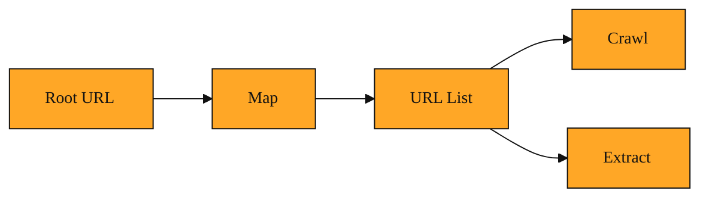

# Map: Discovering Site Structure Before You Crawl

## What Map is, and why it matters

Map is a site discovery tool. Give it one starting web address, which is called a URL, and it will explore a website to find the pages inside. It does not pull down the full text of each page. It simply returns a list of addresses, like a table of contents for the site.

Searching a large website without Map is like walking into a dark warehouse. You know the information is in there somewhere, but you cannot see which aisle to check. If you send a Crawl in blindly, it might read two hundred irrelevant pages before it finds the five you actually need. That wastes time and costs you money, because most services charge you for every page they read in full.

Map exists to be your scout. It goes in first, learns the layout, and reports back with the paths worth exploring. You get a clear plan before you spend a single cent on heavy reading.

<InlineQuiz
  id="quiz-s1-l7-map-core-purpose"
  question="What is the main reason to use Map before running Crawl or Extract on a large website?"
  options='["It creates a focused list of page addresses without reading full content, saving both time and cost.","It downloads the complete text of every page so you can search through it later.","It generates a visual diagram showing how every page connects to every other page.","It ranks every discovered page by relevance so you only read the most important ones."]'
  correct="0"
  explanation="Map is designed to scout a site by collecting page addresses without pulling down full text, which keeps the work fast and cheap. The second option confuses Map with Crawl or Extract, which actually read page content. The third option is tempting because the tool is called Map, but it returns a simple list of addresses rather than a visual diagram. The fourth option is wrong because Map does not rank pages by relevance; it returns a list of what it finds and lets you choose which pages to read next."
  courseSlug="tavily-for-developers-fast-track"
  lessonSlug="07-map-discovering-site-structure-before-you-crawl"
/>

## How Map explores a site

Map moves through a website the same way you would map out a building made of hallways and doors. It starts at the entrance you give it. That starting address is called the root URL. From there it notes every link on that page. Then it follows those links to new pages, and repeats the process. Because every page links to other pages, Map can discover an entire corner of a site just by walking those connections. It checks many branches at the same time, so it can cover a large site in seconds. The result is a full view of the site structure without the heavy work of reading every word.

Because Map only records addresses and basic structure, it is fast and cheap compared to reading full pages. Sometimes it also picks up the page title or a short description, but it never grabs the full article text. You can guide it with a few simple rules. You can tell it to stay on the same website so it does not wander off to other sites. You can give it path patterns so it focuses only on certain sections, like addresses that begin with /sdk/python. You can also set a page limit so it stops after a certain number of addresses. That keeps your bill predictable and prevents the search from wandering too far.

Think of it like driving through a new neighborhood to note where the grocery store, pharmacy, and bank are located. You do not go inside yet. You just write down the addresses so you know exactly where to go later. Map does the same for websites. It gives you the addresses. Crawl and Extract are what you use later to go inside and read the details.

## A simple example

Imagine you need to find every page about the Python developer tools inside a large documentation site. The site has hundreds of pages covering interfaces, tutorials, billing, and blog posts. Finding the right pages by hand would take hours.

You start Map at the docs homepage and tell it to look for Python content. You might also add a path pattern so it only checks sections whose web addresses start with /sdk/python. Map returns ten addresses: the quick start guide, the installation page, the reference documentation, and a few troubleshooting articles. You now have a short, focused list.

You can send those ten addresses to Extract or Crawl to read the full content. You could also just look at the list yourself to decide which pages matter most. Without Map, you might have paid for a broad crawl across hundreds of unrelated pages. Map turned a confusing website into a short to-do list.

## How to keep Map straight in your head

Map is the planning step. It answers the question, "What is out there?" before you commit to the question, "What does it say?" Any time you face a large website and feel overwhelmed by its size, Map is the tool that turns the unknown into a short list of targets. It works hand in hand with Crawl and Extract. Map finds the doors. The other tools open them. Once you adopt this plan-first habit, large websites stop feeling like black boxes.

*Figure: Map discovers the doors so Crawl and Extract know exactly which ones to open.*

## Where you will see this next

Once you have that blueprint of addresses, the next step is turning them into actual content and wiring them into your application. In the next lesson we will look at the Crawl tool and how the system decides which tool handles which job. Map gives you the targets. Next you will see how the system fetches and uses them.
