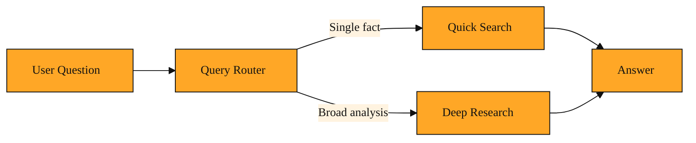

# Query Routing: Matching the Question to the Right Tool

You are building an assistant that answers questions using Tavily. One user asks, "What is the capital of Norway?" Another asks, "Analyze the economic impact of renewable energy subsidies in Europe over the last five years and compare them to Asia." Here is the question you face as a junior developer: does my app use the same tool for both? And if not, how does it know which tool to pick without bothering the user?

If you treat every question the same way, you will run into trouble. A simple fact does not need a long, expensive research pipeline. Running it through the deep Research API would be like calling a full engineering team to change a lightbulb. On the flip side, a complex analysis cannot be answered by a quick lookup. Using shallow search for that would be like trying to fix a server outage with a single search. You might be tempted to ask the user, "Do you want a quick answer or deep research?" But users do not know the internals of your system. They just want the right answer. The system has to decide for them. Without a way to judge the question before acting, your app will constantly mismatch effort to need.

## Understanding the idea

Query routing fills that gap. It is a component that sits between the user's question and your tools. When a question arrives, the router examines it and decides whether to use a quick search or the deep Research API.

Think of it like the person at the front desk of a library. If you walk in and ask for a specific fact, they point you to a quick-reference shelf. If you ask for a deep investigation, they send you to the research department. The visitor never has to know which department to visit. The front desk makes the call based on the size of the request.

In practice, the router lives inside your application. It does not answer the question itself. It only picks the door. TavilyClient can reach both quick search tools and the Research API, so the router simply tells the client which path to take. The router might notice whether the question asks for a single fact or a broad comparison. It might look for words like "analyze" or "compare." Either way, the goal is the same. Send simple work down the fast path, and send hard work down the thorough path.

*Figure: How query routing sits between a question and the right tool, sending simple work to quick search and complex work to deep research.*

<InlineQuiz
  id="quiz-s1-l8-query-routing-purpose"
  question="What is the main purpose of query routing in an assistant that offers both quick search and deep research?"
  options='["It examines each user question and automatically sends simple requests to quick search and complex requests to deep research without bothering the user with the choice.","It answers user questions directly by analyzing keywords and generating responses on its own instead of calling a search tool.","It asks the user to pick between a fast answer or a thorough research report before the system processes the request.","It runs every question through both quick search and deep research at the same time and keeps the better result."]'
  correct="0"
  explanation="The correct option is right because query routing is a decision layer that sits between the user and the tools, matching the depth of the tool to the complexity of the question so the user never has to choose. The second option is wrong because the router does not answer questions itself; it only picks which tool should do the work. The third option is wrong because routing exists specifically to avoid forcing users to choose between quick and deep options, since users do not know the internal differences between tools. The fourth option is wrong because routing selects a single path based on the question; running everything through both tools would waste time and resources and would not match effort to need."
  courseSlug="tavily-for-developers-fast-track"
  lessonSlug="08-query-routing-matching-the-question-to-the-right-tool"
/>

## A simple example

Imagine a help desk chatbot for a small company. An employee messages, "What is the office Wi-Fi password?" That is a single fact. A quick search against an internal page handles it in a second. An hour later, someone asks, "What are the latest compliance changes in our industry, and how should we update our policies?" That question is broad, analytical, and multi-step. It needs the Research API to gather sources, compare them, and build a thorough answer.

Query routing lets the chatbot handle both messages the same way on the surface. The bot receives the text, the routing layer judges the complexity, and the bot calls either a quick search or a deep research task. The employee just gets an answer. They never see a menu asking them to choose "quick" or "deep."

Without routing, you would have to guess. If you default to quick search, the compliance question gets a thin, unhelpful paragraph. If you default to deep research, the Wi-Fi question takes thirty seconds and wastes time and resources. Routing makes the default intelligent.

## How to think about it

You can picture query routing as a traffic director for information. You already know that Extract pulls structured content from pages and that Research performs deep investigation. Query routing is the step that happens before those tools run. It looks at the shape of the question and says, "This one is small; go fast," or "This one is big; go deep."

You will encounter this pattern whenever you build an assistant that has more than one way to find answers. It keeps simple questions cheap and complex questions thorough, all without burdening the user with the choice. When you see platforms that use Tavily as a web search provider, the routing often happens behind the scenes. The assistant decides whether the moment calls for a fast fact check or a full research report. You do not need to write a custom rule for every possible question. You just need to give the system a way to tell the difference.

## Where you'll see this next

So far we have talked about routing between different ways of searching the web. But many applications also hold their own private data. Next, we will look at what happens when you want to blend web search with your own database. You will see how Tavily mixes those two sources, and how results come back in a clean, predictable shape. We will also explore how to keep the conversation moving in real time, so users are not left waiting while research is underway.
