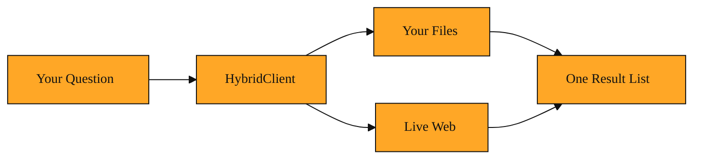

# Searching Your Own Data and the Web Together

## When web search alone is not enough

So far, Tavily Search has been your window to the internet. You ask a question. It brings back fresh results from the live web. That works well for public knowledge.

But many facts you care about are not online. They sit in your own files. Maybe they are product manuals, research notes, or past meeting transcripts. Tavily Search cannot open your laptop and read them.

Without a way to search your own documents and the web together, you end up doing double work. You hunt through your files. Then you switch to a browser. You try to stitch the story together yourself. You also miss hidden links. A note you wrote three months ago might perfectly explain a news article from this morning. Something needs to check both places at once. The gap is obvious. You need a single search that treats your private data and the public web as one big library.

## One librarian, two shelves

Tavily offers a tool called HybridClient to solve this. Think of it as a single librarian who checks two shelves at once. One shelf holds your own documents. The other shelf is the live web. When you ask a question, the HybridClient searches both places. It blends the results together. It then hands you back the most relevant mix.

The word hybrid simply means two things blended into one. This is not two separate searches you run back to back. The client looks for meaning in your local documents and on the web. Then it scores the results so the best matches float to the top. It does not matter where they started. You get one unified list.

You do not need to tell it which shelf to check first. You ask in plain language. The tool decides where the answer is most likely to live. It might find that your own documents answer half the question while the web answers the other half. Either way, you receive a single response.

Your own documents live in a local database. Think of a database as a digital filing cabinet that software can query quickly. The HybridClient knows how to read that cabinet. It also knows how to call Tavily's web index. Because it is built in Python, it fits neatly into data projects and notebook workflows. But the big idea is not the programming language. The big idea is the blending.

*Figure: How a single question reaches your private files and the live web, then returns one blended result list.*

<InlineQuiz
  id="quiz-s2-l9-hybrid-client-blending"
  question="You keep product manuals on your laptop and you also need current web news. What does HybridClient do when you ask it a question?"
  options='["It searches both your local files and the live web by meaning, then returns one unified ranked list of the best matches.","It runs a file search and a web search separately and gives you two distinct lists to stitch together yourself.","It requires you to pick which source to check first before it will look at the other one.","It only searches your local files because Tavily Search already handles everything on the web."]'
  correct="0"
  explanation="HybridClient is designed to blend both sources into one experience. It searches your private documents and the live web together, scores results by meaning, and returns a single ranked list no matter where the answer came from. The wrong option about two separate lists describes the exact double work you would do without the tool, since HybridClient is explicitly not two separate searches run back to back. The wrong option about picking a source first contradicts the lesson, which states you do not need to tell it which shelf to check. The wrong option about only searching local files misses the point, because HybridClient is built to treat your private data and the public web as equals."
  courseSlug="tavily-for-developers-fast-track"
  lessonSlug="09-searching-your-own-data-and-the-web-together"
/>

## A student with notes and news

Picture a college student working on a paper about renewable energy. She has fifty pages of lecture notes saved on her university system. Her notes are stored in small, searchable pieces inside a local database. She also wants the latest statistics from government websites.

With HybridClient, she writes one question. "What are the latest trends in solar efficiency, and how do they compare to what I learned in class?" The client checks her notes. It checks the live web. It ranks everything together. It returns a blended list.

Near the top might be a paragraph from her own notes about panel basics. Right after that might be a web article about a breakthrough from last week. She does not copy and paste between two apps. One search did both.

She might have missed that connection on her own. Her notes use technical terms from class. The web article uses newer industry language. Because the client searches by meaning and not just exact word matches, it sees that the two sources talk about the same idea. That is the real power. It finds relevance even when the words differ.

The content comes back in a familiar format. Each item includes the text she needs. Some items include images or small site icons. The source is clear. Some snippets came from her own files. Others came from the internet. From her perspective, it is simply a ranked list of useful answers.

## Searching your world

HybridClient is best understood as a bridge. It connects your private knowledge to the public web. You reach for it when you have your own documents and you want them treated as equals to online sources. It is one question, two pools of data, one combined answer.

Over these nine lessons, you have moved from the basics of asking the web for answers to building structured, trackable, and now deeply personalized search workflows. You started with Tavily Search. You learned how Session IDs keep context organized. You explored how tools and small pieces break information into usable chunks. You saw how API Credits measure the cost of exploration. HybridClient is the capstone. It takes everything Tavily does well and adds your own data to the equation. You are no longer just searching the web. You are searching your world and the web together, with one simple question.
