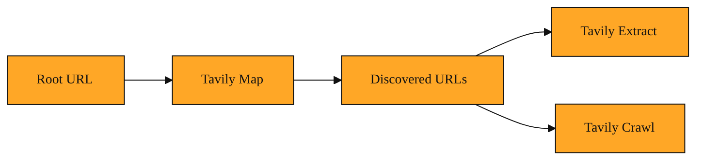

# How AI Finds Its Way Around a Website

Imagine you have built a smart assistant that can read and understand web pages. You ask it to learn everything about a company's product so it can answer customer questions. You point it at the homepage and tell it to go. It opens the front door, looks around, and... gets stuck. It does not know which hallway leads to the pricing page, which stairwell goes to the API docs, or whether there is a basement full of old tutorials. It is wandering blind.

That is the problem Tavily was built to solve.

Tavily is a discovery service made specifically for AI applications. While a regular search engine is designed to help a human find one answer and click away, Tavily is designed to help software explore the web systematically. It gives AI agents a way to see what is actually out there, find every relevant room in the building, and do it at machine speed.

Today, developers use it to keep chatbots current with real-time news, build research agents that compile reports, monitor competitor websites, and enrich business leads with fresh public data. Instead of feeding an AI static files that go stale overnight, they let it pull live facts directly from the source. Generic web search is optimized for a person skimming headlines and picking one link. Tavily is optimized for a machine that needs to understand an entire site or topic in one coherent sweep.

But before an AI can read a site, it needs to know the site exists. That is where Tavily Map comes in.

## Why blind exploration fails

If you have ever tried to find every article in a help center or every post in a company blog, you know the pain. A normal search query gives you the top ten results. A sitemap published by the website might be incomplete or outdated. And if you simply tell a program to follow every link, it can spiral into an endless maze of calendar widgets, tag pages, and duplicates.

Without a clear map, AI agents waste time, burn through resources, and miss hidden corners entirely. Developers end up maintaining giant hand-curated lists of web addresses, which break the moment the site adds a new section. When you are building something like a competitive intelligence agent or a lead enrichment tool, missing even a few pages can mean missing critical information.

## Understanding the idea

Tavily Map is like sending a scout ahead of the main expedition.

You give it one starting address, usually a homepage or a documentation root. The scout walks the halls, notes every door it finds, and comes back with a complete list of discovered pages. It does not stop to read every whiteboard or memorize every document inside the rooms. It simply answers the question: what pages are here, and how do I reach them?

It starts at your root web address and fans outward, discovering linked pages in parallel, the same way you might explore a network of connected rooms. You can give it loose instructions, like looking only for paths that contain certain words or stopping after a certain number of link-clicks deep. But the core job is always the same: build a reliable directory of what lives on the site.

Think of it as the difference between searching a library catalog for one book and receiving a full floor plan of every shelf. The floor plan does not replace reading. It makes reading possible.

<InlineQuiz
  id="quiz-s2-l1-tavily-map-purpose"
  question="What does Tavily Map produce when it explores a site starting from a root address?"
  options='["A permanent cached copy of every page for offline reading","A readable summary of the most important content on the site","A directory of discovered page addresses without reading their contents","A ranked list of the top ten most relevant links for a human to click"]'
  correct="2"
  explanation="Tavily Map acts like a scout that builds a directory of discovered pages, answering what pages are on the site and how to reach them without stopping to read or memorize their contents. The first option is wrong because Map does not create permanent cached copies. The second option confuses mapping with extraction or summarization, which are downstream steps. The fourth option describes a traditional search engine optimized for human browsing, not a systematic discovery service built for AI."
  courseSlug="tavily-live-web-answers-for-builders-beginner"
  lessonSlug="01-how-ai-finds-its-way-around-a-website"
/>

## A simple example

Marcus runs a small SaaS company. He wants a support chatbot that can answer questions using his own documentation. He points Tavily Map at his docs homepage. A few seconds later, he has a list of every guide, changelog entry, and troubleshooting page his team has published.

He now knows his site has 147 relevant pages. He knows which ones are about the Python SDK and which ones cover billing. He did not have to click through menus or export a broken sitemap. He has a living index.

That index becomes the foundation. Later, Tavily Extract can pull the text from those pages in small chunks, and Tavily Crawl can go deeper into the structure. But the map had to come first. You cannot extract what you have not yet found.

## How to think about it

Tavily Map is reconnaissance, not excavation. Its product is a list of addresses, not the contents inside. You reach for it whenever you need to answer "what is on this site?" before you ask "what does it say?"

You will see Tavily Map at the heart of larger workflows. It sits upstream from crawling and extraction because you cannot intelligently crawl what you have not yet discovered. It also powers use cases like competitive intelligence, where simply knowing that a competitor published twelve new pricing pages is valuable intelligence on its own. Whether you are building a news dashboard, an AI chatbot with real-time search, or any agent that touches the live web, mapping is usually the first step.

*Figure: The pipeline shows how Tavily Map sits upstream, turning a single start address into the directory that downstream tools need.*

## Where you will see this next

In the next lesson, we will look at what Tavily Map actually hands back to you. We will meet the raw response structure, learn how to tell a successful discovery from a failed one, and see how the tool is called in practice. The abstract idea of mapping will turn into concrete data you can hold in your hands.

---
[Next →](./02-how-to-map-a-website-without-opening-a-hundred-tabs.md) · [Course home](./README.md)
