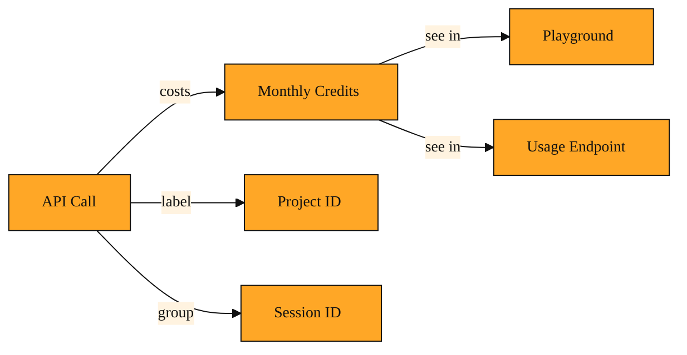

# How do you know how much you're actually using?

## Why you need a speedometer

How do I know if I’m about to run out of free credits?

In the last two lessons, you learned how to ask Tavily for content and how to control how deep it goes. You can send a query, pick a search depth, and pull clean text from a page. That part feels great.

But once your app starts making real calls, that question gets louder. You also start to wonder: how much have I burned through? If my teammate joins and starts calling the API too, will we suddenly hit a wall?

This is exactly why Tavily gives you usage. Usage is the running tally of the API Credits you have spent. Tavily provides a monthly bucket of credits, and every call, whether it is a search, an extract, or a crawl, consumes some amount from that bucket. Without a way to see that tally, you are driving without a speedometer. You might also bump into Rate Limits, which are speed restrictions on how frequently you can call the API. Rate limits and usage work together. Rate limits keep you from calling too fast. Usage keeps you from calling too much.

## What usage really means

Think of your Tavily account like a prepaid phone plan. You get 1,000 free API Credits to start each month. Every time your code asks Tavily to do work, the meter ticks forward. A simple search might cost less than a deep crawl across many pages. The exact cost depends on the job, but the important thing is that the platform keeps a precise record.

You can check that record in two places. The Playground, Tavily's interactive web interface, shows you a friendly dashboard of what you have used so far. If you are building in code, you can also call the /usage endpoint. Send your API Key with the request, and Tavily sends back a snapshot of your current spend and your plan limits in real time.

Usage tracking gets even more useful when you share the account across a team. By attaching an X-Project-ID header to your requests, you can label calls by project. Later, you can filter your usage to see that the client-demo project ate half your credits while the personal-blog project only ate twenty. That label is called Project tracking. There is also Session Tracking, which lets you group related calls together so you can trace a multi-step workflow back to one conversation or user. These tags do not change the cost, but they change how clearly you can see where the cost came from.

*Figure: How API calls consume credits, where to check them, and how tags organize the spend.*

<InlineQuiz
  id="quiz-s2-l3-usage-visibility"
  question="Tavily gives you a monthly bucket of API credits and tracks your usage. What is the main benefit of being able to see that usage?"
  options='["It adds more credits to your bucket when your spend is low","It lets you see how much of your monthly pool you have used and which calls used the most","It automatically slows down your API calls to prevent you from hitting zero","It changes your search depth settings to the cheapest option for you"]'
  correct="1"
  explanation="Usage tracking is your fuel gauge. It shows you a running tally of the API credits you have consumed and, when you use Project or Session IDs, helps you see exactly which workflows are eating up your pool. It does not add credits, throttle your requests, or change your parameters for you. The main benefit is turning invisible calls into visible numbers so you know when to tune your settings."
  courseSlug="tavily-live-web-answers-for-builders-beginner"
  lessonSlug="03-how-do-you-know-how-much-you-re-actually-using"
/>

## A quick example: the Friday check

Imagine it is Friday afternoon. You have been building a small app that extracts article summaries all week. You remember that Tavily gives you a monthly credit pool. Before you head into the weekend, you check your usage.

You see you have spent 240 credits and have 760 left. You relax. But then you notice that 200 of those credits came from the project tagged client-demo. That is the one where you set extract_depth very high on a huge site. The numbers tell you exactly which habit is expensive.

Without usage visibility, you might have blamed the whole week on bad luck. With it, you know exactly where to tune your parameters.

## How to think about it

Usage is your fuel gauge. It turns invisible API calls into visible numbers. When you see usage climbing faster than you expected, it is a signal to revisit the settings from earlier lessons, like tightening your search_depth or being pickier about which pages you extract. It also keeps you honest when you start shipping features that call Tavily automatically. You would check usage whenever you add a new feature, onboard a teammate, or notice your app slowing down because it is bumping into limits.

## Where you'll see this next

In the coming lessons, you will meet the Tavily Research Agent and patterns like RAG, where an agent or pipeline makes many calls on its own. An agent left unchecked can burn through a month's credits in one long afternoon. That is why Tavily lets you pass Session IDs and Project IDs to group those automated calls together, so you can audit the total cost of a single research task. Now that you know how to read the meter, you are ready to hand the keys to an agent.

---
[← Previous](./02-how-to-map-a-website-without-opening-a-hundred-tabs.md) · [Next →](./04-the-difference-between-searching-and-researching.md) · [Course home](./README.md)
