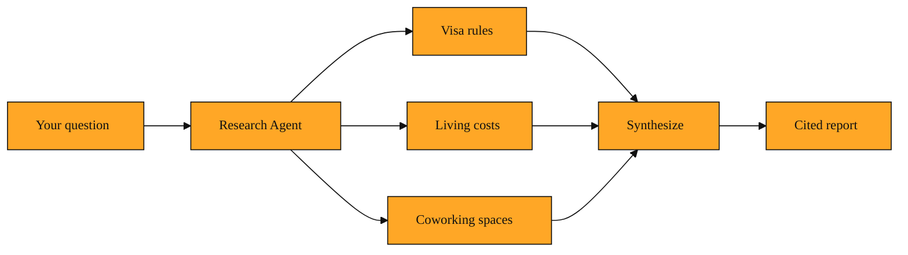

# The Difference Between Searching and Researching

## Why this exists

So far in this course, you have met Tavily's building blocks. Tavily Search gives you fast, factual answers. Tavily Extract pulls the text you need from a specific page. Tavily Crawl explores a website, and Tavily Map lists every corner of a domain. Each one is excellent at its single job.

But real questions are rarely that tidy. Imagine you are planning a six-month sabbatical in Japan. You need visa rules, cost-of-living comparisons between Tokyo and Osaka, weather patterns, and a list of coworking spaces that welcome foreigners. You could run five separate searches, then five separate extracts, and spend your afternoon stitching tabs together into a spreadsheet. That is research, not search. It is slow, manual, and easy to lose track of sources.

That friction is exactly why the Tavily Research Agent exists. It is built for broad, messy problems where one query will never be enough. Instead of handing you raw links, it handles the entire investigation for you.

## Understanding the idea

Think of the Tavily Research Agent as a research assistant you hire for one specific project. You describe the topic in plain language. The agent then figures out what sub-questions need answering, dispatches parallel investigators to tackle them, reads the sources, and hands you back a single, citation-backed report.

In earlier lessons, Tavily Search, Extract, Crawl, and Map were like individual hand tools: a screwdriver, a wrench, a drill. The Research Agent is the carpenter. It picks the right tool for each task without you micromanaging the toolbox. Under the hood, it coordinates parallel sub-agents so that one can look up visa law while another scans rental listings and a third checks climate data. When they finish, the agent synthesizes everything into one narrative with footnotes pointing back to the original web pages.

You still get the same trustworthy citations you expect from Tavily. The difference is scale and shape. Instead of raw snippets or a list of URLs, you receive a coherent answer to a complex question. If you want, you can even watch it work in real time through progress updates as each investigator completes its task.

*Figure: How the Research Agent coordinates parallel investigators to answer one broad question.*

<InlineQuiz
  id="quiz-s2-l4-research-agent-role"
  question="What is the main job of the Tavily Research Agent?"
  options='["It performs one large Tavily Search that scans more websites than a normal search","It breaks a broad question into pieces, runs parallel investigations, and writes a single cited report","It removes the need for citations by generating original answers instead of reading sources","It replaces Tavily Extract with a faster way to pull full text from a single page"]'
  correct="1"
  explanation="The agent acts like a carpenter who chooses the right tool for each task. It coordinates parallel sub-agents to tackle sub-questions such as visa rules and living costs, then synthesizes everything into one narrative with footnotes. Option A is a common misconception because simply scanning more sites is still just search, not research. Option C is wrong because the agent preserves trustworthy links to original sources. Option D describes Extract, not the agent, which uses multiple tools together rather than replacing one."
  courseSlug="tavily-live-web-answers-for-builders-beginner"
  lessonSlug="04-the-difference-between-searching-and-researching"
/>

## A simple example

Let us stay with the Japan sabbatical. You ask the Research Agent: "Plan a six-month remote-work sabbatical in Japan, including visas, budget, and best cities."

The agent breaks that down internally. One sub-agent searches for the latest visa rules for digital nomads. Another compares current cost-of-living data between Tokyo, Osaka, and Fukuoka. A third gathers recent reviews of English-friendly coworking spaces. They work at the same time. Once the facts are in, the agent writes a short report: "You will likely need a designated activities visa or a tourist visa run depending on your nationality. Budget roughly $2,800 per month in Tokyo versus $2,000 in Osaka. Here are five coworking spaces with day passes..." Every claim includes a link to its source.

You asked once. You got back a briefing, not a pile of links to sort through yourself.

## How to think about it

The Tavily Research Agent moves the burden from you to the system. Search is a lookup. The Research Agent is an investigation. You stop being the person who opens twenty tabs and starts being the person who reads the summary.

It is helpful anytime a question has moving parts: competitive analysis, policy research, travel planning, or technology scouting. And because it still runs on the same Tavily Search and Extract APIs you already know, the sources remain reliable and traceable. When you need a fast fact, you still use Search. When you need a full picture, you escalate to the agent.

## Where you'll see this next

In the next lesson we will move from understanding the agent to actually wiring it into your own projects. You will see how to stream its progress live, how to plug it into popular frameworks, and how to connect it through servers like the Tavily MCP Server so your own applications can trigger deep research on demand. Once you know what the agent does, hooking it up is the natural next step.

---
[← Previous](./03-how-do-you-know-how-much-you-re-actually-using.md) · [Next →](./05-why-long-research-jobs-don-t-have-to-go-silent.md) · [Course home](./README.md)
