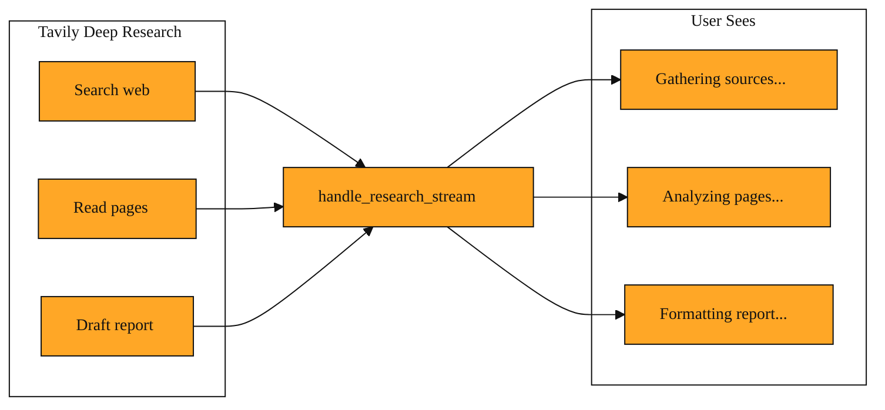

# Why Long Research Jobs Don't Have to Go Silent

You are building a feature for your team. A user types a hard question into your app. Something like, “What are the biggest supply chain risks for battery manufacturers in 2025?” You hand this off to Tavily’s research mode. You already know Tavily can search the web or extract a page in seconds. But a deep research question is different. It fires off multiple searches, reads many sources, and writes a full report. That takes time. So your app sits there. The seconds tick by. Thirty. Sixty. The user wonders if the page crashed and hits refresh. That quiet gap is the problem.

## Why silence is worse than slowness

Without a helper, your code has two bad choices. It can freeze the screen and wait for one giant final answer. That leaves the user staring at a blank box, guessing if anything is happening behind the scenes. Or your app can try to read the messy flood of raw updates coming from the research job. Those updates arrive jumbled and fast. They contain progress signals mixed with extra technical details your user does not need. If you try to read and sort that flood by hand, you risk dropping messages, showing gibberish, or losing the connection entirely. What is missing is a simple translator. Something that sits between Tavily’s busy work and your interface, catching every heartbeat and turning it into a plain, human-friendly message.

## A calm translator for busy work

This is what `handle_research_stream` does. It is part of the Tavily tools you have already been exploring. Think of it as a stage manager at a theater. The actors backstage are doing a hundred things at once. Props move. Lights shift. Scripts get rewritten. Costumes are adjusted. The audience should not see that chaos. Without the stage manager, the crowd might hear random shouting and clattering from behind the curtain. With the stage manager, every backstage call becomes a single, calm announcement: “The show will begin shortly.”

When Tavily tackles a deep research question, it works in stages. It gathers sources, reads pages, and drafts an answer. While it works, it sends out a rapid stream of small updates about what it is doing. These updates are useful, but they arrive in a raw, technical format that is hard for your app to read directly. `handle_research_stream` listens to that flow, sorts each update, and hands your app only the clean, readable pieces. It does not do the research itself. It simply babysits the connection so your code stays simple and your user stays informed.

*Figure: How handle_research_stream sits between Tavily's busy research work and your user, turning raw technical updates into calm status messages.*

<InlineQuiz
  id="quiz-s2-l5-research-stream-translator"
  question="You are running a Tavily deep research job that takes about a minute. What is the main reason to use handle_research_stream?"
  options='["To do the web searches and draft the report so Tavily does not have to.","To turn the fast, messy stream of raw progress updates into calm, human-readable status messages.","To make the research finish faster by running the searches in parallel.","To save the final report into your database once the research is complete."]'
  correct="1"
  explanation="handle_research_stream is a translator, not a worker. It sits between the busy Tavily research process and your user interface. It catches the rapid, jumbled stream of raw technical updates that Tavily sends while it works, sorts them, and passes only clean, readable status messages to your app. That is why your user sees Gathering sources instead of confusing backstage noise. Option A is wrong because the tool does not perform the actual research; Tavily still does the searching and report writing. Option C is wrong because the handler does not speed up the research timeline; the research still takes the same amount of time, and the handler only makes the wait feel calm and informed. Option D is wrong because storage is not its purpose; its job is real-time translation of progress signals, not database storage."
  courseSlug="tavily-live-web-answers-for-builders-beginner"
  lessonSlug="05-why-long-research-jobs-don-t-have-to-go-silent"
/>

## A window into a complex question

Imagine a small marketing team using an internal dashboard. A manager asks, “How are our three biggest competitors talking about AI safety this quarter?” The app starts a Tavily research stream. The question is broad, so the research takes time. Instead of showing a blank white box for a minute, the dashboard prints gentle status lines. “Gathering sources…” appears for a few seconds. Then “Analyzing pages…” Then “Formatting report.” Each of those lines arrived because `handle_research_stream` caught the raw updates and translated them into something readable. The raw feed contained technical fragments and busy noise that would confuse a user. The handler stripped away the clutter and kept only the human-friendly signals. When the final report is ready, it helps the app swap the status text for the full answer smoothly. The manager stayed informed from start to finish.

You are not building the research engine. You are building trust between the user and the wait. `handle_research_stream` is the piece you reach for when you are running a longer Tavily job that takes real time. It turns a chaotic burst of backstage updates into a calm, readable pulse.

## What this opens up next

Soon you will explore longer Tavily workflows that touch dozens of pages and sources. Those tasks naturally take more time and send more updates back to you. Knowing how to handle that stream calmly will be the bedrock that makes those longer jobs feel smooth and under control.

---
[← Previous](./04-the-difference-between-searching-and-researching.md) · [Next →](./06-why-the-api-says-no-to-your-first-request.md) · [Course home](./README.md)
